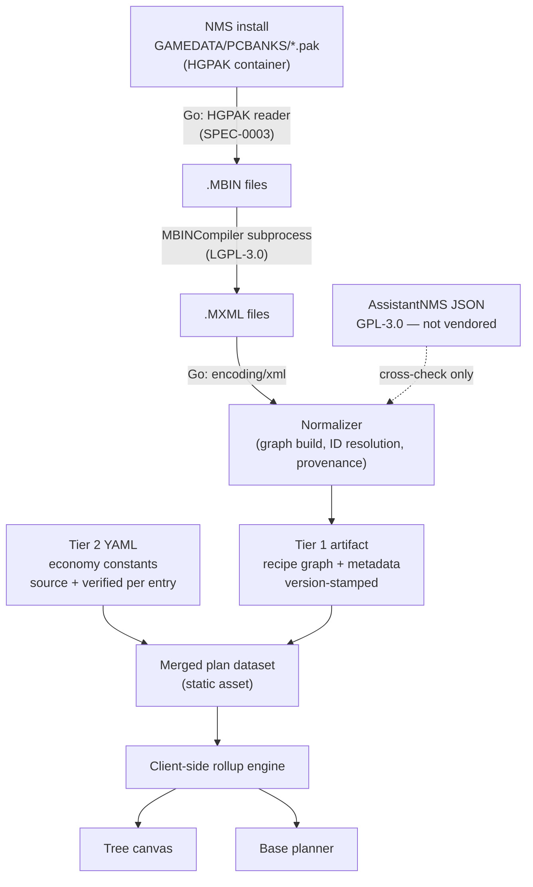

# ADR-0001: Two-tier NMS game data ingestion via Go and MBINCompiler

## Context and Problem Statement

The base planner is driven entirely by No Man's Sky game data: a crafting/refining/cooking dependency graph (to render the tree canvas) and a set of base-economy constants — crop yields, biodome capacity, extractor rates, generator output in kPs (to compute the per-base build checklists). The design handoffs are explicit that the prototypes' numbers are illustrative and that *"production reads real game data"*, and they already anticipate that sources disagree — the `unverified` badge exists precisely because refiner-variant ratios differ between community sources.

Where does that data come from, in what form does it reach the app, and under what license?

## Decision Drivers

* **No copyleft contamination.** The app must not inherit GPL-3.0 obligations from its data source.
* **Refreshable per game update.** NMS ships frequent updates that change recipes; ingestion must be re-runnable, not hand-maintained.
* **Provenance must be representable.** `unverified` is a designed UI affordance, so confidence has to be a property of the data, not a hardcoded list.
* **Client-side shippable.** Plan state lives in the URL hash and the rollup engine runs in the browser (see the Overview in `docs/design/README.md`); the dataset must ship as a static artifact, not a runtime query.
* **Verifiable against the design.** The handoffs specify a real 34-node Stasis Device tree, which gives us an exact acceptance test for any ingestion path.
* **Learning goal.** The maintainer wants substantive Go in this project.

## Considered Options

* **A. Vendor AssistantNMS's extracted JSON** — copy `assets/json/en/*.json` from the AssistantNMS app repo
* **B. Call the AssistantNMS public API at runtime**
* **C. Direct extraction: Go pipeline invoking MBINCompiler as a subprocess** — with a second, hand-curated tier for economy constants
* **D. Full Go reimplementation of MBIN decoding**
* **E. Scrape the NMS community wikis**

## Decision Outcome

Chosen option: **C, direct extraction with a two-tier data model**, because it is the only option that gets the recipe graph under a permissive footing while keeping the refresh cycle under our control — and because the constants that extraction cannot supply turn out to be a small curated set rather than a second pipeline.

**Tier 1 — extracted.** A Go CLI locates the game's `.pak` archives, unpacks them (they are HGPAK containers — see the note below and SPEC-0003), shells out to MBINCompiler to convert `.MBIN` → `.MXML`, then parses and normalizes the XML in Go into a version-stamped artifact: the recipe graph (products, substances, refinery, nutrient processor), item metadata, the biome→gas mapping from `GcGeneratorUnitComponentData.BiomeGasRewards`, the extractor taxonomy, the base parts catalog, refiner throughput (`RefinerProductsMadeInTime` / `RefinerSubsMadeInTime` and their Survival variants, from `gcgameplayglobals`), the per-part production and consumption rates and storage buffers from `GcBaseLinkGridData`, the C/B/A/S hotspot class strengths and weightings from `REGIONHOTSPOTSTABLE`, and crop yields and growth times. Regenerated per game version; never hand-edited.

**Tier 2 — curated.** A hand-maintained YAML file of the base-economy constants that are genuinely *not* in the game files. As of the 2026-08-18 confirmation that is one entry — biodome crop-slot count — since generator and consumer rates, class scaling, crop yields, and growth times all turned out to be extractable (see the finding below). Each entry carries a `source` and a `verified` date, feeding the same `unverified` badge convention the tree canvas uses.

MBINCompiler is invoked as a **subprocess**, never linked. It is LGPL-3.0, and a license governs a program rather than its output, so the extracted artifact carries no copyleft obligation. AssistantNMS is retained as a **cross-check** on Tier 1 correctness — read, compared against, never vendored.

Extraction takes **structure and quantities only**. In-game `Description` text and icon assets are Hello Games' creative expression and are excluded, consistent with the design bundle's own rule that *"No game assets or trade dress are used or should be."*

### Consequences

* Good, because the recipe graph is derived from the maintainer's own game files rather than copied from a GPL-3.0 repository, removing the copyleft question entirely.
* Good, because the refresh cycle depends only on MBINCompiler's release cadence, not on a third party's decision to keep publishing JSON.
* Good, because splitting extracted from curated data makes confidence explicit — Tier 2 entries are individually attributable and individually stale-able, which is exactly what the `unverified` badge renders.
* Good, because the substantial engineering (normalization, graph construction, provenance, artifact emission) is pure Go, satisfying the learning goal without contorting the frontend.
* Bad, because ingestion requires a local NMS install, so it cannot run in CI. It is a developer-local step producing a committed artifact.
* Bad, because a game update invalidates the artifact and may require waiting for an MBINCompiler release before re-extraction is possible.
* Bad, because Tier 2 is manual labour that must be re-verified after balance changes, and nothing automatically detects when it has gone stale — though the 2026-08-18 confirmation shrank Tier 2 to a single constant, so the exposure is now small.
* Neutral, because MBINCompiler becomes a vendored build-time dependency with a .NET 8 runtime requirement on developer machines.

### Confirmation

The pipeline is correct when it reproduces the Stasis Device tree from `docs/design/tree-canvas/handoff.md` exactly, rooted at product ID **`ULTRAPROD2`**:

* 34 distinct nodes across the Quantum Processor (`MEGAPROD2`), Cryogenic Chamber (`MEGAPROD3`), and Iridesite (`ALLOY8`) branches
* Each gas product costing 250 gas + 50 Condensed Carbon — `REACTION1` / `REACTION2` / `REACTION3`
* At quantity ×1: 500 each of Sulphurine / Nitrogen / Radon, and 300 Condensed Carbon

**Finding the ID requires a localisation hop, and this is the part that costs time.** Product IDs are opaque (`CASING`, `ULTRAPROD2`) and carry no display name; the `Name` and `NameLower` fields hold localisation *keys*, and the English strings live in `language/nms_loc*_english.mbin` inside `NMSARC.MetadataEtc.pak` — a different archive from the product table. Searching `GcProductTable` for "Stasis Device" therefore finds nothing. The chain is:

```
language/nms_update3_english.mbin  →  UI_ULTRAPROD_2_NAME_L = "Stasis Device"
NMS_REALITY_GCPRODUCTTABLE.MBIN    →  NameLower = UI_ULTRAPROD_2_NAME_L  →  ID = ULTRAPROD2
```

Any normalizer that wants human-readable names must join against the localisation tables; the reality tables alone cannot produce them.

All three bullets above were verified on 2026-08-17 against a real extraction — `NMSARC.Precache.pak` unpacked with `internal/hgpak`, decompiled with MBINCompiler 6.45.0.1 — and the traversal returns exactly 34 distinct nodes over 47 edges to 14 leaf resources. An earlier revision of this section named the root `prod80` and asserted the tree "has already been verified by hand against extracted data". No such ID exists in the game data, in the handoff this section cites, or in the design mocks, and no extraction was possible at the time the claim was written: the reader then in the tree could not open a single archive. The three quantitative bullets were nevertheless correct, so only the identifier was invented — see the HGPAK note below for the same failure mode on the container format.

Tier 2 is confirmed differently: every entry must carry a `source` and `verified` date, and any entry lacking one must render with the `unverified` badge rather than silently presenting as fact.

## Pros and Cons of the Options

### A. Vendor AssistantNMS's extracted JSON

Copy the ~1.5 MB of `Products` / `RawMaterials` / `Refinery` / `NutrientProcessor` JSON out of the AssistantNMS app repository.

* Good, because the data is clean, normalized, multilingual, and verified working — walking it reproduces the design's 34-node tree exactly.
* Good, because it requires no game install, no .NET runtime, and no extraction step.
* Bad, because the repository is **GPL-3.0**, and copying data files out of a copyleft work carries a real argument that the app inherits those obligations.
* Bad, because it does not close the constants gap — their `Buildings.lang.json` schema has no power or yield fields, so Tier 2 would still be needed.
* Bad, because the refresh cadence belongs to someone else.

### B. Call the AssistantNMS public API at runtime

* Good, because it sidesteps vendoring the files.
* Bad, because it makes a fully client-side app depend on a third-party service at runtime, contradicting the offline-capable, URL-hash-shareable design.
* Bad, because the terms of use are unestablished and the app would break if the API changed or went away.
* Bad, because it still does not supply the economy constants.

### C. Direct extraction via Go + MBINCompiler (chosen)

* Good, because MBINCompiler is **LGPL-3.0** and used as a subprocess, so neither the tool nor its output imposes obligations on this project.
* Good, because the maintainer controls the whole cycle and the artifact is provably derived from their own game files.
* Good, because macOS is supported — a prebuilt `osx-arm64` archive ships each release, requiring the .NET 8 runtime.
* Good, because the game data contains useful structure beyond recipes (`BiomeGasRewards`, the extractor taxonomy, `GcLinkNetworkTypes` modelling power and plant-growth networks) that a JSON re-publisher may not expose.
* Bad, because it requires a local game install and a .NET runtime, and cannot run in CI.
* Bad, because MBINCompiler version must match the game version or decompilation fails.
* Neutral, because it does not close the Tier 2 gap either — but nothing does.

### D. Full Go reimplementation of MBIN decoding

* Good, because it would remove the .NET dependency and make the pipeline a single Go binary.
* Bad, because MBIN files are serialized C# structs and are not self-describing. libMBIN's value is roughly a thousand hand-maintained struct definitions keyed per game version — which is why it needs a release after every patch.
* Bad, because reimplementing that means maintaining a parallel libMBIN indefinitely. That is a larger project than the planner itself.

### E. Scrape the community wikis

* Good, because the wikis document the economy constants that game-file extraction does not appear to expose.
* Bad, because wiki content is generally CC-BY-SA, which carries its own share-alike considerations for prose (though the numeric facts themselves do not).
* Bad, because scraping is brittle against page restructuring and gives worse provenance than a hand-curated file with explicit sources.
* Neutral, because the wikis remain a legitimate *source* for Tier 2 entries — the rejection is of automated scraping as an architecture, not of the wikis as a reference.

## Architecture Diagram



## More Information

**Operational: extraction runs on Linux, the artifact crosses via git.** Ingestion needs a local NMS install, so it runs on the maintainer's Linux gaming PC, not the macOS development machine. This is the intended split, not a workaround — the Consequences section already records that ingestion is a developer-local step producing a committed artifact.

* **Game data** lives in the ordinary Steam library; Proton virtualizes the Windows environment, not the install: `~/.steam/steam/steamapps/common/No Man's Sky/GAMEDATA/PCBANKS/*.pak`
* **Save files** (for ADR-0002) live inside the Proton prefix, NMS being Steam app ID `275850`: `~/.steam/steam/steamapps/compatdata/275850/pfx/drive_c/users/steamuser/AppData/Roaming/HelloGames/NMS/st_<steamid>/`
* **MBINCompiler ships first-class Linux binaries** — release `v6.45.0-pre1` publishes `MBINCompiler-linux`, `MBINCompiler-linux-dotnet6`, `libMBIN-linux.so`, and `libMBIN-linux-dotnet6.so`. It requires the .NET 8 runtime and does not need mono. Notably that release publishes **no macOS asset at all**, despite the README stating one accompanies every release — a further reason extraction belongs on Linux.
* **Flow:** Linux PC extracts, normalizes, and commits the artifact; the Mac pulls and develops against it. The development machine never needs .NET, MBINCompiler, or the game installed.

**The archive format is HGPAK, not PSARC — verified against the install.** An earlier revision of this ADR labelled the extraction edge of the diagram above `PSARC extract`. That label was never a decision, was never verified, and is wrong. All 97 archives under `GAMEDATA/PCBANKS` on the maintainer's install (NMS 5.97; pak files span 2026-05-04 to 2026-06-16, since the game patches incrementally and rewrites only changed archives) carry the magic `HGPAK`; none carry `PSAR`. NMS shipped PSARC historically, which is why the assumption looked safe and why community documentation still describes it — but it does not hold for current builds.

Confirmed by parsing real archives end to end:

* Header is little-endian: 8-byte `HGPAK\0\0\0` magic, then u64 version (2), entry count, block count, a **storage flag**, and a data-start offset.
* An entry table of 32-byte records — 16-byte MD5 + u64 offset + u64 size — followed by a block table of u64 compressed lengths.
* The storage flag selects the layout. `1` is a zstd block stream (95 archives); `0` is **stored** — no block table, entry offsets are direct file offsets, and entry bytes including the manifest sit uncompressed (`NMSARC.audio.pak`, `NMSARC.audioBNK.pak`, whose WEM/BNK payloads are already compressed). An earlier revision of this ADR called this an unknown field, "1 in every archive observed" — true of the two archives parsed at the time, and false in general. Parsing all 97 is what corrected it.
* Blocks are **zstd**, each decompressing to exactly 65,536 bytes, each starting 16-byte aligned. `NMSARC.globals.pak`: 87 blocks decompressing to 5,701,632 bytes = 87 x 64 KiB exactly. A block whose *compressed* length is exactly 65,536 is stored verbatim instead (`NMSARC.UI.pak` and the `TexBiomes*` family) — a length rule, not a magic sniff.
* Entry offsets are into a **virtual image** of the file, so stream position is `entry.offset - dataStart`.
* **Entry 0 is a manifest** of CRLF-separated lowercase paths, and each entry's 16-byte hash is the **MD5 of its lowercase path** (verified 400/400 on sampled names). Filenames are therefore fully recoverable from the archive alone; no external hash mapping is required.

**Consequence for Tier 1: the tables are in `NMSARC.Precache.pak`.** `NMSARC.MetadataEtc.pak` contains no `metadata/reality/tables/` paths at all. `NMSARC.Precache.pak` holds all 54, including `nms_reality_gcproducttable.mbin`, `nms_reality_gcsubstancetable.mbin`, `nms_reality_gcrecipetable.mbin`, and — for the base parts catalogue this ADR's Tier 1 promises — `basebuildingpartstable.mbin` and `basebuildingcoststable.mbin`. Entries extracted from it carry MBIN magic `cccccccc`, so they feed MBINCompiler directly as this decision assumes.

None of this changes the decision. Option C is chosen for licensing and refresh-cycle reasons that are indifferent to the container format; only the unpacking step's implementation is affected. `internal/psarc` reads no file in the game install and is superseded by SPEC-0003.

**Never commit a real save file.** The Tier 1 artifact is game data and is safe to commit. A save file is *player* data — discovered systems, base locations, platform UID — and committing one would defeat ADR-0002's privacy rationale permanently, since git history preserves it. Test fixtures MUST be either gitignored, drawn from a throwaway playthrough, or synthesized from a scrubbed `PersistentPlayerBases` subtree. The synthetic option is preferred: smaller, readable, and free of personal data.

**Tier 2 rested on a provisional finding, now confirmed.** The original search covered libMBIN's struct definitions — every numeric field matching `Consumption|Production|Supply|Demand|Grid|Wattage|Output|Generation|Extract|Yield|Growth|Mine`, all 208 entries of `GcStatsTypes`, plus `GcBuildingGlobals` and `GcMaintenanceComponentData` — found no field corresponding to generator kPs, extractor rate per class, biodome capacity, crop yield, or C/B/A/S class multipliers.

That was a *searched hard, did not find it* result over libMBIN's field **names and types**, and it required confirmation against real values before this ADR could be accepted.

**That confirmation was done on 2026-08-18 and the finding did not survive it.** Against a real NMS 5.97 install unpacked with `internal/hgpak` and decompiled with MBINCompiler 6.45.0.1, four of the five constants are present and extractable:

| Constant | Where it actually lives |
|---|---|
| Generator / extractor / consumer rates | `GcBaseLinkGridData.Rate` and `.Storage` on the base-building entry — 101 parts carry a nonzero value |
| C/B/A/S class scaling | `METADATA/SIMULATION/SCANNING/REGIONHOTSPOTSTABLE.MBIN` — `ClassStrengths` and `ClassWeightings` per hotspot category |
| Crop yield | `NMS_REALITY_GCREWARDTABLE` — `GcRewardSpecificSubstance` with `AmountMin` / `AmountMax` |
| Crop growth time | `Storage` on the plant's `PlantGrowth` network connection, in seconds |
| Biodome crop-slot count | **Not found.** The only remaining Tier 2 constant. |

**The class model is ranges attached to hotspots, not multipliers attached to devices.** A part declares a base `Rate` and a `DependsOnHotspots` category; the hotspot carries the class. `regionhotspotstable.mbin` gives Power hotspots `ClassStrengths` of 150 / 220 / 250 / 300 for C/B/A/S, and Mineral and Gas hotspots 1 / 1.5 / 2 / 2.5, alongside `ClassWeightings` (Power 10/6/2/1, Gas 20/4/2/1) that bias which class spawns. Searching the parts table for `_C`/`_B`/`_A` variants finds nothing precisely because the class is never a property of the device.

The link-grid model is complete enough to compute a base's power budget directly:

```
U_EXTRACTOR_S   Rate=100  Storage=360000  DependsOnHotspots=Mineral
                └─ DependentConnections: Power, DependentRate=-50, DependentEffect=EnablesRate
U_SOLAR_S       Rate=50                   U_BATTERY_S  Storage=45000
BIOROOM         Rate=-50                  PLANTER Rate=-5   PLANTERMEGA Rate=-20
```

Plants themselves declare `DependentRate = 0` against Power, so a biodome's -50 is the entire power cost of what it contains; there is no per-plant draw to accumulate.

Crop yields are flat per crop: Cactus Flesh 100, Gamma Root / Solanium / Frost Crystal / Fungal Mould 50, Star Bulb / Mordite / Faecium 25. Growth times come from the same link-grid `Storage` field — 3,600 s for frostwart, 14,400 s for most, 57,600 s for the slowest.

**Consequences for the two tiers.** Tier 1 gains generator and consumer rates, class strengths and weightings, crop yields, crop growth times, battery capacity, and refiner throughput (`RefinerProductsMadeInTime` / `RefinerSubsMadeInTime` and their Survival variants, from `gcgameplayglobals`). Tier 2 shrinks to a single entry — biodome crop-slot count — plus whatever later proves genuinely absent. The decision itself is unaffected: this ADR already said that "if the constants turn out to be extractable, Tier 2 shrinks or disappears and this decision should be revised rather than superseded," and that is what has happened.

**This ADR moved from `proposed` to `accepted` on 2026-08-18.** The single blocker it set for itself — confirming the Tier 2 finding against decompiled MBIN files rather than libMBIN struct names — is met, and the decision survives the confirmation going against it. Option C was chosen for licensing and refresh-cycle reasons that do not depend on how the tiers are split, and the ADR anticipated this exact outcome in its own text. What changed is the size of Tier 2, not whether the two-tier model is right.

**On how the earlier answer was wrong**, because the failure is instructive and this document has now recorded three of them. An initial pass concluded the constants were absent and this section briefly said so. That pass searched `METADATA/REALITY/TABLES/` and the globals, found only `DependentRate` inside connection dependencies, and reported absence — while the sibling `Rate` and `Storage` fields on the same structure went unread, and `METADATA/SIMULATION/SCANNING/` was never opened at all despite `gcterrainglobals` naming `RegionHotspotsTable` outright. The reward table holding every crop yield had already been decompiled and grepped. The error was not a missing capability; it was reporting a bounded search as a general result, which is the same move that produced the `PSARC` edge label and the "unknown field, 1 in every archive observed" claim. State the boundary of a search whenever stating its result.

Supporting signal that Tier 2 matches the design's intent: `docs/design/base-planner/handoff.md` already specifies these values as tweakable parameters — *"`emOutput` (kPs, default 110): base EM generator output at class B — swap in real game data without touching code."* The mock's tweaks panel is the curated-constants file in prototype form.

**On Hello Games' position.** No explicit written policy permitting data extraction was found. What is established: Hello Games officially supports modding, and a large extraction ecosystem has operated openly for years without enforcement action. This is *tolerated in practice, not granted in writing*. The EULA governs and has not been reviewed. Taking structure rather than expression, and shipping no game assets, is the mitigation — and it aligns with the design bundle's own rule.

**Open questions deferred to later ADRs.**

1. Frontend stack — deliberately independent; any stack consumes the same artifact.
2. Whether a backend is introduced later for screenshot storage, plan persistence, or sync. The Tier 1 artifact schema is the contract such an API would serve, so it should be designed as if it will be served.
3. Tier 1 artifact format (JSON vs. something more compact) and whether it ships whole or is split per target item.

**References.**

* `docs/design/README.md` — data fidelity and no-game-assets rule
* `docs/design/tree-canvas/handoff.md` — the 34-node Stasis Device tree used as the acceptance test
* `docs/design/base-planner/handoff.md` — the economy constants, specified as tweaks
* [MBINCompiler](https://github.com/monkeyman192/MBINCompiler) — LGPL-3.0, `v6.45.0-pre1` (June 2026)
* [AssistantNMS/App](https://github.com/AssistantNMS/App) — GPL-3.0, cross-check reference only
