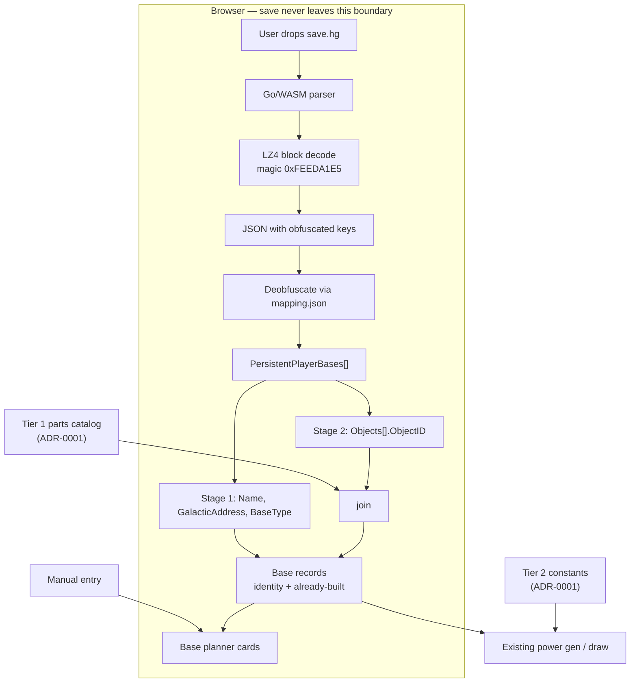

# ADR-0002: Client-side save file import for base bootstrapping

## Context and Problem Statement

Starting a plan currently means the player types everything by hand: base names, a 12-glyph portal address per base, biome and hazard notes, and which producers already exist. That is the worst part of onboarding, and all of it already exists in the player's No Man's Sky save file.

Saves are readable — `.hg` files are sequential 16-byte block headers with magic `0xFEEDA1E5` followed by LZ4 payloads, unencrypted in modern formats (2002+, post-Frontiers), decompressing to JSON with obfuscated three-character keys. The deobfuscation table ships as `mapping.json` with MBINCompiler, which ADR-0001 already commits us to.

Should the planner import saves, and if so, where does parsing run?

## Decision Drivers

* **Onboarding friction** — hand-entering 12 portal glyphs per base is the single worst step in the current flow.
* **Privacy** — a save is the player's entire game state: discovered systems, inventory, platform UID, every base location. It is far more than the planner needs.
* **Safety** — a planning tool that can corrupt a save is a planning tool nobody trusts.
* **Dependency reuse** — `mapping.json` and the base-parts catalog are already required by ADR-0001; save import is largely a join away.
* **Platform reach** — console players cannot readily extract save files, so this cannot be the only onboarding path.
* **Learning goal** — the maintainer wants substantive Go in this project.

## Considered Options

* **A. No save import** — manual entry only
* **B. Server-side parsing** — user uploads the save, backend parses and returns base records
* **C. Client-side parsing, Go compiled to WASM**
* **D. Client-side parsing, reimplemented in TypeScript**
* **E. Wrap an existing save tool** (NomNom, goatfungus, NMSSaveExplorer)

## Decision Outcome

Chosen option: **C, client-side parsing with Go compiled to WASM**, with import **strictly read-only** and delivered in stages.

The privacy driver eliminates B outright and is the load-bearing part of this decision: **the save file must never leave the browser.** That narrows the field to C or D. Between those, the engineering case is close — LZ4 plus JSON is not hard in TypeScript either, and if the frontend turns out to be TypeScript, D is arguably the simpler shipping choice. C wins on two grounds that are honest to name as partly non-technical: the parsing and normalization logic is shared with the ADR-0001 ingestion CLI rather than written twice in two languages, and it serves the maintainer's stated goal of writing real Go. **This is a judgment call weighted by project goals, not a claim that WASM is technically superior.** If WASM tooling proves painful in the spike, falling back to D costs little and should not be treated as a failure of this ADR.

**Import is read-only.** The application MUST contain no code path that writes a save file. Import parses, extracts, and discards.

**Staged scope:**

1. **Identity** — `Name`, `GalacticAddress` (from which the portal address derives), `BaseType`. This alone removes manual glyph entry and is worth shipping on its own.
2. **Built inventory** — `Objects[].ObjectID` joined against the ADR-0001 parts catalog, yielding counts of biodomes, extractors, generators and panels per base. Feeds pre-checked BUILD TODO items and lets the POWER block compute *existing* generation and draw instead of assuming a blank site.
3. **Storage** — container inventories feeding the v2 stocked-vs-needed bars. **Speculative** — not yet confirmed reachable in the save.

Manual base entry remains a first-class path, since console players cannot use import at all.

### Consequences

* Good, because the worst onboarding step disappears for PC and Mac players, and the data arrives more accurately than hand transcription would produce.
* Good, because the save never leaves the user's machine, so the app takes on no custody of sensitive player data and needs no upload endpoint, retention policy, or deletion story.
* Good, because it reuses `mapping.json` and the parts catalog already required by ADR-0001 — one dependency serving two features.
* Good, because staging means stage 1 ships independently and delivers most of the onboarding benefit.
* Bad, because it is PC/Mac only. Console players get no benefit, so every import-fed field needs a manual equivalent and the UI must not imply import is required.
* Bad, because save formats drift across game updates; `BaseVersion` exists precisely because the structure changes. Import must fail legibly on an unrecognized version rather than silently producing wrong bases.
* Bad, because Go/WASM adds build complexity and harder cross-boundary debugging relative to a native TypeScript parser.
* Neutral, because `mapping.json` is fetched at ingestion time rather than vendored, keeping MBINCompiler's LGPL-3.0 redistribution question out of the repository.

### Confirmation

* **Privacy is verifiable, not aspirational.** The import path MUST issue no network request. A test asserts that no `fetch`/`XHR`/WebSocket call occurs during parse, and review treats any network call added to that path as a defect.
* **Read-only is structural.** The codebase contains no save-writing function. Absence is confirmed by grep in review, not by convention.
* **Round-trip correctness.** A fixture save parses to a known set of base names, galactic addresses, and part counts.
* **Version failure is graceful.** A save with an unrecognized `BaseVersion` or a `mapping.json` version mismatch produces a clear user-facing message and imports nothing, rather than partially populating.

## Pros and Cons of the Options

### A. No save import

* Good, because it is zero work and carries no privacy surface at all.
* Good, because it treats every platform identically — console players are not second-class.
* Bad, because it leaves the worst onboarding step in place, and hand-transcribing 12-glyph portal addresses is both tedious and error-prone.
* Bad, because it discards data the player already has, for no benefit.

### B. Server-side parsing

Upload the save; a backend parses it and returns base records.

* Good, because parsing runs in one well-controlled environment with no WASM toolchain and easy debugging.
* Good, because it would work identically on any client, including mobile.
* Bad, because it requires the user to hand over their complete game state — discovered systems, inventory, platform UID — to obtain base names and addresses. Grossly disproportionate to the benefit.
* Bad, because it creates data-custody obligations (retention, deletion, breach exposure) that a planning tool has no business taking on.
* Bad, because it forces a backend into an otherwise client-side app, contradicting the deployment model.

### C. Client-side parsing, Go compiled to WASM (chosen)

* Good, because the save never leaves the browser — the privacy problem is solved structurally rather than by policy.
* Good, because parsing and normalization logic is shared with the ADR-0001 ingestion CLI instead of being maintained twice in two languages.
* Good, because Go handles this format natively — LZ4 block decompression via a BSD-3-Clause library plus `encoding/json`, with no subprocess and no .NET runtime. This is a genuine contrast with MBIN, which is not tractable in Go.
* Good, because it advances the maintainer's Go learning goal on a real problem.
* Bad, because WASM adds build tooling and makes debugging across the JS boundary harder.
* Bad, because it ships a WASM payload the user downloads whether or not they use import — mitigable by loading it lazily.
* Neutral, because the engineering advantage over option D is modest; the deciding factors are code-sharing and project goals.

### D. Client-side parsing in TypeScript

* Good, because it solves privacy exactly as well as C — the file still never leaves the browser.
* Good, because it needs no WASM toolchain, debugs natively in the browser, and adds no payload beyond ordinary JS.
* Good, because LZ4 and JSON parsing are well-served by existing TypeScript libraries.
* Bad, because the save-parsing and normalization logic would exist twice — once in Go for the ingestion CLI, once in TypeScript — with two places to fix when the format drifts.
* Bad, because it does not serve the Go learning goal.
* Neutral, because this is a legitimate fallback if WASM proves painful, not a rejected-on-merit option.

### E. Wrap an existing save tool

Shell out to or embed NomNom, goatfungus' editor, or NMSSaveExplorer.

* Good, because these are mature and handle platform quirks and format drift already.
* Bad, because they are desktop applications, not libraries, and cannot run in a browser — which defeats the client-side requirement entirely.
* Bad, because licensing is hostile to reuse: NomNom and the NMSCD tools are GPL-3.0; goatfungus' editor and NMSSaveExplorer publish no license at all, which is more restrictive than GPL, not less.
* Bad, because they are full *editors*, carrying save-writing capability this project deliberately refuses.

## Architecture Diagram

## More Information

**Verified against the live mapping table.** Every field this decision depends on was resolved in `mapping.json` (1,424 entries, `libMBIN_version 6.45.0.1`): `PersistentPlayerBases` → `F?0`, `Name` → `NKm`, `GalacticAddress` → `oZw`, `BaseType` → `peI`, `Objects` → `@ZJ`, `ObjectID` → `r<7`, `Position` → `wMC`, plus `Owner`, `RegionSeed`, `LastUpdateTimestamp`, `BaseVersion`.

**Unverified, to settle during the spike:**

1. The macOS save file location. PC is `%APPDATA%/HelloGames/NMS/st_<steamid>/`; the Mac path is presumably under `~/Library/Application Support/HelloGames/` but has not been confirmed.
2. Whether container inventories are reachable, which determines if stage 3 is feasible at all.
3. Whether `ObjectID` values join cleanly to `GcBaseBuildingEntry.ID` without normalization — the join is the premise of stage 2 and should be proven early.

**Multiple save slots.** `save.hg`, `save2.hg` and so on correspond to different playthroughs. The import flow needs a slot picker; silently taking the first file found would be wrong.

**Why format knowledge is safe to use.** The `.hg` structure is a fact about a file format, not copyrightable expression, and this project implements it independently. The same reasoning as ADR-0001: no code is taken from the GPL-3.0 and unlicensed tools surveyed above, and `mapping.json` is fetched at ingestion time rather than redistributed.

**Relationship to open decisions.** This ADR strengthens the case for a Go/WASM component in the frontend stack decision, which remains open. It does not settle that decision — a TypeScript frontend with a TypeScript parser (option D) remains coherent, and the fallback is cheap. The stack ADR should weigh this alongside the tree-canvas rendering requirement.

**References.**

* ADR-0001 — supplies `mapping.json` and the base-parts catalog this decision joins against
* `docs/design/base-planner/handoff.md` — the base card fields import populates (env strip, portal address, BUILD TODO, POWER)
* [MBINCompiler](https://github.com/monkeyman192/MBINCompiler) — source of `mapping.json`, LGPL-3.0
* [pierrec/lz4](https://github.com/pierrec/lz4) — BSD-3-Clause, LZ4 block support for Go
* Surveyed and rejected for reuse: [NomNom](https://github.com/zencq/NomNom) (GPL-3.0), [NMSCD/NMS-Save-Decoder](https://github.com/NMSCD/NMS-Save-Decoder) (GPL-3.0), [goatfungus/NMSSaveEditor](https://github.com/goatfungus/NMSSaveEditor) (unlicensed), [NMSSaveExplorer](https://github.com/CheckForUpdates/NMSSaveExplorer) (unlicensed)
