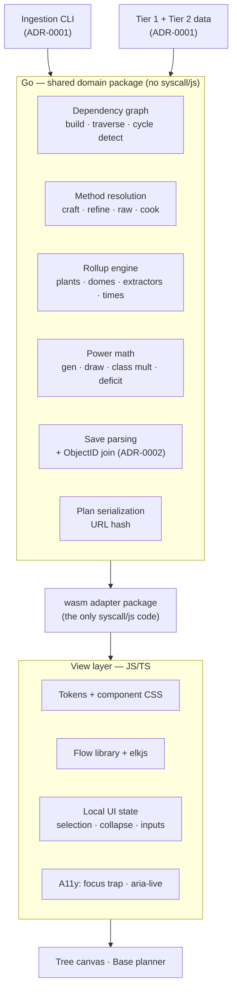

# ADR-0003: Go/WASM domain core with a thin view layer

## Context and Problem Statement

The planner's substantive logic — dependency graph construction, method resolution, quantity rollup, power math, save parsing, plan serialization — has to live somewhere. ADR-0001 put game-data ingestion in a Go CLI; ADR-0002 put save parsing in Go compiled to WASM. Neither settled where the rest goes.

The maintainer's stated goal is to learn Go at depth, which raises the obvious follow-up: should the *frontend itself* be Go? Where exactly is the line between Go and JavaScript?

## Decision Drivers

* **Learning goal** — the maintainer explicitly wants to be thrown in the deep end on Go, not to write a thin Go veneer.
* **Code reuse** — the ingestion CLI (ADR-0001) and the browser both need the same graph model and the same notion of a recipe node. Writing it twice guarantees divergence.
* **Canvas requirement** — the tree canvas needs a mature flow library with pan/zoom, custom nodes, and bezier edge routing. `docs/design/tree-canvas/handoff.md` names React Flow plus elkjs. No Go equivalent exists, and elkjs itself is a transpiled Java project with no Go port.
* **Testability** — the rollup math is pure computation with known-correct expected values from the handoffs. It should be testable without a browser.
* **Replaceability** — the view framework is the part most likely to be revisited; domain logic should survive a change of mind.
* **Interaction latency** — every recompute (method toggle, class picker, quantity slider) must feel instant.

## Considered Options

* **A. All logic in TypeScript** — Go confined to the ingestion CLI
* **B. Go frontend framework** — whole UI in Go via go-app or Vugu
* **C. Go/WASM domain core with a thin JS view layer**
* **D. Ad hoc split** — some logic in Go, some in TypeScript, decided case by case

## Decision Outcome

Chosen option: **C, a Go/WASM domain core with a thin JS view layer**, because it puts the majority of the app's non-trivial code in Go — satisfying the learning goal far better than a Go veneer would — while leaving the one genuinely hard UI component to a library that already exists.

**The Go core owns:**

* Dependency graph construction, traversal, and cycle detection
* Method resolution — craft / refine / raw / cook, and which are legal per node
* Quantity propagation and the producer rollup: plants = qty ÷ yield, domes = plants ÷ 16, extractor counts sized to fill time, harvest and fill durations
* Power math — generation and draw, EM class multipliers, solar plus battery derivation, deficit sizing
* Leaf-to-base assignment and per-base aggregation
* Save file parsing and the `ObjectID` → parts-catalog join (ADR-0002)
* Plan serialization to and from the URL hash

**The view layer owns:**

* CSS from the design tokens, and all component markup
* Flow library wiring and elkjs layout invocation
* Local UI state — selection, section collapse, form inputs, focus management
* Accessibility — focus trapping in the method popover, `aria-live` announcements, topological tab order

**Package boundary — the load-bearing structural rule.** The domain lives in a package that imports **no** `syscall/js`. A separate, thin adapter package is the only code permitted to touch `js.Value`. This is what makes the domain testable as ordinary Go, reusable verbatim by the ingestion CLI, and portable if WASM is ever abandoned. Without this split, the "shared code" benefit evaporates and the domain becomes untestable outside a browser.

**Data crosses the boundary as serialized values**, not live object graphs. The view never recomputes a domain value it could ask for.

### Consequences

* Good, because roughly two-thirds of the app's non-trivial code is Go, which is what "deep end" actually means here — graph algorithms, table-driven tests, interfaces, error handling — rather than learning one framework's component API.
* Good, because the ingestion CLI and the browser share one graph implementation, so the Stasis Device tree cannot mean two different things in two places.
* Good, because the pure-Go domain package is testable at speed with no browser and no WASM toolchain in the loop.
* Good, because the view framework becomes a smaller, more reversible decision — a stack change costs the views, not the domain.
* Good, because the tree canvas uses a mature library instead of a hand-rolled canvas competing with one.
* Bad, because the WASM payload is real — standard Go WASM output runs to multiple megabytes. Mitigable with lazy loading and TinyGo, but it is a cost React or Svelte alone would not carry.
* Bad, because debugging across the JS/WASM boundary is harder than a single sourcemapped language, and Go WASM stack traces in a browser are poor.
* Bad, because there is still a substantial JavaScript surface. Accessibility, focus management, and DOM work all stay in JS, so this is not "escaping JavaScript" — it is drawing a line through the middle of the app.
* Neutral, because marshalling cost at the boundary is unlikely to matter at this app's scale (34 nodes, a handful of bases), but it is a real constraint on how chatty the interface can be.

### Confirmation

* **The domain package imports no `syscall/js`.** Verified by grep in review. This is the structural guarantee the whole decision rests on; if it erodes, the decision has failed even if the app works.
* **The ingestion CLI and the WASM build import the same domain package.** Two import paths, one implementation.
* **Table-driven tests reproduce the handoffs' known values**: the 34-node Stasis Device tree, 500 each of Sulphurine/Nitrogen/Radon and 300 Condensed Carbon at ×1, and the base-planner rollup figures at `deviceQty` 1 and 10.
* **Domain tests run without a browser or WASM toolchain** — plain `go test`.

## Pros and Cons of the Options

### A. All logic in TypeScript

* Good, because it is one language end to end, with the best debugging story and no boundary to marshal across.
* Good, because it has the smallest payload and the simplest build.
* Bad, because the graph model would exist twice — once in the Go ingestion CLI, once in TypeScript — with two places to fix every time the model changes.
* Bad, because it reduces Go to a data-prep script, which does not meet the learning goal at all.

### B. Go frontend framework (go-app, Vugu)

Whole UI in Go compiled to WASM.

* Good, because it is the maximum amount of Go, with a single language for the entire application.
* Good, because [go-app](https://github.com/maxence-charriere/go-app) is genuinely maintained (8,953 stars, pushed 2026-08-12) and renders ordinary HTML/CSS, so the token-based design would be expressible.
* Bad, because **there is no Go flow-graph library**. The tree canvas would have to be hand-built — pan/zoom, custom nodes, bezier routing, hit testing — competing with a mature library, before any planner logic gets written.
* Bad, because the alternative to hand-building is calling elkjs and a JS flow library through `syscall/js`, which means writing stringly-typed glue in Go's `js.Value` API precisely where the interaction density is highest — losing the type safety that motivated Go.
* Bad, because the accessibility work the handoffs specify (focus trap with return-to-node, `aria-live` on every recompute, topological tab order) is painful through `syscall/js`.
* Bad, because [Vugu](https://github.com/vugu/vugu) self-describes as experimental and [Vecty](https://github.com/hexops/vecty) has not been pushed since October 2022.
* Neutral, because it teaches go-app's API more than it teaches Go — narrower and less transferable knowledge than a domain core would give.

### C. Go/WASM domain core with a thin JS view layer (chosen)

* Good, because it concentrates Go on graph algorithms and computation, which is transferable Go knowledge rather than framework-specific knowledge.
* Good, because it shares one implementation with the ingestion CLI.
* Good, because it leaves the canvas to React Flow or Svelte Flow and elkjs, exactly as the handoff recommends.
* Good, because the pure-domain package stays testable without a browser.
* Bad, because it is two languages and a marshalling boundary, with the debugging cost that implies.
* Bad, because the WASM payload is larger than a JS-only app.

### D. Ad hoc split

Decide per feature whether logic goes in Go or TypeScript.

* Good, because each piece can go wherever it is most convenient at the time.
* Bad, because without a stated boundary the split drifts, and "which language owns this rule?" becomes a question asked repeatedly forever.
* Bad, because duplicated logic appears silently on both sides and diverges without anyone noticing.
* Bad, because it makes the domain untestable as a unit — the thing that makes option C worth its costs.

## Architecture Diagram

## More Information

**What this changes about ADR-0002.** That ADR scoped Go/WASM to save parsing and noted the engineering case against a TypeScript parser was modest — mostly code-sharing plus the learning goal. This decision strengthens that considerably: with the whole domain in Go, a TypeScript save parser would be an isolated island of duplicated model knowledge. The ADR-0002 fallback to TypeScript is correspondingly less attractive, though still available if WASM proves unworkable in the spike.

**On payload.** Standard Go WASM output is multiple megabytes. Three mitigations, in order of preference: lazy-load the WASM module so first paint does not wait on it, evaluate TinyGo (smaller output, but with reflection and stdlib limits worth checking against the JSON parsing in ADR-0002), and keep the boundary coarse so the module does not need to be chatty. Worth measuring in the spike rather than assuming.

**On the honest limits of this decision.** This is not an escape from JavaScript. Accessibility, focus management, styling, and the entire canvas remain JS work, and the handoffs specify real accessibility depth. Expect a meaningful JS surface regardless — the claim is that the *interesting* logic is Go, not that JS is marginal.

**Deferred.** The view framework is a separate decision (see ADR-0004) and deliberately smaller because of this one. Client state management within the view is deferred further still — with domain state in Go, the view holds much less than a typical SPA, and the right answer depends on how the boundary feels in practice.

**References.**

* ADR-0001 — ingestion CLI sharing this domain package; Tier 1/Tier 2 data consumed by it
* ADR-0002 — save parsing, now a component of this core rather than a standalone WASM module
* `docs/design/tree-canvas/handoff.md` — the flow-library requirement that rules out a pure-Go frontend
* `docs/design/base-planner/handoff.md` — the rollup and power math the core implements
* [go-app](https://github.com/maxence-charriere/go-app) · [Vugu](https://github.com/vugu/vugu) · [Vecty](https://github.com/hexops/vecty) — surveyed and rejected for option B
