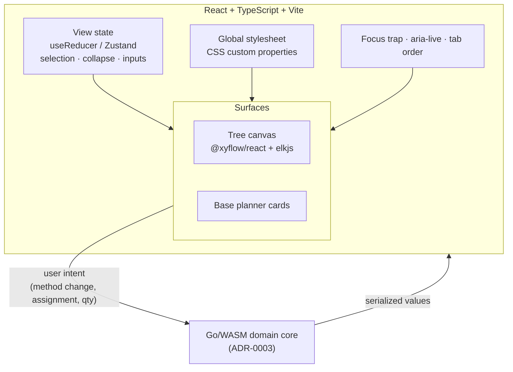

# ADR-0004: React with TypeScript and Vite for the view layer

## Context and Problem Statement

ADR-0003 moved the dependency graph, rollup engine, power math, save parsing, and plan serialization into a Go/WASM domain core. That leaves the view layer with a narrower job than a typical SPA: render the design's markup from its tokens, wire a flow library and elkjs for the tree canvas, hold local UI state, and carry the accessibility behavior the handoffs specify.

Which framework does that job?

## Decision Drivers

* **Concentrate the learning budget.** Go is already the new thing (ADR-0001, ADR-0002, ADR-0003). Taking on an unfamiliar view framework at the same time means two simultaneous unknowns.
* **The flow library is the hard dependency.** `docs/design/tree-canvas/handoff.md` names React Flow (`@xyflow/react`) plus elkjs explicitly.
* **The design mandates custom CSS.** Every color, spacing step, and control size is measured and final, with strict border rules. Component libraries are largely unusable here, so ecosystem breadth matters less than it usually would.
* **View state is small.** Domain state lives in Go. The view holds selection, section collapse, form inputs, and focus — not the plan.
* **Accessibility is specified in detail.** Focus trapping in the method popover with return-to-node, `aria-live="polite"` on every recompute, nodes as buttons in topological tab order.

## Considered Options

* **A. React + TypeScript + Vite**
* **B. SvelteKit + Svelte 5**
* **C. Solid + SolidStart**

## Decision Outcome

Chosen option: **A, React with TypeScript and Vite**, because the maintainer already knows it, which is the whole point — it concentrates the learning budget on the Go domain core where the interesting work now lives.

This is a deliberate trade and worth recording honestly: **on isolated merit the recommendation was Svelte 5.** Svelte Flow is first-party, so the hardest component carried no compromise; fine-grained reactivity suits the recompute-heavy interactions; and the static adapter matched the no-backend deployment. Those advantages are real and are being knowingly declined. What outweighs them is that ADR-0003 makes the Go core the substantial and unfamiliar part of this project, and adding a second unfamiliar thing alongside it raises the risk of finishing neither well.

The performance argument for Svelte was investigated and **does not apply at this scale**. Measured package sizes put elkjs (7.8 MB unpacked) and the forthcoming Go WASM module far ahead of any framework delta; React and ReactDOM at roughly 40–45 KB gzipped versus Svelte's smaller runtime is a one-time, cache-friendly difference swamped by both. At 34 canvas nodes and three base cards, React's re-render model is comfortably fast with ordinary memoization. The real load-time levers — lazy-loading elkjs and lazy-loading the WASM module — are framework-independent.

**Styling: plain CSS custom properties with scoped component styles.** The theme handoff specifies recreating tokens as CSS custom properties in a global stylesheet. A utility framework would fight that token discipline and the strict border rules, and buys nothing when no component library is in use.

**No Redux for now.** With domain state in the Go core, the view holds far less than a typical React app, and Redux's actions/reducers/middleware machinery would be boilerplate around a small amount of UI state. Start with `useReducer` plus context, or Zustand if that proves thin. See the open question below — this is deferred, not settled.

### Consequences

* Good, because the maintainer is immediately productive in the view layer and attention goes to the Go core.
* Good, because React Flow is the reference implementation the tree-canvas handoff was written against, so the guidance maps directly.
* Good, because React's ecosystem depth is a genuine advantage for the accessibility work — focus trapping and live-region patterns are well-trodden, and the handoffs demand real rigor there.
* Good, because ADR-0003 makes this decision cheap to revisit: a framework change costs the views, not the domain.
* Bad, because it teaches the maintainer nothing new on the frontend, which was an original stated interest.
* Bad, because React's re-render model is the weaker fit for the rollup recompute pattern, requiring memoization discipline on the `deviceQty` path that Svelte would have given structurally. Not a performance problem at this scale, but ongoing authoring attention.
* Neutral, because bundle size is slightly larger than Svelte's, and immaterial next to elkjs and the WASM module.

### Confirmation

* **Tokens are CSS custom properties in a global stylesheet**, with no hardcoded hex values in component styles. Verified by grep for `#` literals outside the token file.
* **Border discipline holds**: 3px identity frames only; hover is `filter: brightness(1.12)`, focus is an outboard outline, selection is an inboard ring via an overlay element. No `inset box-shadow` anywhere — it paints under positioned children.
* **The view recomputes no domain values.** Any arithmetic on quantities, power, or counts in the React tree is a defect; those come from the Go core.
* **Accessibility is tested, not assumed**: focus returns to the invoking node on popover close, and every recompute produces an `aria-live` announcement.

## Pros and Cons of the Options

### A. React + TypeScript + Vite (chosen)

* Good, because the maintainer knows it, so the learning budget goes entirely to Go.
* Good, because React Flow is exactly what the handoff specifies, making its guidance directly applicable.
* Good, because the ecosystem is deepest where this project actually needs help — accessibility primitives, focus management.
* Good, because Vite's build is fast and its WASM handling is well-supported.
* Bad, because it teaches nothing new on the frontend.
* Bad, because correct fine-grained updates require memoization discipline rather than coming for free.

### B. SvelteKit + Svelte 5

* Good, because runes are a genuinely different reactivity model and would be real learning.
* Good, because Svelte Flow (`@xyflow/svelte`) is first-party from the xyflow team, so the hardest component carries no compromise.
* Good, because fine-grained reactivity fits the recompute pattern structurally.
* Good, because the static adapter matches the no-backend deployment model exactly.
* Bad, because it is a second unfamiliar thing alongside the Go core, and the Go core is where this project's difficulty is now concentrated.
* Neutral, because the smaller ecosystem costs little here — the design requires custom CSS regardless.

### C. Solid + SolidStart

* Good, because signals give fine-grained updates, and JSX means React knowledge partly transfers.
* Good, because performance is excellent for fine-grained update patterns.
* Bad, because there is no first-party flow library — only community Solid ports of varying maturity, on the single hardest component in the app. That is the wrong place to accept ecosystem risk.
* Bad, because it carries much of Svelte's unfamiliarity cost without Svelte's first-party flow support.

## Architecture Diagram

## More Information

**Open question — client state management.** The maintainer's stated preference was "React/Redux". This ADR records React as decided and deliberately leaves the state library open, because ADR-0003 materially changed what the view holds: with the plan, the graph, and all derived quantities living in Go, React is left with selection, section collapse, form inputs, and focus.

The recommendation is to start without Redux — `useReducer` plus context, or Zustand — and adopt Redux Toolkit only if a concrete need appears. There is one genuine argument in Redux's favor worth naming rather than dismissing: **its devtools time-travel is useful precisely when debugging a boundary you cannot step through**, and the JS/WASM boundary is exactly that. If the boundary proves hard to reason about during the spike, that alone may justify the machinery. Settle this after the first working slice, not before.

**Load-time work, deferred but noted.** Lazy-load elkjs (only needed when the tree canvas mounts, and it can run in a web worker) and lazy-load the WASM module (only needed on save import and first plan computation). Both matter far more than framework choice and neither needs deciding now.

**Reversibility.** ADR-0003's package boundary is what makes this decision low-stakes. If React proves a poor fit, the domain package is untouched and only the views are rewritten. That was a deliberate design goal, and it is the reason this ADR could be settled on familiarity rather than on merit-in-isolation without much regret.

**References.**

* ADR-0003 — the domain core that narrows this decision's scope
* `docs/design/tree-canvas/handoff.md` — React Flow + elkjs recommendation, keyboard and a11y requirements
* `docs/design/theme/handoff.md` — tokens as CSS custom properties, border discipline, control scale
* `docs/design/base-planner/handoff.md` — card anatomy and the interactions the view wires up
