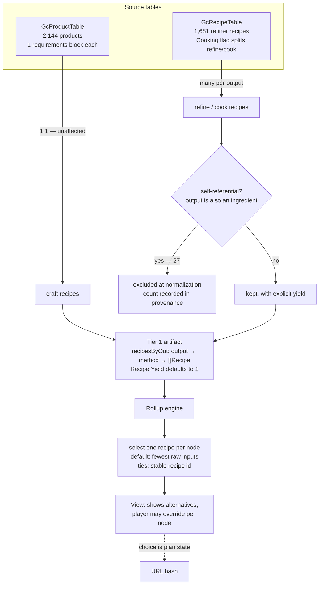

# ADR-0005: Multiple recipes per output, with explicit yields and player selection

## Context and Problem Statement

The Tier 1 artifact models a recipe as one output, one method, and a list of inputs — `recipesByOut` is `map[string]map[Method]Recipe`, and the type's own comment reads *"Recipe produces one unit of Output by Method from Inputs."* That shape was designed against `stasis-device.tier1.json`, a hand-authored 34-node crafting tree where it holds exactly.

Building the Tier 1 normalizer (SPEC-0004) against the real tables broke it three ways at once. The game's refining and cooking data carries many recipes for the same item, produces varying quantities, and includes recipes that consume the thing they produce.

How should the artifact represent recipe data that does not fit a one-recipe-per-output model, and how should the engine choose between alternatives once it does?

## Decision Drivers

* **The data is not an edge case.** 261 of 403 refiner output/method pairs have more than one recipe. A model that cannot express this cannot express most of refining.
* **Silent loss is the failure mode this project keeps hitting.** Picking one recipe and dropping 25 produces an artifact that loads cleanly and quietly misinforms — the same shape as the PSARC label and the Tier 2 "confirmed absent" finding.
* **The planner's purpose is choosing.** A build planner whose answer to "how do I make Sodium Nitrate?" is one arbitrary route is not doing the job the tree canvas exists to do.
* **Exactness is already a commitment.** SPEC-0001 went to real lengths for exact integer and rational arithmetic; a missing output quantity silently multiplies every refining total by the wrong factor.
* **The view layer renders, it does not decide.** ADR-0004 keeps computation in the domain core, so any selection rule belongs in the engine with the view merely surfacing it.

## Considered Options

* **A. Keep one recipe per output/method** — normalizer picks one and discards the rest
* **B. Multiple recipes per output/method, explicit yields, engine selects with a player override** (chosen)
* **C. Model refining as a separate structure outside the recipe graph**
* **D. Scope Tier 1 to crafting only** and omit refining and cooking

## Decision Outcome

Chosen option: **B**, because it is the only option that represents what the game actually contains, and because the alternative that ships soonest (A) is the one that produces confidently wrong numbers.

Three changes follow:

**Recipes become a list per output and method.** `recipesByOut` becomes `map[string]map[Method][]Recipe`. SPEC-0001's REQ "Method Resolution" currently says a node MUST resolve to exactly one *method*; with alternatives, resolving the method no longer resolves the recipe, so the requirement extends to resolving exactly one *recipe*, and the engine's report of legal options extends from methods to recipes within a method.

**Recipes gain an output quantity.** `Recipe` acquires a yield field defaulting to 1, so `1x Crystal Sulphide -> 50x Sodium Nitrate` is representable. Without it every refining total is wrong by the yield factor, and the exactness SPEC-0001 protects is spent on the wrong number.

**Selection is a deterministic default the player can override.** The engine picks the recipe whose expansion resolves to the smallest total of raw inputs, ties broken by a stable recipe identifier so the choice is reproducible. The view surfaces the alternatives per node and the player may pick another, exactly as they already may pick a method. Selection is per-node plan state, so it belongs in the URL hash alongside the method.

**Self-referential recipes are excluded at normalization**, and the count is recorded in the artifact's provenance. A recipe consuming its own output — `1x Phosphorus + 1x Solanium -> 2x Solanium` — is a doubling strategy, not a production path; expanding it is a cycle. There are 27. Dropping them at the normalizer keeps the engine's cycle detection a guard against genuine bugs rather than a routine data condition, and recording the count means a change in it is visible rather than silent.

### Consequences

* Good, because the artifact can represent refining and cooking at all, which options A and D cannot.
* Good, because "how else could I make this?" becomes answerable, which is close to the planner's whole purpose.
* Good, because an explicit yield field makes a class of silent arithmetic error impossible rather than merely unlikely.
* Good, because excluding self-referential recipes at the normalizer keeps a data condition out of the engine's error paths.
* Bad, because plan state grows: a per-node recipe choice joins the per-node method choice in the URL hash, and the hash is already a size-sensitive surface.
* Bad, because the default selection rule needs the raw-material total of each candidate, which means resolving alternatives before choosing between them — more work per node than picking the only option.
* Bad, because SPEC-0001 and SPEC-0004 both need amending, and SPEC-0001's engine is already merged.
* Neutral, because crafting is unaffected: all 2,144 products carry exactly one requirements block, so the 1:1 assumption was always true there and remains so.

### Confirmation

The decision is implemented when all of the following hold against a generated artifact from a real install:

* `CATALYST2` (Sodium Nitrate) carries 26 refine recipes, including `1x Crystal Sulphide -> 50x Sodium Nitrate` with its yield intact
* No recipe in the artifact names its own output as an ingredient, and the provenance records 27 excluded
* The engine, asked for Sodium Nitrate's options, reports all 26 and expands the default deterministically across repeated runs
* ADR-0001's acceptance test still passes: `ULTRAPROD2` resolves to 36 distinct nodes with leaf totals of 500 Sulphurine, 500 Nitrogen, 500 Radon and 300 Condensed Carbon

## Pros and Cons of the Options

### A. Keep one recipe per output/method

The normalizer picks a single recipe — first by ID, or by some heuristic — and discards the alternatives.

* Good, because no schema change, no engine change, and SPEC-0004 ships immediately.
* Good, because the artifact stays small.
* Bad, because it discards 261 of 403 output/method pairs' alternatives — most of the refining graph.
* Bad, because the discarded data is invisible downstream: the planner reports one route as though it were the only one.
* Bad, because it does not fix yields, so totals are wrong by up to 250× regardless of which recipe is kept.
* Bad, because it is precisely the "plausible-looking artifact" failure this project has already recorded three times.

### B. Multiple recipes per output/method, explicit yields, engine selects with a player override (chosen)

* Good, because it represents the data as it is rather than as the schema assumed.
* Good, because it makes the yield explicit and therefore checkable.
* Good, because the selection surface already exists conceptually — the method picker — so the UI grows an option rather than a concept.
* Bad, because plan state and URL hash size both grow.
* Bad, because it requires amending a merged spec and its implementation.

### C. Model refining as a separate structure outside the recipe graph

Keep `Recipe` 1:1 for crafting and add a parallel refining structure the engine consults separately.

* Good, because the merged rollup engine needs no change to its existing paths.
* Neutral, because it acknowledges refining genuinely differs from crafting.
* Bad, because refining sits *inside* crafting trees — the Stasis Device needs `REACTION1/2/3` — so the two structures would have to interleave during expansion anyway.
* Bad, because it duplicates traversal, quantity propagation and provenance across two shapes, which is where drift starts.

### D. Scope Tier 1 to crafting only

* Good, because 2,144 products are 1:1 and would ship today with no schema change.
* Bad, because the Stasis Device tree contains refine steps, so ADR-0001's own acceptance criterion becomes unreachable.
* Bad, because the tree canvas could never show a refine branch, which the design handoffs specify.
* Bad, because it defers the problem without reducing it.

## Architecture Diagram

## More Information

**How this was found, and why it was not found earlier.** SPEC-0004's normalizer parsed the real tables successfully — 2,237 items, 2,159 recipes, graph closed — and then `Tier1.Validate` refused the result with `duplicate refine recipe for "PLANT_HOT"`. The schema was never wrong for the data it was designed against; `stasis-device.tier1.json` is a hand-authored crafting tree, and crafting genuinely is 1:1. The assumption only fails where hand-authored fixtures never reached.

**The measurements**, taken from an NMS 5.97 install decompiled with MBINCompiler 6.45.0.1:

| Property | Measurement |
|---|---|
| Refiner recipes total | 1,681 |
| Output/method pairs with more than one recipe | 261 of 403 |
| Largest number of recipes for one output | 61 (`FOOD_R_EYESTEW`, cook) |
| Recipes whose output quantity is not 1 | 156, up to 250 |
| Self-referential recipes | 27 |
| Products with more than one crafting recipe | 0 of 2,144 |

Sodium Nitrate is the readable example — 26 refine recipes including `2x Sodium -> 1x Sodium Nitrate` and `1x Crystal Sulphide -> 50x Sodium Nitrate`. Both facts that break the schema appear in those two lines: two routes to one item, and a yield of 50.

**Downstream amendments this decision requires.**

* SPEC-0001 REQ "Method Resolution" — extend from resolving one method to resolving one recipe; extend the legal-options report from methods to recipes within a method; state the default selection rule and its tie-break.
* SPEC-0001 — the exactness requirements now apply to yield as well as to input quantities.
* SPEC-0004 REQ "Recipe Graph Construction" — recipes are a list per output and method; yields are read from the source; self-referential recipes are excluded and counted.
* SPEC-0002 (WASM boundary) — the per-node recipe choice crosses the boundary alongside the method, and the encoding requirement applies to yield.

**On the plan-state cost.** ADR-0002 and the design handoffs put plan state in the URL hash. Adding a per-node recipe choice grows it, and the hash is already size-sensitive. The mitigation is that the default is deterministic: a node using its default recipe encodes nothing, so only deliberate overrides cost bytes.

**Related.** ADR-0001 (two-tier ingestion — this extends its Tier 1 half), SPEC-0001 (rollup engine), SPEC-0004 (Tier 1 normalizer), SPEC-0006 (tree canvas — the surface that carries out this decision's instruction to the view, offering a node's recipe alternatives rather than presenting one route as though it were the only one).
