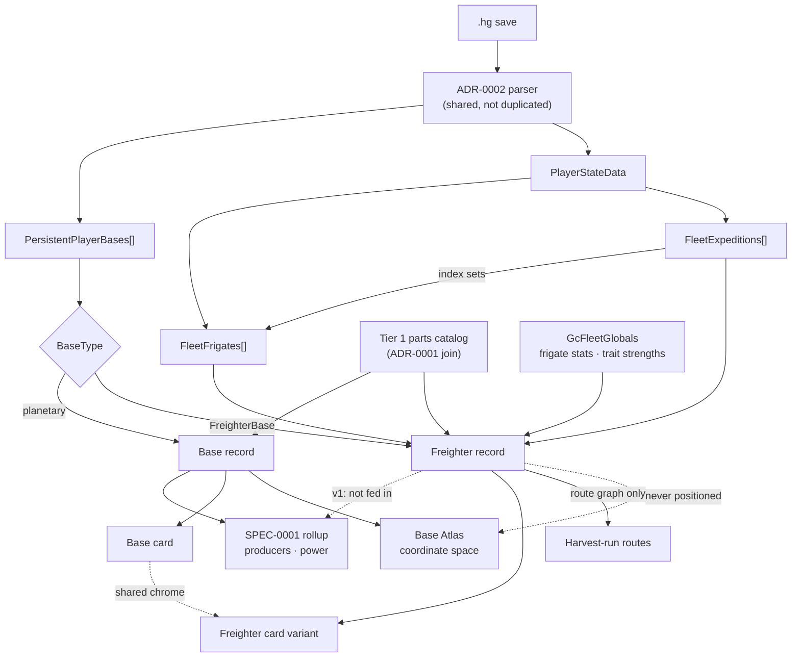

# ADR-0006: Freighter as its own surface, not a base card with sections hidden

## Context and Problem Statement

ADR-0002 imports `PersistentPlayerBases` and renders every entry as a base card. Freighter bases share that record's shape — same `Objects[]` part list, same `Name` — but almost nothing else on the card applies. There is no power grid to budget. `GalacticAddress` and `Position` are stale the moment the ship warps. And the things a player actually plans a freighter around — fleet command rooms, upgrade-room adjacency bonuses, storage rooms, the frigate roster, active expeditions — do not live in the base record at all; they sit elsewhere in `PlayerStateData`.

Rendering that through the planetary base card would mean a card whose largest section is inapplicable and whose location is wrong. So: is the freighter a base card with parts suppressed, or its own surface? And what exactly comes in from the save, what must Tier 1 additionally extract, does it participate in plan rollup, and how does a base with no fixed location appear on a map?

## Decision Drivers

* **Reuse the existing parser and join.** ADR-0002's decoder and ADR-0001's `ObjectID` → parts-catalog join must serve this too; a second parsing path would be a second thing to keep correct.
* **KISS.** One card variant before a whole view. Fleet content can earn its own surface later by growing, not by anticipation.
* **ADR-0002's rules carry over unchanged.** Read-only, client-side, no network on the import path, no save committed.
* **Console players still need a manual path.** Import is a convenience on PC and Mac, never a prerequisite.
* **Runtime-computed values are computed, not read.** Room bonuses and hyperdrive range are derived in-game from what is installed; the planner derives them the same way from counts plus Tier 1 constants rather than looking for a stored total.
* **ADR-0003 constrains where the logic lives.** All freighter modelling belongs in the Go domain package, with no `syscall/js`; ADR-0004's view renders what the domain returns and computes nothing itself.

## Considered Options

* **A. Suppress POWER on the existing base card and add a FLEET section**
* **B. A dedicated freighter card variant sharing header, notes, and screenshot with the base card**
* **C. A separate Fleet view with its own route**
* **D. Out of scope until planetary base import ships**

## Decision Outcome

Chosen option: **B, a dedicated freighter card variant**, because it shares the chrome that genuinely is shared and diverges where the domain genuinely differs — without spending a whole view on content that does not yet exist.

Option A is the thing this ADR exists to reject: hiding POWER leaves it conceptually present, and a card defined by what it suppresses accumulates conditionals at every future change. Option C is more surface than v1 earns. It remains the natural evolution once fleet content grows, and choosing B does not foreclose it — the domain type is the same either way.

### (a) Save fields in scope

**In scope for v1:**

| Field | Key | Taken for |
|---|---|---|
| `PersistentPlayerBases[]` where `BaseType == FreighterBase` | `F?0` / `peI` / `gNy` | Identity and `Objects[]` room list |
| `Objects[].ObjectID` + `Position`/`Up`/`At` | `@ZJ` / `r<7` / `wMC` / `wJ0` / `aNu` | Room counts, and adjacency from geometry |
| `PlayerStateData.FleetFrigates[]` | `6f=` / `;Du` | Roster: class, stats, traits, damage, custom name |
| `PlayerStateData.FleetExpeditions[]` | `kw:` | Category, duration, start/pause time, frigate index sets |

**Explicitly out of v1:** `FreighterInventory` (`8ZP`), `FreighterInventory_Cargo` (`FdP`), and `FreighterInventory_TechOnly` (`0wS`) — storage defers on exactly ADR-0002's stage-3 reasoning, which remains unverified. `FreighterLayout` (`>Yh`) and `FreighterCargoLayout` (`pQJ`) are deferred pending the spike: `Objects[]` already carries positions, so they may be redundant for adjacency. Cosmetics are out; note that **`FreighterColours` does not exist under that name** in the mapping table — only generic `Colour`/`Colours` keys — so the field list this decision was drafted from needed one correction.

**A parsing constraint worth recording:** frigate condition has two representations. `GcFleetFrigateSaveData` carries `DamageTaken` and `RepairsMade` per frigate, while `GcFleetExpeditionSaveData` carries `ActiveFrigateIndices`, `DamagedFrigateIndices`, `DestroyedFrigateIndices`, and `AllFrigateIndices` — **index sets into the roster, held on the expedition, not on the frigate**. Resolving fleet state means joining indices against `FleetFrigates[]`, and the parser MUST treat an out-of-range index as a data error rather than a silent drop.

### (b) Tier 1 additions, with the search boundary stated

**Confirmed present:**

* **Frigate stat ranges and trait strengths** — `GcFleetGlobals` carries `FrigateInitialStats` (`GcFrigateStatsByClass`), `FrigateTraitStrengths` (`GcFrigateTraitStrengthByType`), and `PassiveIncomes` (`GcPassiveFrigateIncomeArray`).
* **Freighter room catalog** — from the base-building parts table, joined by `ObjectID` exactly as ADR-0002 stage 2 does for planetary parts. No new mechanism; the same join, over more rows.

**Boundary stated for what was not found.** The drafting assumption was that room bonus and adjacency rules live in the freighter tables. They do not:

* `GcFreighterBaseRoom` holds only `Palette` and `Name` — a cosmetic record, not a catalog.
* `GcFreighterBaseGlobals` is entirely NPC spawn logic — spawn priorities, capacities, nav connectivity, `MaxTotalNPCCount`. No bonus or adjacency field of any kind.

That rules out both freighter-specific homes. The remaining candidates, in order of likelihood: **`GcTechnology.StatBonuses`** — upgrade rooms are technology installs, and the game already models upgrade adjacency through `GcStatsBonus` elsewhere, which makes this the strongest lead — then the base-building parts table. **Expedition duration values** are within boundary but unconfirmed: `GcExpeditionDuration` exists as a type on the save record, and its values are expected in `GcFleetGlobals` but were not located in this pass.

If adjacency rules are absent from all of the above, they become **Tier 2 curated constants** under ADR-0001's two-tier model, carrying `source` and `verified` — not a new category. That fallback is a heavier cost than it was when this decision was first drafted: the 2026-08-18 confirmation shrank Tier 2 to five entries, two of which are planner policy rather than missing data, so adding a category of curated game data cuts against the direction that tier is moving.

**A caveat on the boundary above, stated rather than buried.** The ruled-out conclusion rests on reading libMBIN's struct *definitions* — the same technique ADR-0001's original Tier 2 finding used, and that technique has since been shown insufficient. Generator and consumer rates turned out to live in `GcBaseLinkGridData`, and class scaling in `REGIONHOTSPOTSTABLE`; neither surfaced in a definition-name search. Treat "not in `GcFreighterBaseGlobals` or `GcFreighterBaseRoom`" as *those two files do not hold it*, which is all that was checked, and not as evidence about tables that were not read.

### (c) Rollup participation: informational in v1

The freighter is a first-class domain type but is **not** fed into SPEC-0001's stage 2 or stage 3.

Two reasons, and the second is the load-bearing one. There is no power grid, so stage 3 is inapplicable by construction. And expeditions are probabilistic, time-based yield — `SpeedMultiplier`, event counts, success and failure tallies — which is structurally unlike the deterministic producer counts stage 2 computes. Folding that into the rollup engine would put a stochastic model inside the thing SPEC-0001 REQ "Determinism" requires to be byte-identical across runs.

Refiners and storage rooms aboard are acknowledged as legitimate future producers. The domain type MUST be shaped so that participation can be added without re-parsing — this is a scope decision, not a modelling one.

### (d) Base Atlas: present in the route graph, absent from the coordinate space

The freighter is rendered as a dedicated orbital berth **outside** the district grid, and MUST NOT be given a map position derived from `GalacticAddress` or `Position`.

It does appear in harvest-run routes, because the base teleporter network genuinely reaches it — that connection is real even though the location is not. This splits cleanly: the freighter participates in the route graph as a node, and is excluded from the spatial layout that districts and building sprites occupy.

### Consequences

* Good, because the card stops lying — no suppressed power section, no stale coordinates presented as a location.
* Good, because parsing and the catalog join are reused rather than duplicated, per the primary driver.
* Good, because deferring rollup keeps the stochastic expedition model out of a deterministic engine.
* Good, because the route-graph-but-not-coordinate-space split is honest about what a freighter is and still useful for planning.
* Bad, because a second card variant is a second thing to keep visually consistent as the base card evolves, and the 8-bit restyle applies to both.
* Bad, because the adjacency rules remain unlocated, so upgrade-room bonuses may ship as curated constants rather than extracted data — a known accuracy risk carried openly.
* Bad, because informational-only means the freighter's refiners contribute nothing to a plan in v1, which some players will reasonably expect.
* Neutral, because the manual path must now cover freighter fields too for console players, widening the manual-entry surface.

### Confirmation

* **A scrubbed synthetic fixture** containing one `FreighterBase` entry plus `FleetFrigates` and `FleetExpeditions` parses to known room counts, a known frigate count, and known expedition state. Built the same way as ADR-0002's base fixture: synthesized from a real save on the Linux box, identifiers scrubbed, never the save itself.
* **The freighter card exposes no location** derived from `GalacticAddress` or `Position` — verified by grep, since absence is the requirement.
* **The import path still issues no network request**, asserted by the same test ADR-0002 requires.
* **Frigate indices resolve** — an index outside the roster's range produces a named error, not a silently shortened list.
* **All freighter logic sits in the domain package**, which still imports no `syscall/js` (ADR-0003), and no freighter arithmetic appears in the React tree (ADR-0004).

## Pros and Cons of the Options

### A. Suppress POWER and add a FLEET section to the base card

* Good, because it is the smallest diff and needs no new component.
* Good, because everything stays in one code path, so styling drift is impossible.
* Bad, because the card's identity becomes "the base card, except" — every future base-card change needs a freighter conditional.
* Bad, because a suppressed section is still conceptually present; the card is defined by what it hides.
* Bad, because it does not fix the location problem — stale coordinates remain on a card that has an environment strip built to show them.

### B. Dedicated freighter card variant (chosen)

* Good, because shared chrome — header, notes, screenshot slot — stays shared, while power, environment, and location simply do not exist rather than being hidden.
* Good, because it is one component, not a route and a view, which matches the KISS driver.
* Good, because it leaves option C available: the domain type does not change if a Fleet view arrives later.
* Bad, because two card variants must stay visually consistent, including through the 8-bit restyle.
* Neutral, because some duplication between variants is likely before the shared parts settle.

### C. Separate Fleet view with its own route

* Good, because fleet content — roster, expeditions, trait strengths — could grow into a genuinely rich surface.
* Good, because it separates concerns most cleanly of any option.
* Bad, because it is a whole surface, its own navigation, and its own layout for content that is currently a room count, a roster, and a timer.
* Bad, because it front-loads work before anyone knows which fleet content players actually plan around.

### D. Out of scope until base import ships

* Good, because it is the least work now and keeps ADR-0002's scope tight.
* Good, because the extraction spike may change what is feasible, making any decision now provisional.
* Bad, because the freighter is not a niche feature — a player with a freighter has one from early on, and the base import would render it as a broken card in the meantime.
* Bad, because deferring does not avoid the decision; it ships the wrong default while waiting.

## Architecture Diagram

## More Information

**Evidence base.** The save-field keys were resolved against `mapping.json` from MBINCompiler `libMBIN 6.45.0.1` (1,424 mappings); the struct shapes come from libMBIN's definitions — `GcFleetFrigateSaveData`, `GcFleetExpeditionSaveData`, `GcFleetGlobals`, `GcFreighterBaseRoom`, `GcFreighterBaseGlobals`. As with ADR-0001, these give field *names and types*, not values, so a field's presence proves the shape and not the contents.

**Two corrections to the framing this decision was drafted from**, both recorded above rather than silently applied: `FreighterColours` does not exist under that name, and the freighter-specific globals demonstrably do not hold room bonus or adjacency rules.

**Relationship to the extraction pipeline.** The extraction spike has already run — ADR-0001 and ADR-0002 are both `accepted`, and the pipeline now produces a generated artifact including the base parts catalog, which is what the room-catalog join in (b) consumes. So (b) is not blocked on a trip; it is a question to put to output that already exists. The adjacency rules are the one piece still to locate, and reading the technology table for `StatBonuses` is a desk exercise against the current decompiled set rather than new fieldwork.

**Open questions, deliberately not answered here:**

1. **Exact `ObjectID` values for 4.x+ modular rooms versus legacy corridors.** Freighter interiors changed shape across game versions; whether both generations appear in one save, and whether they share a catalog, is unknown.
2. **Where adjacency bonus rules live.** Ruled out above for the two freighter-specific homes; `GcTechnology.StatBonuses` is the leading candidate but unconfirmed.
3. **Whether frigate cargo is worth importing.** `GcCostFrigateCargo` exists as a type, and expedition rewards are a real player concern — but it pulls toward the yield modelling (c) deliberately defers.
4. **Whether `FreighterLayout` is authoritative for adjacency** or redundant with `Objects[]` geometry.
5. **How the manual path represents a freighter** for console players, given the card variant has different fields from a base.

**References.**

* ADR-0002 — the parser, the privacy rules, and the `ObjectID` join this extends
* ADR-0001 — Tier 1 additions and the two-tier model adjacency constants would fall back to
* ADR-0003 — all freighter logic in the domain package, no `syscall/js`
* ADR-0004 — the view renders what the domain returns
* `docs/design/bases-map/handoff.md` — the Atlas coordinate space a freighter is excluded from
* `docs/design/base-planner/handoff.md` — the base card whose chrome the variant shares
