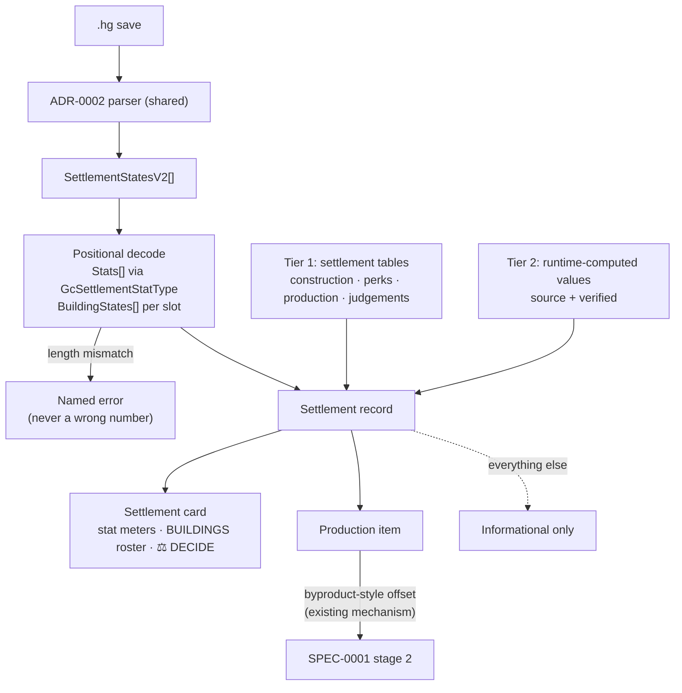

# ADR-0007: Settlement as its own surface, with production modelled as demand offset

## Context and Problem Statement

Settlements are not bases. They live in `PlayerStateData.SettlementStatesV2[]`, have no free-form `Objects[]` list, and are judged on stats rather than assembled from parts: population, happiness, production, upkeep, sentinel alert, debt. They have a fixed set of building slots with per-slot state, a perk list, a pending-judgement flag, and a set of timers the game surfaces poorly — next judgement, last upgrade, last alert change, upkeep debt check.

Identity and location work like a base, so the temptation is to reuse the base card. But the card's largest section is a power budget a settlement does not have, and its BUILD TODO means "things to construct" where a settlement's building list means "what exists, at what level."

So: own surface or base card variant, what comes in from the save, what must Tier 1 extract, and how — if at all — does a settlement touch the plan?

## Decision Drivers

* **Reuse the ADR-0002 parser and ADR-0001 join** rather than adding a second parsing path.
* **KISS.** Minimum plan coupling in v1; the card can be rich while the engine coupling stays thin.
* **ADR-0002's rules carry over unchanged** — read-only, client-side, no network on import, no save committed.
* **Console players still need a manual path**, so import stays a convenience.
* **The design already has the meter.** The chunked segment meters built for GEN/DRAW take stat values without new visual vocabulary.
* **ADR-0003 and ADR-0004 constrain placement** — all settlement logic in the Go domain package, no `syscall/js`; the view renders what the domain returns.
* **ADR-0001's lesson applies to any "not found" claim** made here.

## Considered Options

* **A. Base card with POWER replaced by stat meters**
* **B. Dedicated settlement card sharing header, environment strip, and notes**
* **C. Atlas point with a dossier, no card**
* **D. Defer**

## Decision Outcome

Chosen option: **B, a dedicated settlement card**, consistent with the freighter decision and for the same reason: a card defined by what it substitutes accumulates a conditional at every future base-card change.

### The finding that reshapes (a): stats are positional, not named

Seven field names in the framing — `Happiness`, `Production`, `ProductionEnabled`, `Upgrades`, `Maintenance`, `Debt`, `Sentinels` — **do not exist in the mapping table**. They are not renamed; they are not fields at all.

`GcSettlementState` carries `int[] Stats`, indexed by `GcSettlementStatType`:

```
MaxPopulation · Happiness · Production · Upkeep · Sentinels · Debt · Alert · BugAttack
```

`BuildingStates` is likewise `int[]`, positional per slot. So the import surface is **two positional arrays plus named scalars**, not a field list. `Maintenance` is spelled `Upkeep`. `Upgrades` is not a field — the save carries `LastBuildingUpgradesTimestamps`, `NextBuildingUpgradeIndex`, `NextBuildingUpgradeClass`, and `NextBuildingUpgradeSeedValue`.

One subtlety that would be easy to get backwards: **`Population` is a named `ushort` field, while `MaxPopulation` is a stat index.** They are different values in different places.

This makes a requirement, not just a note. **The parser MUST record the `GcSettlementStatType` ordering it decoded against, and MUST fail loudly when the array length disagrees.** A game update that inserts one stat silently shifts every value after it, and every number on the card would be wrong while remaining plausible. This is the settlement analogue of ADR-0001's fixture version pin, and it is the single most important thing in this decision.

**In scope for v1:** `Name`, `UniverseAddress` (a packed `ulong`, not a struct), `Position`, `Owner`, `SeedValue`, `Race`, `Population`, `Stats[]` decoded through the enum, `BuildingStates[]`, `ProductionState[]` (`GcSettlementProductionSlotData`), `Perks[]`, `PendingCustomJudgementID` with `PendingJudgementType`, and the timer set.

**Out of v1:** `DbTimestamp` / `DbVersion` / `DbResourceId` (backend sync bookkeeping, not player-facing), `MiniMissionSeed` / `MiniMissionStartTime`, `LastWeaponRefreshTime`, `IsReported`, `UniqueId`.

### (b) Tier 1 additions — present, unlike the freighter case

Named tables exist for every category the framing asked about:

| Need | Table |
|---|---|
| Building catalogue and tiers | `GcSettlementConstructionLevel`, `GcSettlementBuildingCost`, `GcSettlementBuildingCostData` |
| Perk effects | `GcSettlementPerksTable`, `GcSettlementPerkData`, `GcSettlementPerkUsefulData` |
| Production | `GcSettlementProductionElement`, `GcSettlementProductionElementRequirement`, `GcSettlementProductionSlotData` |
| Judgements | `GcSettlementJudgementData`, `GcSettlementJudgementType`, `GcSettlementCustomJudgement`, `GcSettlementJudgementOption` |
| Stat ranges | `GcSettlementStatStrengthRanges`, `GcSettlementStatValueRange`, `GcSettlementStatStrengthData` |
| Globals | `GcSettlementGlobals` |

**Search boundary, stated per the ADR-0001 lesson.** This is a survey of libMBIN's struct *definitions* — names and types only. It establishes that these tables exist and what shape they have. It does **not** establish that the values the planner needs are inside them rather than computed at runtime, and definition-name search has already been shown insufficient once, when generator rates turned out to live in `GcBaseLinkGridData` and class scaling in `REGIONHOTSPOTSTABLE`. Treat this as *"these tables exist and are the right places to look first."*

Anything that turns out to be runtime-computed becomes a Tier 2 curated entry with `source` and `verified`, carrying the `unverified` badge.

### (c) Production is a demand offset, not a new method

The framing proposed a producer row under a new or existing method. **Neither** — and this is worth being precise about, because the mismatch is structural.

SPEC-0001's stage 2 is **demand-driven**: a target decomposes into leaves, leaves become producers you must build. A settlement produces on its own schedule whether or not the plan wants the item. That is **supply**, and pushing supply through a demand-driven engine as a "method" would misrepresent it.

SPEC-0001 already has exactly the right mechanism: **byproduct offset** — an item whose demand is satisfied without construction, contributing no producer count and no power draw. A settlement's output is the same shape. So a settlement's production item **offsets demand for that item**, with ready time derived from the production timestamp, and requires no new method in the vocabulary.

Everything else on the card is informational. This keeps the only engine coupling to a mechanism that already exists and is already tested.

### (d) Buildings render as a roster, not a BUILD TODO

The base card's BUILD TODO is **computed** — things the plan says you must construct, checkable as you build them. A settlement's `BuildingStates` is **observed** — what exists, at what level, decided by the game.

Rendering observed state in a component whose semantics are "things to construct" is a category error, and a checkbox the player cannot meaningfully tick is worse than no checkbox. Settlements get a **BUILDINGS roster** with per-slot state, visually distinct from BUILD TODO and **not checkable**.

### (e) One new save-derived tag, visually distinct

Alongside the authored ⚠ RESTOCK / ↻ REBUILD / ◈ VISIT tags, exactly one save-derived tag is added: **⚖ DECIDE**, when `PendingCustomJudgementID` or `PendingJudgementType` is set. Upkeep debt maps onto the existing ⚠ rather than earning its own.

Save-derived tags MUST be visually distinguishable from user-authored ones. One is an observation the import can overwrite on the next import; the other is the player's own note and MUST NOT be clobbered.

### Consequences

* Good, because the card stops substituting — no power meter standing in for stats, no checkbox on state the player cannot change.
* Good, because the only engine coupling reuses byproduct offset, a mechanism SPEC-0001 already defines and tests.
* Good, because the positional-array requirement turns a silent-corruption failure mode into a loud one.
* Good, because settlement tables are richly named, so (b) is a reading exercise rather than a hunt.
* Bad, because a third card variant is a third thing to keep consistent through the 8-bit restyle — base, freighter, settlement.
* Bad, because positional decoding is inherently version-fragile; the guard converts silence into failure but does not remove the coupling.
* Bad, because the manual path must now cover settlement stats too, widening manual entry for console players again.
* Neutral, because informational-heavy cards may set an expectation of deeper planning integration that v1 deliberately does not deliver.

### Confirmation

* **A synthetic fixture** with one `SettlementStatesV2` entry parses to known name, stats, production item, building slot states, and pending-judgement flag. Scrubbed and synthesized per ADR-0002 — never a real save.
* **The stat ordering is asserted.** A fixture whose `Stats` length disagrees with the recorded `GcSettlementStatType` ordering fails naming the mismatch, not with a wrong number.
* **`Population` and `MaxPopulation` are asserted separately**, since conflating them would pass a naive test.
* **The production offset flows through the rollup with provenance intact** — an unverified rate produces an unverified derived figure.
* **No network request on the import path**, per ADR-0002's existing test.
* **The BUILDINGS roster exposes no checkable control**, verified by absence.

## Pros and Cons of the Options

### A. Base card with POWER replaced by stat meters

* Good, because it reuses the card and the meter component with no new surface.
* Good, because settlements share identity and location semantics with bases, so the header genuinely fits.
* Bad, because substitution is the same trap as suppression — the card becomes "the base card, except," and every base-card change needs a settlement branch.
* Bad, because BUILD TODO would carry observed state under a computed-state component, which is the category error in (d).

### B. Dedicated settlement card (chosen)

* Good, because the sections that genuinely differ — stats, buildings, judgement — are modelled as themselves.
* Good, because header, environment strip, and notes stay shared, since those parts really are common.
* Good, because it is consistent with the freighter decision, so the codebase has one pattern for "surface that is not a base."
* Bad, because it is a third variant to keep visually consistent.
* Neutral, because some duplication across variants is likely before the shared parts settle.

### C. Atlas point with a dossier, no card

* Good, because settlements have real locations, so the Atlas is a natural home.
* Good, because it is the least new surface of any option that ships something.
* Bad, because the Atlas dossier is a summary panel, and settlement state is too dense for it.
* Bad, because it would leave no place for the production offset to be explained where the player is planning.

### D. Defer

* Good, because it keeps v1 scope tight while base import is still settling.
* Good, because the extraction questions in (b) are unanswered, so any decision now is partly provisional.
* Bad, because the import already reads `PlayerStateData`; deferring means knowingly parsing past settlement data that is right there.
* Bad, because it does not avoid the decision — it ships nothing while the question stays open.

## Architecture Diagram



## More Information

**Evidence base.** Save keys resolved against `mapping.json` (libMBIN 6.45.0.1, 1,424 mappings); field shapes from `GcSettlementState`, `GcSettlementStatType`, and the settlement table definitions. Struct definitions give names and types, not values — the limit stated in (b).

**Why (c) matters beyond settlements.** Treating settlement output as a byproduct-style offset establishes the pattern for any future supply source — a freighter refinery, a stocked container. Supply offsets demand; it does not become a method. Getting this right once avoids a method-vocabulary sprawl later.

**Relationship to ADR-0006** (freighter surface, in review as PR #70): sibling decisions with the same shape — a non-base surface reusing the parser, informational-heavy in v1, with one narrow engine coupling at most. If PR #70 lands, a `related` edge to it belongs here.

**Open questions, deliberately not answered:**

1. Whether production rate depends on perks in a way Tier 1 can express, or is runtime-computed and therefore Tier 2.
2. Whether all settlement slots import or only the active one.
3. How to render a settlement whose `BuildingStates` references a building index absent from the current Tier 1 artifact — game-version drift, the same family as the positional-decode risk.
4. Whether `SettlementHistory` and `SettlementLocalSaveData` — both present in the mapping table — carry anything the planner wants.
5. Whether the `Alert` and `BugAttack` stats deserve surfacing, or are noise for a planning tool.

**References.**

* ADR-0002 — the parser, privacy rules, and read-only constraint
* ADR-0001 — Tier 1 additions, Tier 2 provenance, and the search-boundary lesson
* SPEC-0001 — the byproduct offset mechanism (c) reuses, and the determinism (c) protects
* ADR-0003, ADR-0004 — where the logic lives and what the view may do
* `docs/design/base-planner/handoff.md` — the chunked segment meters and note-tag vocabulary
