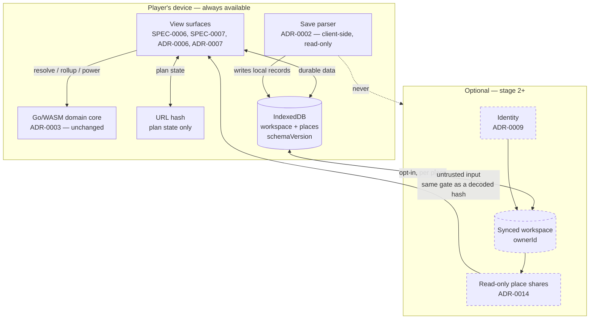

# ADR-0008: Durable User Data Lives in a Local-First Store, Synced to Optional Accounts

## Context and Problem Statement

SPEC-0007 REQ "Absent Data Is Absent" refuses to let the base planner card persist anything — ticked construction items, stocked quantities, notes, tags, screenshots, player-assigned base names — and forbids even *showing a control implying persistence* "until a governing decision establishes where it lives." This is that decision.

Four surfaces now want the store: the base planner card (SPEC-0007), the tree canvas's base assignments (SPEC-0006), the freighter (ADR-0006) and the settlement (ADR-0007). SPEC-0006 and SPEC-0007 are both `approved` as of #83 and about to be planned into stories, so the hole is about to be built against.

The gap already bites inside the category SPEC-0005 *permits*. That spec allows the view to hold "view-local preferences" as interface state, and `ViewState.preferences` holds exactly two — `groupSeparator` and `showUnverified`. With no store they last one page load. A preference that forgets itself on reload is not a preference.

So: where does durable, player-authored data live, and in what shape — given that the destination is accounts with the ability to show a base to another person?

## What was verified rather than assumed

Every claim below was checked in this working tree at `d469ad5`, with its search boundary stated, per SPEC-0004 REQ "Search Boundaries Are Recorded".

| Claim | Result | Boundary |
|---|---|---|
| No browser storage API is used | Confirmed — zero matches | `localStorage`, `sessionStorage`, `indexedDB`, `caches.`, `navigator.storage` across `web/src`, `web/tests`, `web/index.html`; excludes `node_modules` and `dist` |
| `plan-hash.ts` never touches `location` | Confirmed — the only occurrences are in prose comments, none in code | `location`, `history`, `window.` in `web/src/boundary/plan-hash.ts` |
| The view holds exactly two preferences | Confirmed | `ViewState.preferences` in `web/src/state/view-state.ts` |
| ADR-0002's no-network test exists | **False.** See below | `net/http`, `http.Get`, `fetch(`, and `PersistentPlayerBases` / `BaseVersion` across `internal/` and `cmd/` |

**ADR-0002's confirmation test does not exist, because save import does not exist.** No package under `internal/` or `cmd/` references `PersistentPlayerBases` or `BaseVersion`, and none imports `net/http`. The test asserting "no network request during parse" is a *future* obligation of ADR-0002's stage 1, not an existing guarantee this ADR must avoid breaking. Saying it "survives the introduction of a server" would imply it is running today. It is not. What this ADR can do is bind the obligation before the code lands, which it does in Confirmation below.

### The payload was measured, not estimated

Synthetic workspaces modelled on the exact fields SPEC-0007 names — ticks against the 108-entry parts catalog in `data/tier1.json`, stocked quantities, natural-language notes, tags, a player-assigned name — serialized, gzipped, and base64url-encoded as a URL hash would need:

| Bases | Ticks/base | JSON | gzip | gzip + base64url | Fits a 2 KB hash? |
|---:|---:|---:|---:|---:|:---|
| 1 | 20 | 1,287 | 539 | 720 | yes |
| 10 | 40 | 16,755 | 2,445 | 3,260 | **no** |
| 25 | 108 | 74,353 | 6,147 | 8,196 | **no** |
| 50 | 108 | 148,884 | 10,682 | 14,244 | **no** |
| 200 | 108 | 595,700 | 37,669 | 50,228 | **no** |

Screenshots excluded; one 1080p capture is 1.5–3 MB, three orders of magnitude above the entire text workspace at 200 bases.

An earlier run of this measurement used `"x" * 400` as note text and reported gzip figures roughly four times smaller — compressible filler flattering the result. The numbers above use varied natural-language notes. This is the failure #47 recorded: a figure that agrees with the artifact you already had is not evidence about the artifact you did not.

**The finding: durable data does not fit in a URL hash past a single base.** Not "would be awkward" — measured, at ten bases, against a conservative ceiling.

## Decision Drivers

* **SPEC-0007 is blocked on this.** The card cannot ship a todo list, a stocked count, or a base name without it.
* **The destination is accounts with sharing.** Ownership and the sharing unit are schema properties. Retrofitting an owner onto extant data is the expensive migration, so they are settled here even though the sharing model is a later ADR.
* **ADR-0002's precedent: no onboarding path may be the only one.** It rejected save import as the sole route because console players cannot extract saves. The same logic forbids requiring an account.
* **ADR-0002's privacy driver must survive.** A save is the player's entire game state. Base information a player authored and chose to show their family is a different category.
* **The codebase is built to make holding state hard.** `ViewState` has no field a graph could go in; `ResultCache` holds one entry and deep-freezes it. A persistence layer is the first thing here that legitimately holds durable state, and must not become the back door those rules were keeping shut.
* **Custody is an obligation, not a feature.** ADR-0002 banked "no upload endpoint, retention policy, or deletion story" as a benefit. Accounts spend all three.

## Considered Options

* **A. Extend the URL hash** to carry durable data alongside plan state
* **B. Local-only browser storage**, no accounts, no sharing
* **C. Local-first store, with an optional account for sync and sharing**
* **D. Server-only, account required**

## Decision Outcome

Chosen option: **C — a local-first durable store in IndexedDB, with an optional account that syncs and shares it.**

The app works completely for someone who never signs in. An account adds two things and only two: the same workspace on another device, and the ability to show a base to another person. Nothing is gated behind it.

### The four schema decisions, settled now

**What is owned: the workspace.** One per player. It carries `ownerId` (null while local-only), `schemaVersion`, and a collection of place records.

**What is shared: one place.** A base, a freighter, or a settlement — the three surfaces ADR-0006 and ADR-0007 add are the same kind of thing for this purpose, and the record is `PlaceRecord` rather than `BaseRecord` for that reason. Sharing is per place, not per workspace, because "show my family this base" is the actual request and sharing a whole workspace discloses every location a player has.

**Read-only.** A share grants read access. Two people editing one place needs conflict handling a read-only share does not, and shipping that machinery before anyone has asked for it is speculative. The schema leaves room: every place carries `updatedAt` and a monotonically increasing `revision` from the first version, so collaborative editing is a later ADR rather than a migration.

**No account required, ever.** Full function offline and signed out. This is ADR-0002's precedent applied unchanged.

### The two mechanisms stay two

Plan state stays in the URL hash. Durable data goes in the store. They are not merged, for two independent reasons:

- **Measured.** Ten bases of durable data is 3,260 bytes base64url. It does not fit.
- **A hash is *shared*; durable data is often *private*.** The hash is a link a player pastes into Discord. Base locations, notes and screenshots are not things to hand out by pasting a link, and merging them puts a private map position inside the thing designed to be handed around.

### What this decision reverses, stated plainly

**`docs/design/README.md` line 37** — "Plan state (target, methods, assignments, todo checks) should serialize into a shareable URL hash; no localStorage."

Two changes, not one. The `no localStorage` prohibition is lifted **for durable data only** and satisfied by IndexedDB rather than localStorage — which is synchronous, string-only, and capped around 5 MB, none of which suits this. Plan state keeps the rule.

And **todo checks move out of the hash.** The README puts them there; the measurement says they do not fit, and the shared-versus-private argument says they do not belong. This is a larger change to that line than "no localStorage" alone, and is easy to miss.

**SPEC-0005 § Security Requirements** — written on the premise "It has no server … There are no accounts and no server session. The application MUST NOT collect credentials, and MUST NOT transmit save-file contents, plan state, or any user data off the device." The save-file clause survives intact. The rest needs amending: there is now an optional server, an optional session, and deliberately-synced user data.

**SPEC-0007 § Security Requirements** — same premise, same amendment.

**SPEC-0007 REQ "Absent Data Is Absent"** — its "until a governing decision establishes where it lives" clause is discharged by this ADR and should now point at it.

### The line that keeps ADR-0002 intact

ADR-0002's privacy driver is about the save file, and says why: "a save is the player's entire game state: discovered systems, inventory, platform UID, every base location. It is far more than the planner needs."

The line this ADR holds:

> **Save parsing stays client-side and read-only, and nothing derived from a save reaches a server unless the player deliberately shared the place it belongs to.**

Concretely: import writes into the local store like any other authored edit. Sync is per place and opt-in, and the control that enables it states what leaves the device. There is no "sync everything" default, because a default that uploads a player's every base location is ADR-0002 being overturned by convenience rather than argument.

### What does not change

ADR-0003 is untouched. The Go/WASM domain core stays where it is; `resolve`, `rollup` and `power` all run on the device. **A server here is storage and identity, not computation.** No domain work moves off the client, and none of the boundary contract in SPEC-0002 changes.

### A shared record is untrusted input

#78 established that a decoded URL hash must produce an empty plan and a diagnostic rather than a partial one, and that nothing in the boundary may navigate to a value taken from decoded state. **Data arriving from another person's account gets identical treatment.** It is decoded through the same validation gate, a record that fails validation yields nothing rather than a partial place, and no field of it may drive navigation, be injected as markup, or be used as a URL.

### Staging and the migration that is designed now, not later

1. **Local store.** IndexedDB, versioned schema, no account, no network. Unblocks SPEC-0007's todo list, notes, stocked counts and named bases, and gives `ViewState.preferences` somewhere to survive a reload.
2. **Accounts.** Sign-in, and the local workspace uploads on first sign-in as a whole.
3. **Sharing.** Read-only per-place shares.

The migration is the part that gets lost if left until later. A player who has ticked fifty construction items before signing up must not lose them, so:

- Every local place has a stable `id` generated at creation, independent of the save and independent of any account. Sign-in attaches an `ownerId` to the workspace; it does not re-key anything.
- First sign-in with a non-empty local workspace uploads it. That is the whole migration, and it works because `ownerId` was nullable from version 1 rather than added later.
- Sign-out leaves the local copy in place.

### Consequences

* Good, because SPEC-0007 unblocks immediately on stage 1, with no server, no accounts and no hosting decision — the thing four surfaces are waiting for is the cheapest part.
* Good, because the app keeps working with no account and no network, so ADR-0002's platform-reach precedent holds rather than being quietly abandoned.
* Good, because ownership and the sharing unit are in the schema from version 1, so accounts are an addition rather than a migration.
* Good, because ADR-0002's privacy guarantee is preserved by a stated, testable line rather than by there being no server to violate it.
* Bad, because the project takes on custody. Retention, deletion and an upload endpoint were listed as *avoided* costs in ADR-0002 and are now owed.
* Bad, because IndexedDB is evictable. Browsers clear it under storage pressure and in private windows, so "local-first" means "local and losable" until a player signs in — and the UI must not imply otherwise.
* Bad, because two storage mechanisms is more surface than one, and a future contributor will propose merging them. The measurement above is recorded so that argument can be had with numbers.
* Neutral, because screenshots are deferred (below) — the decision is smaller than the full problem, deliberately.

### Screenshots are out of scope

SPEC-0007 lists screenshots among the durable data. They are excluded from this decision. One capture is 1.5–3 MB against 596 KB for a 200-base text workspace, and blobs carry a different cost, abuse and moderation profile than text. Folding them in silently is how a storage decision becomes a hosting bill.

Stage 1 may store screenshots **locally only**. They are not synced and not shareable until a named follow-up ADR decides blob storage. The card must not offer a share control for an image.

### Confirmation

* **ADR-0002's boundary becomes a binding obligation on code that does not exist yet.** When save import lands, its test asserting no `fetch`/XHR/WebSocket during parse MUST be written, and MUST remain green after a sync client exists. Because the parse path and the sync path will both be in `web/`, the test asserts on the *parse* call path specifically rather than on the absence of network code in the bundle — the latter will be false once sync ships, and a test that quietly weakens to accommodate that is worse than no test.
* **Sync is opt-in, mechanically.** A test asserts that with a signed-in account and no place marked shared, no place record is transmitted.
* **Versioned, and fails legibly.** The store carries `schemaVersion` at the workspace and at each place. An unrecognized version loads **nothing** and reports it — one path, the standard `plan-hash.ts` already meets by returning `EMPTY_PLAN` rather than applying a partial decode, and the standard ADR-0002 set for an unrecognized `BaseVersion`. A test feeds a future version and asserts an empty store plus a diagnostic, never a partial load.
* **An empty store is a designed state.** Cleared storage, a fresh device, a private window: the player sees an intentional empty state, not a screen of zeroes. SPEC-0007 REQ "Absent Data Is Absent" already sets that tone and the same rule applies — absent is rendered as absent, not as `0`.
* **Retention and deletion.** Deleting an account removes the workspace and every place in it within 30 days, and revokes outstanding shares immediately. Unsharing revokes immediately. Local data is the player's and is removed by clearing site data. The operational detail is ADR-0011 below; the commitment is here so it cannot be discovered as an afterthought.
* **The amendments land.** SPEC-0005 § Security Requirements, SPEC-0007 § Security Requirements, SPEC-0007 REQ "Absent Data Is Absent", and `docs/design/README.md` line 37 — including the todo-checks half, not only the localStorage half.

## Pros and Cons of the Options

### A. Extend the URL hash

Carry durable data alongside plan state in the hash, as `docs/design/README.md` line 37 currently implies for todo checks.

* Good, because it needs no new mechanism and inherits `plan-hash.ts`'s validation, which already refuses partial decodes.
* Good, because it is shareable with no account at all.
* Bad, because **it does not fit.** Ten bases is 3,260 bytes base64url against a ~2,000-byte conservative ceiling; twenty-five is 8,196.
* Bad, because it cannot hold a screenshot at any size.
* Bad, because it conflates shared with private: a hash is pasted into chat, and base locations are not.
* Bad, because durable data would be lost by editing the URL, which is a thing people do to links.

### B. Local-only browser storage, no accounts

* Good, because it takes on no custody: no endpoint, no retention policy, no deletion story, and ADR-0002's benefit list survives intact.
* Good, because it is the cheapest thing that unblocks SPEC-0007.
* Good, because it needs no hosting decision and no operational story.
* Bad, because it cannot share, which is the stated destination.
* Bad, because it is single-device, and a player planning on a desktop and checking on a laptop has two unrelated workspaces.
* Bad, because IndexedDB is evictable and losable with no recovery path at all — no server copy to restore from.

### C. Local-first, optional account for sync and sharing — chosen

* Good, because the app is fully usable signed out, honouring ADR-0002's "no single onboarding path" precedent.
* Good, because stage 1 ships with no server and unblocks four surfaces.
* Good, because the account is additive: `ownerId` nullable from version 1 means sign-in attaches an owner rather than migrating a schema.
* Good, because it gives the evictable local store a recovery path for players who want one.
* Neutral, because it requires the sync boundary to be specified precisely — which is work, and is also what keeps ADR-0002 intact.
* Bad, because it is two code paths where D is one: local writes and sync reconciliation, both needing tests.
* Bad, because custody arrives anyway at stage 2, just later than in D.

### D. Server-only, account required

* Good, because there is one storage path and one source of truth, with no reconciliation.
* Good, because sharing and multi-device are natural rather than added.
* Bad, because it requires an account to use the app at all, which contradicts ADR-0002's platform-reach driver directly. That ADR rejected save import as the only onboarding path; requiring sign-in is the same mistake with a different gate.
* Bad, because it breaks offline use, and the domain core runs locally precisely so the app does not need a network.
* Bad, because it takes on custody immediately, before anyone has asked to share anything.
* Bad, because it makes the hosting and identity decisions blocking prerequisites for SPEC-0007, which is ready now.

## Architecture Diagram

## More Information

### ADRs that spawn from this one

| ADR | Subject |
|---|---|
| ADR-0009 | Identity provider and the sign-in flow |
| ADR-0010 | Places are authored first, and a plan assigns to places that exist — makes this ADR's place record the application's spine |
| ADR-0011 | Server hosting, retention and deletion operations |
| ADR-0012 | Multi-device sync and conflict resolution — schema room is reserved here (`updatedAt`, `revision`) |
| ADR-0013 | Screenshot and blob storage |
| ADR-0014 | Sharing and permission model — the unit is fixed here; the permissions are not |

ADR-0010 was reserved for the sharing model when this table was written. It was
taken by the places decision instead, so sharing moved to the next free number
rather than displacing three reservations this table and SPEC-0009's design.md
both already point at.

### Next step

`/sdd:spec durable-store` — the local store is stage 1 and is specifiable now, independently of every deferred ADR above.

### Related

Extends [ADR-0002](ADR-0002-client-side-save-import.md). Related to [ADR-0004](ADR-0004-react-view-layer.md), [ADR-0006](ADR-0006-freighter-surface.md), [ADR-0007](ADR-0007-settlement-surface.md).
