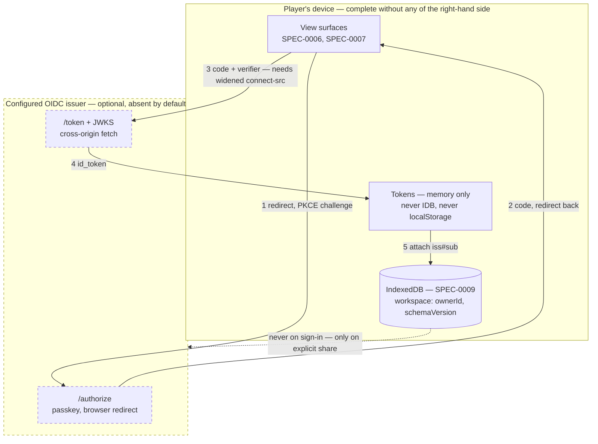

# ADR-0009: Player Identity Is Generic OIDC, with Pocket ID as the Reference Deployment

## Context and Problem Statement

ADR-0008 put a server-side identity in its diagram as `AUTH["Identity ADR-0009"]` and left the node dashed. It also put `ownerId` in the workspace schema at version 1, nullable and null in stage 1, on the explicit reasoning that *"a field added in version 2 cannot do that for data written under version 1."* The field exists; nothing fills it.

Pocket ID is already deployed in this environment for other applications. The question is not whether it works — it is whether its presence makes it *the* identity provider, *an* identity provider, or the deployment a standards-only integration happens to be validated against. That choice determines what `ownerId` may contain, and `ownerId` is the one thing here that is expensive to change after the first record is written.

So: who is a player, what identifier durably names them, and what does the browser have to be allowed to do to find out?

## Decision Drivers

* `ownerId` must survive an identity-provider change, a re-deployment under a new URL, and a second provider — it is written once and read forever
* ADR-0008's confirmations are binding, not advisory: no account required ever, sync opt-in mechanically, and the store carries player data rather than session material
* The deployed Content-Security-Policy forbids the cross-origin calls an OIDC flow needs — measured below, not assumed
* ADR-0002's platform-reach rule, now in its third instance: an onboarding path that excludes a class of players may not be the *only* path
* SPEC-0005's Security Requirements section makes claims this decision falsifies, and a silently-stale spec is worse than an amended one

## Considered Options

* **Generic OIDC, Pocket ID as the reference deployment** — the client reads a discovery document; Pocket ID is what it is validated against and what the maintainer runs
* **Pocket ID specifically** — the ADR names the provider, and the client may depend on its particulars
* **Defer identity entirely** — keep `ownerId` null, ship no sync, revisit when sharing forces it

## Decision Outcome

Chosen option: **"Generic OIDC, Pocket ID as the reference deployment"**, because Pocket ID is OpenID Connect Certified™, so a standards-only integration costs approximately nothing over a provider-specific one, and the difference it buys is not hypothetical: a self-hoster deploying this planner points it at their own issuer, which is the audience this project decided it has.

The decision has four parts. The first is the expensive one.

### 1. `ownerId` is issuer-qualified, from the first record written

`ownerId` is `{iss}#{sub}` — the issuer identifier from the discovery document, joined to the subject claim by a character that appears in neither. Never a bare `sub`.

A `sub` claim is unique *within* one issuer and carries no guarantee across issuers. Two providers can and do mint the same subject string. Storing `sub` alone would mean that changing issuer, re-deploying under a new URL, or admitting a second provider either silently collides two players' workspaces or requires re-keying every record — which is precisely the retrofit ADR-0008 spent its schema section avoiding. Qualifying the identifier costs one string concatenation now and is unrecoverable later.

This also means the application MUST NOT treat `sub` as a display value or a lookup key anywhere. `ownerId` is the identity.

### 2. The CSP widens; hosting stays static

`connect-src` gains the configured issuer origin, and nothing else. The flow is authorization-code + PKCE with a public client holding no secret.

The alternative — a backend-for-frontend exchanging the code server-side — keeps `connect-src 'self'` intact and keeps tokens out of the browser entirely, which is genuinely the stronger security position. It was not chosen because **it decides that a server-side component exists**, and that decision belongs to a hosting ADR that has not been written. Choosing BFF here would let a security-header question quietly settle the deployment architecture. Naming that coupling and declining to resolve it by side effect is the point.

The cost is accepted explicitly: tokens live in the browser, and SPEC-0005's claim that no cross-origin call is legitimate stops being true.

### 3. Tokens are session material, not player data

Access and ID tokens live **in memory only**. They are never written to the SPEC-0009 store, never to `localStorage`, never to a cookie this application sets. No refresh token is persisted; a reload returns the player to a signed-out state until they sign in again.

SPEC-0009's store is for durable player-authored records. A token in it would be durable, would be synced by the machinery that syncs the workspace, and would outlive its own validity. It does not enter the schema.

### 4. Signing in transmits nothing

Authentication is not a sync trigger. Completing a sign-in attaches an `ownerId` to the local workspace and does nothing else — no upload, no place record leaving the device, no share created. Upload happens when the player marks a place shared, which is ADR-0008's opt-in confirmation and remains the only path.

This is stated because implementing sign-in as "authenticate, then reconcile with the server" is the natural shape and would overturn ADR-0008 by accident rather than by decision.

### Passkey-only, and why it is acceptable here

Pocket ID supports passkeys and nothing else. A player without a passkey-capable authenticator cannot sign in at all. This is the third time this project has met the platform-reach question — ADR-0002 refused save import as the *only* onboarding path because console players cannot extract saves, and ADR-0008 refused to require an account for the same reason.

It is acceptable here **because** ADR-0008 made accounts optional. The application is complete signed out: every stage-1 capability works with no provider configured and no network reachable. Sign-in adds sync and sharing; it gates nothing. Were sign-in required for any capability a player currently has, passkey-only would be a blocker and this option would have to be rejected.

That reasoning is recorded because it does not transfer. A project that decided accounts were mandatory could not adopt this and cite this ADR.

### An unexpected benefit: SPEC-0005's credential claim survives

SPEC-0005 § Authentication says the application *"MUST NOT collect credentials."* With a passkey-only external provider, it still does not — the passkey is exchanged between the player's authenticator and the provider's origin, and this application never sees a credential of any kind. The requirement outlives the premise that produced it, and should be re-stated rather than deleted.

### Consequences

* Good, because `ownerId` is portable across issuers from the first write, so an identity-provider change is a configuration change rather than a data migration
* Good, because a self-hoster configures their own issuer and the planner works, which the provider-specific option would have foreclosed
* Good, because static hosting survives — no server component is introduced, and SPEC-0005's CSRF section stays satisfied by absence rather than needing to be revisited
* Good, because the application still collects no credentials, so SPEC-0005's strongest security claim holds under a changed premise
* Bad, because tokens live in the browser, which is a weaker position than a BFF and is accepted deliberately rather than overlooked
* Bad, because `connect-src` is no longer the origin alone, and the reasoning in `web/public/_headers`, `web/vite.config.ts` and SPEC-0005 § Security Headers must be rewritten rather than deleted
* Bad, because no refresh-token persistence means signing in again after every reload — a real friction cost, taken over persisting session material in a store this project has promised holds only player data
* Neutral, because who may hold an account remains the issuer's concern; whether a *share recipient* needs one at all is ADR-0014's, and this ADR deliberately does not answer it

### Confirmation

* **Signed-out remains complete.** A test exercises the application with no issuer configured and no network reachable to one, and asserts every stage-1 capability works. This is the passkey-only justification made mechanical: if it ever fails, passkey-only becomes a blocker rather than a non-issue.
* **Sign-in transmits nothing by itself.** ADR-0008's opt-in-sync test extends to cover the moment of authentication, not only the steady state — a completed sign-in with no place marked shared transmits no place record.
* **`ownerId` is issuer-qualified.** A test asserts that two subjects with an identical `sub` from different issuers produce different `ownerId` values and do not collide in one workspace store.
* **Tokens are absent from the store.** The SPEC-0009 schema check asserts no token-shaped field exists, in the same style as SPEC-0009 REQ "Nothing Is Marked for Synchronization" — the absence is checked, not reviewed.
* **Token failure is legible.** An expired or invalid token produces a stated diagnostic and a fully signed-out state, never a partial one — the standard `plan-hash.ts` set by returning `EMPTY_PLAN` through one path, and ADR-0008 set for an unrecognized `schemaVersion`.
* **The CSP change ships with its reasoning.** `web/public/_headers` and `web/vite.config.ts` no longer claim that no cross-origin call is legitimate, and say instead which origin is permitted and why.
* **The amendments land.** SPEC-0005 § Authentication and § Security Headers are amended in the same change that introduces the flow. § CSRF Protection is untouched, and the reason — no server route was added — is recorded there so a future BFF does not slip past it.

## Pros and Cons of the Options

### Generic OIDC, Pocket ID as the reference deployment

The client performs discovery, authorization-code + PKCE, and JWKS validation against whatever issuer is configured. Pocket ID is the instance it is developed and tested against.

* Good, because Pocket ID is OIDC Certified™, so standards-only costs nothing extra to reach the same working system
* Good, because a second provider, a re-deployment, or a self-hoster's own issuer are configuration rather than code
* Good, because it forces the `ownerId` question to be answered correctly — a generic client cannot pretend `sub` is globally unique
* Neutral, because "generic" here means reading a discovery document and validating a token, not building a provider abstraction layer — the moment it grows a plugin interface, this option has been misread
* Bad, because it forgoes provider-specific features Pocket ID may offer, which is a real cost only if such a feature is later wanted

### Pocket ID specifically

The ADR names Pocket ID as the identity provider and the client may depend on its endpoints and behaviour.

* Good, because it is honest about what is actually deployed, and reads as less speculative
* Good, because provider-specific features are available without an abstraction to route around
* Bad, because it accepts a constraint for no gain — the code would read a discovery document either way
* Bad, because it makes a self-hosted deployment against another issuer a code change, contradicting the audience this project chose
* Bad, because it invites `sub` as `ownerId` — with one provider assumed forever, issuer-qualification looks like ceremony, and the mistake is unrecoverable

### Defer identity entirely

Keep `ownerId` null, ship no sync, revisit when sharing forces the question.

* Good, because it is the cheapest option today and forecloses nothing
* Good, because stage 1 is genuinely complete without it, which is ADR-0008's whole design
* Bad, because ADR-0014 (sharing) cannot be specified without knowing what owns a share
* Bad, because the risk is not that the decision is late but that it is made implicitly — the first line of sign-in code written without this ADR will use `sub`, because `sub` is what the tutorial uses
* Neutral, because the schema is already prepared, so deferring costs nothing structurally — it costs only the guarantee that the next person gets `ownerId` right

## Architecture Diagram

Hand-authored rather than generated: no identity code exists yet, so a call graph would describe an empty set. The arrow that matters is the dotted one — sign-in moves an identifier *into* the store and moves nothing out of it.

## More Information

### What was verified, and the boundary of each check

Recorded in the style SPEC-0004 REQ "Search Boundaries Are Recorded" requires of the normalizer, because #47's lesson applies here: a figure that agrees with the artifact you already had is not evidence about the artifact you did not.

**Verified:**

* **OIDC Certified™, OAuth 2.0, passkey-only** — `pocket-id/pocket-id` README at `main`: *"an easy-to-use OpenID Connect Certified™ and OAuth 2.0 provider"*, and it *"only supports passkey authentication, which means you don't need a password."*
* **Go backend, SQLite or Postgres** — `backend/go.mod` at `main`: Go 1.27.0, with `gorm.io/driver/postgres` + `jackc/pgx/v5` and `modernc.org/sqlite`. The prompt's "single Go binary" is consistent with this but was not itself confirmed.
* **Public clients hold no secret, and PKCE is forced for them** — `backend/internal/service/oidc_service.go` at `main`: `client.PkceEnabled = input.IsPublic || input.PkceEnabled`, and secret creation is refused for a public client. This is the configuration this ADR depends on, and it is supported.
* **The CSP blocks the flow** — measured, not reasoned. Chromium loaded a page served under the exact policy from `web/public/_headers` and attempted the two cross-origin calls the flow needs:

  | Call | Result |
  |---|---|
  | `POST https://…/token` | Blocked — *"Refused to connect … violates … `connect-src 'self'`"* |
  | `GET https://…/jwks.json` | Blocked — same directive |
  | `GET /token` (same-origin control) | Allowed, 200 |

  The same-origin control matters: without it, "both fetches failed" is equally consistent with a broken probe.

**Not verified — the boundary:**

* **The discovery document of a running instance was not read.** No instance URL was available to this session, and `pocket-id.org` is blocked by this environment's network egress proxy. Grant types, the advertised `code_challenge_methods_supported`, and the full claim set therefore rest on source and README rather than on a live `/.well-known/openid-configuration`. **This should be confirmed against the actual instance before the ADR moves to `accepted`.**
* **Whether `sub` is stable across a passkey being replaced was not determined.** The token-building code lives in a `previewBuilder` service that was not read. This matters more than it looks: if `sub` rotates when a player re-enrols an authenticator, issuer-qualification does not save them — the workspace would be orphaned — and this ADR would need a stable-identifier strategy rather than only a collision-proof one.
* **Single-tenancy was not confirmed** from any primary source; the README does not address it.

### Method note

The `/sdd:adr` edge pre-search (SKILL.md step 1a) queries the `nms-base-planner-adrs` qmd collection for candidate frontmatter edges. It did not run: the collection exists and is indexed, but qmd cannot reach `huggingface.co` through this environment's egress proxy to fetch its embedding, reranker, or query-expansion models, so every query path fails. Substituted an exhaustive read of all eight existing ADRs — for a corpus this size that is stronger than a six-result retrieval, not weaker, but it is a substitution and is recorded as one. The `extends: [ADR-0008]` and `related: [ADR-0002, ADR-0004]` edges come from that read.

### Related decisions

* **ADR-0008** reserved this number, put `ownerId` in the schema nullable at version 1, and set the confirmations this decision must survive
* **ADR-0002** established the platform-reach rule invoked here for the third time
* **ADR-0014** (sharing and permissions, not yet written) is constrained by this one: whether a share recipient needs an account at all is its question, but a share requiring an account on a private issuer is not meaningfully shareable
* The **hosting decision** has no ADR. This one deliberately avoids making it by declining the BFF option, and should be revisited if a server component is introduced for another reason

### Out of scope

The sync server, its API and its hosting; the sharing and permission model; multi-device conflict resolution; blob and screenshot storage.
