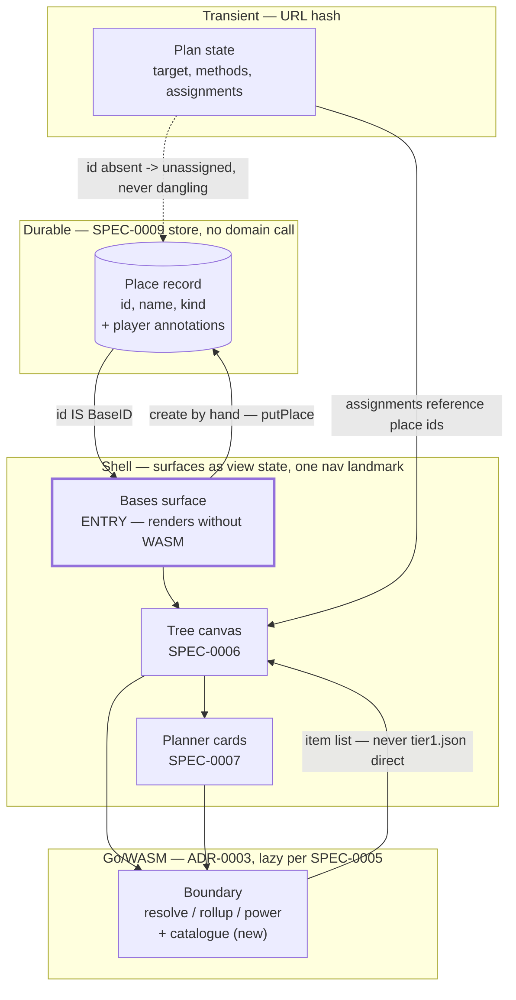

# ADR-0010: A Player Authors Places First, and a Plan Assigns Leaves to Places That Exist

## Context and Problem Statement

SPEC-0007 deferred the panel that arranges cards — "application-shell furniture [that] belongs with the shell surface, which has no spec yet." That deferral was never picked up, and the gap is now load-bearing rather than cosmetic. `BasePlannerCard` is reachable from exactly one file under `web/src/`, and only as a type-only import of `IdentitySlot` in `canvas/NodeCard.tsx`; every render of it is a Playwright fixture. `<nav aria-label="Surfaces">` holds one button, "Plan", carrying `aria-current="page"` and no handler. Target selection is a bare `<input>` whose value goes to the domain as an item id, so the only way to load anything is to already know a string like `ULTRAPROD2`.

The temptation is to call this "the app needs a router". It is not. Underneath the missing chrome is an unanswered modelling question, and building navigation without answering it would freeze the wrong answer.

Today the domain runs **plan → base**. `BaseID` is a bare string whose own doc comment says it "identifies a base within a plan"; `BaseGroup` and `BaseBuild` are derived output, existing only as by-products of a plan's leaf assignments. A base has no independent existence.

But everything the design's base card carries — biome, hazards, sentinel and economy, portal address, screenshot, notes, ticked build items, power type and class — is player-authored data about a real base someone owns, and none of it is derivable from a plan. Meanwhile SPEC-0009 REQ "A Place Is One Record Type, Whatever Its Kind" already gives a place "a stable `id` generated at creation, independent of any save file and independent of any account", covering bases, freighters and settlements.

So the model holds a place record with no producer and a base with no identity, and nothing joins them. Which way does the relationship run?

## Decision Drivers

* The card's content is player-authored and permanent; a plan is a question asked on a Tuesday. Deriving the durable thing from the transient one inverts their lifetimes
* SPEC-0009's place record already exists, is `implemented`, and already has the stable identifier this needs — a second identifier would be a second source of truth
* SPEC-0005 REQ "Module Loading" loads the WASM module lazily, after the shell is interactive, so whatever surface opens first must render without the domain
* SPEC-0005 REQ "Boundary Client" forbids the view reading the Tier 1 artifact directly, which constrains where a searchable item list can come from
* A first-run player has no plan, no save import (SPEC-0008 is blocked on a real fixture, issue #103) and no way to guess an item id. The current entry point cannot be used by someone who has not read the source
* SPEC-0005 § Accessibility mandates one named `role="navigation"` landmark; multi-surface navigation must not answer that by adding a second

## Considered Options

* **Places first** — a place is a durable record the player authors; a plan assigns leaves to places that already exist
* **Plan-derived bases with a side table** — keep `BaseID` as a plan-scoped string and hang player annotations off it in a parallel store
* **Defer again** — build the shell chrome now against the current plan → base direction and revisit when sharing forces it

## Decision Outcome

Chosen option: **"Places first"**, because the durable thing must own the identifier. A plan is a question; a base is a place the player actually built. When the transient artifact owns the key, every durable annotation is orphaned the moment the question changes.

Six things follow, and each is a decision rather than an implication left to the reader.

### 1. `BaseID` is the place record's `id`

`BaseID` stops being a plan-scoped string and becomes the SPEC-0009 place `id`. No new identifier is minted, and no mapping table is introduced. The domain type keeps its name and its shape — it is still a string to the Go core — but its meaning changes from "a key this plan invented" to "a place that exists".

`Unassigned BaseID = ""` survives unchanged; the empty value is still not a place.

**An assignment naming a place that no longer exists resolves to unassigned.** Deleting a place MUST NOT delete a plan and MUST NOT silently drop the leaves assigned to it: those leaves reappear in the unassigned group, which is a state the domain already models and the design already draws. The alternative — cascading the delete into every plan, or leaving a dangling id that renders as a base with no name — either destroys the player's work or lies about it. This also means a plan can outlive the places it referenced, which is the correct behaviour for a shared link (see 6).

### 2. The application opens on the bases surface

Bases-first, and the reason is not only that it reads better.

The bases surface is **the only surface that renders correctly with no domain call at all**. It draws player-authored records out of the SPEC-0009 store. SPEC-0005 REQ "Module Loading" loads the module lazily after the shell is interactive, so an entry surface that needs the domain to show anything is an entry surface that shows a spinner first. Plan-first has that problem structurally; bases-first does not.

It is also the only entry point a new player can use. Opening on a plan means opening on a text field that demands an item id, which the player cannot know. Opening on bases means the first thing the application says is "add the base you built", which is a question they can answer.

### 3. A place is created by hand, on the bases surface

`putPlace` already exists on the durable store. Nothing under `web/src/` calls it — the capability is there and the route is not. The bases surface provides that route: a form that creates a place independent of save import, so SPEC-0008 being blocked on a real save fixture does not block a player from using the application.

**The minimum a place needs before a plan can assign to it is an `id` and a name.** Nothing else. Biome, hazards, sentinel and economy, portal address, screenshot and notes are all optional annotation. A place with no site configuration is assignable; the rollup treats its site as unconfigured and the card renders that absence as absence, per SPEC-0007 REQ "Absent Data Is Absent". Requiring more would make the first-run path longer than the thing it unblocks.

### 4. Surfaces are shell view state, inside the one navigation landmark

The surfaces are the ones the design names — bases, tree, planner — plus the freighter and settlement surfaces ADR-0006 and ADR-0007 add. Selection between them is view state the shell holds. **No router library is introduced**: three to five surfaces with no nested routes do not need one, and ADR-0004's stack does not include it.

The existing `<nav aria-label="Surfaces">` gains the other surfaces. It MUST remain the only `role="navigation"` landmark. The design's cross-navigation links — "view planner →", "view atlas →", "view tree →" — are content links inside `main`, not a second nav; SPEC-0005 § Accessibility mandates one named navigation landmark, and satisfying a design flourish by adding an unlabelled second one would break it.

### 5. Target selection is a search, and the list comes from the boundary

The raw id field is replaced by a search over known items, matching fuzzily against **both display name and item id, with the display name as the primary key and the id shown as secondary**. Matching on the name alone would break the player who knows the id; matching on the id alone is what exists now and is what makes the tool unexplainable.

The list comes from a **new boundary entry point**, not from the shell. SPEC-0005 REQ "Boundary Client" says the view "MUST NOT read the Tier 1 artifact directly", and the boundary currently exposes only `resolve`, `rollup` and `power` — there is no catalogue call. Adding one is a SPEC-0002 surface change and is the cost of this decision; the alternative, a list compiled into the view bundle, is a second copy of Tier 1 data that drifts from the artifact the module actually resolves against.

The control's visual form is the design's, not this ADR's.

### 6. The hash owns the plan; the store owns the player

Both mechanisms now exist and the boundary between them is stated here:

* **The URL hash owns plan state** — target, quantity, method and recipe choices, and leaf assignments. That is what a share is, and SPEC-0005 already carries the rule that hash state is untrusted input decoded through one path, producing an empty plan and a diagnostic rather than a partial one.
* **The durable store owns player-authored data** — places and their annotations, ticked build items, and view preferences.

`docs/design/README.md` line 37 says plan state serialises into a shareable hash with "no localStorage", and lists "todo checks" among the things it carries. That line predates ADR-0008. Ticked build items are per-place player data and belong in the store; the "no localStorage" half survives as ADR-0008 read it, since IndexedDB is the store and the point was that durable data must not be smuggled into a share.

The consequence worth naming: **a shared hash carries assignments that reference place ids the recipient does not have.** Those assignments resolve to unassigned by rule 1, and the recipient sees the plan with its leaves unplaced rather than an error. This is the correct behaviour and it is what makes rule 1 load-bearing rather than an edge case.

### Consequences

* Good, because the durable record owns the identifier, so a player's annotations survive every change to every plan
* Good, because SPEC-0009's place record stops being a store with nothing to store and becomes the spine of the application
* Good, because the entry surface renders without the WASM module, which is what SPEC-0005's lazy load already implied and nothing yet honoured
* Good, because a first-run player has a route in that does not require reading the source for an item id
* Good, because save import becomes one of two ways to create a place rather than the only one, so issue #103 stops gating first use
* Bad, because `BaseID`'s meaning changes across the boundary and in the Go core, and every place that treats it as plan-scoped has to be re-read — a rename would be honest but touches more than this decision should
* Bad, because target search needs a new boundary entry point, which is a SPEC-0002 surface change and a fifth call to version
* Bad, because a shared plan can name places the recipient lacks, so a share is never fully faithful — mitigated by resolving to unassigned, not solved
* Neutral, because the freighter and settlement surfaces (ADR-0006, ADR-0007) inherit this shape without being designed here; they are places by SPEC-0009's definition already

### Confirmation

* **The entry surface needs no domain.** A test renders the application with the WASM module unavailable and asserts the bases surface is complete and interactive, with no error state.
* **A place is creatable by hand.** A test creates a place through the UI with only a name, asserts it persists across a reload, and asserts a plan can assign a leaf to it.
* **A deleted place unassigns rather than destroys.** A test assigns leaves to a place, deletes the place, and asserts the plan survives with those leaves in the unassigned group and no dangling identifier rendered.
* **One navigation landmark.** The existing SPEC-0005 accessibility check extends to assert exactly one `role="navigation"` element, named, after all surfaces are reachable — the mutation check's landmark case is the model.
* **Target search finds by name.** A test searches a display name the player would plausibly type and asserts the intended item is offered without the id being known.
* **The view still reads no artifact.** The existing boundary discipline check continues to pass once the catalogue call exists — the list arrives through the module, not from `tier1.json`.

## Pros and Cons of the Options

### Places first

A place is a durable record with a stable id; a plan references places that already exist.

* Good, because lifetimes line up — the permanent thing owns the key and the transient thing points at it
* Good, because it needs no new identifier and no mapping table; SPEC-0009's `id` is already the right shape and already shipped
* Good, because it makes the bases surface a real surface with its own reason to exist, rather than a view of plan output
* Neutral, because it does not by itself say what a plan is worth without places — the answer is that a plan with no places is still resolvable, just entirely unassigned
* Bad, because it changes what `BaseID` means in code that is already merged and tested

### Plan-derived bases with a side table of annotations

Keep `BaseID` plan-scoped and store player annotations in a parallel table keyed by that string.

* Good, because no existing domain type changes meaning, so the diff is smaller today
* Good, because it can be built without touching the Go core at all
* Bad, because the key is invented by whichever plan first named it, so the same real base acquires different keys in different plans and the annotations fragment
* Bad, because deleting or renaming within a plan orphans annotations silently — there is no record to notice the loss
* Bad, because it duplicates the identity SPEC-0009 already defines, giving the application two answers to "which base is this"
* Bad, because the fragmentation surfaces later as data loss rather than earlier as a compile error, which is the worst time to find it

### Defer again

Build the shell chrome against the current direction and revisit when sharing forces the question.

* Good, because it is the fastest route to a navigable application, which is a real product gap today
* Good, because the question genuinely can be answered later — nothing is technically impossible in either direction
* Bad, because chrome built against plan → base bakes that direction into every surface, and the revisit becomes a rewrite of the thing just built
* Bad, because SPEC-0007 already deferred once and the deferral is why `BasePlannerCard` renders only in a fixture; deferring the same question twice is a pattern rather than a judgement
* Bad, because ADR-0010's sharing model needs to know what a share references, and it cannot be specified while the referent is undecided

## Architecture Diagram

The dotted edge is the one that matters: a plan referencing a place that is gone degrades to unassigned. Nothing dangles, and nothing cascades.

## More Information

### A number collision this ADR creates

**This file takes ADR-0010, which two existing artifacts already promise to something else.** ADR-0008's architecture diagram labels a node `SHARE["Read-only place shares ADR-0010"]`, and ADR-0009's More Information calls ADR-0010 "sharing and permissions, not yet written". Numerically 0010 was the next free slot and the owner directed its use here; the reservation was prose and a diagram label rather than a file.

Both references are now wrong and should be corrected in a documentation pass, with the sharing model taking the next free number. Recorded here rather than fixed silently, because a stale forward reference in an accepted ADR is exactly the kind of drift that goes unnoticed.

### A stale sentence in SPEC-0006

SPEC-0006 REQ "Leaf Assignment to Bases" (line 149) says assignment "reaches the domain through stage 2, whose boundary entry point is reserved and not yet wired." That is no longer true, verified in the tree at `0c5acc5`:

* `internal/bridge/stages.go` — `RollupRequest` carries `Assignments map[string]string` and `Sites map[string]Site`
* `web/src/boundary/client.ts` — `rollup()` is exposed at line 117
* `web/src/card/useConfiguredBase.ts` — builds a `RollupRequest` and calls `client.rollup()`

Stage 2 is wired and called. What is missing is a UI that produces assignments, which is what this ADR unblocks. Specs are protected in feature work, so the sentence is not edited here; it should be corrected in a spec pass.

### A misnamed requirement

The brief for this ADR cited SPEC-0005 REQ "Boundary Access". No such requirement exists; the constraint lives in **REQ "Boundary Client"**, which carries the sentence relied on above: "The view MUST reach the domain only through the module surface SPEC-0002 defines, and MUST NOT read the Tier 1 artifact directly." Noted so the wrong name does not propagate.

### What was verified, and where

Every claim of current behaviour above was read from the tree at `0c5acc5` rather than taken from the brief:

| Claim | Evidence |
|---|---|
| One-button nav, no handler | `web/src/shell/AppShell.tsx:247-259` |
| `BasePlannerCard` unreachable | Only `web/src/` reference is a type-only `IdentitySlot` import at `web/src/canvas/NodeCard.tsx:4`; all others are `web/tests/fixtures/` |
| `BaseID` is plan-scoped | `internal/domain/rollup.go:20-22`, doc comment "identifies a base within a plan" |
| Place record has a stable id | SPEC-0009 REQ "A Place Is One Record Type, Whatever Its Kind" |
| No place-creation route | `putPlace` exists at `web/src/store/durable-store.ts:264`; no caller under `web/src/` |
| No catalogue call | `web/src/boundary/client.ts` exposes `resolve`, `rollup`, `power` only |
| One nav landmark required | SPEC-0005 line 215 |
| Hash rule | SPEC-0005 line 203 |
| Design cross-navigation and hash intent | `docs/design/README.md` lines 19 and 37 |

### Method note

The `/sdd:adr` qmd edge pre-search (SKILL.md step 1a) did not run: the collections are indexed, but this environment's egress proxy blocks `huggingface.co`, so qmd cannot fetch its embedding, reranker or query-expansion models and every query path fails. Substituted a direct read of the ADR corpus. The `extends: [ADR-0008]` and `related: [ADR-0002, ADR-0004]` edges come from that read. The cgg call-graph opt-in was also skipped — the decision is about a direction of reference rather than a call path, and the hand-authored diagram carries it better.

### Related decisions

* **ADR-0008** established the durable store and the place record this decision makes load-bearing
* **ADR-0002** keeps save parsing client-side and read-only; save import becomes the second route to a place, not the only one
* **ADR-0004** fixes the view stack, within which "no router library" is a decision rather than an omission
* **ADR-0006** and **ADR-0007** add the freighter and settlement surfaces, which are places under SPEC-0009 and inherit this shape
* The **sharing and permission model** is still unwritten and is now constrained by rule 6: a share carries plan state that may reference places the recipient does not have

### Out of scope

The visual form of any control; the shell spec itself, which this ADR unblocks rather than replaces; the sharing model; and any change to SPEC-0006's stale sentence, which belongs to a spec pass.
