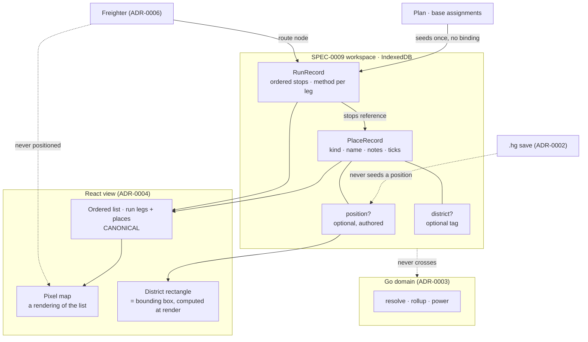

# ADR-0011: The Base Atlas — an authored coordinate space, and a route graph that is presentation

## Context and Problem Statement

`docs/design/bases-map/` is a complete, high-fidelity design for the Base Atlas: a pixel map of every base, dashed district territories, and traceable harvest-run routes with numbered waypoints and per-leg travel methods. It has a handoff document and an interactive prototype. It has no ADR, no spec, no issues, and no implementation.

It is not an optional extra, and the evidence is that two accepted decisions already reason about it as though it exists. ADR-0006 carries a section titled "Base Atlas: present in the route graph, absent from the coordinate space" and argues at length that a freighter joins harvest runs while being excluded from spatial layout. ADR-0007 weighs and rejects an option on the grounds that "the Atlas dossier is a summary panel, and settlement state is too dense for it." Both make load-bearing arguments about a surface nobody has specified.

The surface introduces two things this codebase does not have. **A coordinate space**: bases acquire positions, and the handoff is explicit that they are player-arranged rather than read from the game — authored data with no in-game source of truth, which needs a home. **A route graph**: a harvest run is an ordered sequence of stops with a travel method per leg. So: where do positions and runs live, is a run authored or derived, and does the route graph belong in the Go domain alongside the rollup or in the view?

## Decision Drivers

* **The domain/view boundary is strict and worth keeping strict.** SPEC-0005 REQ "The View Computes No Domain Values" is enforced mechanically, by source scan, in three suites. Anything routed through the domain needs a boundary crossing — an ADR-sized commitment under ADR-0003 — so the question of whether a route *is* a domain value has to be answered rather than assumed.
* **ADR-0006 must not be contradicted.** A freighter appears in the route graph as a node and is never positioned. Whatever shape positions take, "has a position" cannot be a property every place carries.
* **ADR-0008 already settled where durable user data lives.** SPEC-0009 gives one `PlaceRecord` type in a local-first IndexedDB workspace. Positions and runs, if durable, live there and inherit its schema-version and eviction rules — not a second store.
* **Authored data is not derived data, and calling it derived would be a lie.** The design shows two runs matching the planner's two targets, which invites "derive runs from assignments". A plan carries a *set* of bases; a run is a *sequence* with a travel method per leg. Two of a run's three components have no source in any plan.
* **A pixel map of clickable buildings is the hardest accessibility case in the project.** SPEC-0005 requires WCAG 2.1 AA, colour never the sole carrier, and keyboard operability. A surface whose primary structure is spatial cannot meet that by bolting on an alternative afterwards.
* **KISS, and the project's own precedent.** SPEC-0006 REQ "Layout Geometry Is Not a Domain Value" already drew this line once for the tree canvas: positions are the view's business, quantities are the domain's. A second surface should not draw it in a different place.

## Considered Options

* **A. Domain-owned: positions and routes are domain values, computed across a new boundary crossing**
* **B. Authored data, view-rendered: positions and runs are player-authored records in the SPEC-0009 store**
* **C. Derived: runs computed from plan assignments, positions auto-laid-out from the plan graph**
* **D. Defer the Atlas until save import lands and supplies real coordinates**

## Decision Outcome

Chosen option: **B — the Atlas is authored data rendered by the view, with no new boundary crossing.**

The load-bearing argument is narrower than "routes are presentation", and it is worth stating precisely, because the obvious objection is that "the shortest run across five bases" is exactly the kind of thing the domain exists to compute.

**There is no distance to minimise.** Atlas positions are player-arranged for legibility; the handoff says so outright. They are not the game's coordinates, they are not to scale, and they are not derived from anything. And the travel between stops is a teleporter or a portal — constant-cost, and unaffected by how far apart two buildings sit on the player's arrangement. So a shortest-path computation over this graph would be optimising a metric that is fiction against a cost that is uniform. It is not that the domain *may not* compute the route; it is that there is no well-posed question to ask it. Option A would add a boundary crossing to answer a question the data cannot pose.

That is a different claim from "routes are presentation because rendering is the view's job", and if the premise ever changes — if positions come to mean real in-game distance, or if travel acquires a real per-leg cost — the conclusion changes with it. That contingency is recorded in Consequences rather than buried.

### (a) The coordinate space: an optional position on `PlaceRecord`

A position is a nullable field on the existing `PlaceRecord`, not a new record type and not a required property.

**Optional is the whole point.** ADR-0006 requires a freighter to be a route node that is never positioned, so a schema making position mandatory would contradict an accepted decision on its first record. A place without a position is a first-class state, not an error and not a missing value to be filled in with a default — the same rule SPEC-0007 REQ "Absent Data Is Absent" already applies to the card. An unpositioned place appears in the run panel and the place list, and simply does not appear on the map.

The position is authored: two integers in the Atlas's own grid space, meaningful only relative to other positions in the same workspace. It carries no relationship to `GalacticAddress` or to the in-game `Position` that ADR-0006 rejects as stale, and MUST NOT be seeded from either.

**What a shared place now carries.** ADR-0008 makes sharing per place precisely because "sharing a whole workspace discloses every location a player has", and treats base locations as the thing not to hand out by pasting a link. Adding a position to `PlaceRecord` puts a coordinate inside the record that sharing sends. The disclosure is real but small, and it is small for the same reason the domain has no metric to optimise: an Atlas position is the player's arrangement of their own map, not a galactic address, and it locates a base relative to the other bases in one workspace and nowhere else. A recipient learns where the owner chose to draw it, not where to fly. That is a weaker disclosure than the notes and screenshots a share already carries, and it does not reopen ADR-0008's decision — but the share confirmation should say the arrangement travels with the place, because a player who has spent an hour laying out a map will reasonably assume it is theirs.

Adding a field to `PlaceRecord` is a schema change under SPEC-0009, so it takes a `schemaVersion` increment and inherits the rule that an unrecognised version loads nothing rather than partially populating. It also inherits REQ "Storage Is Evictable and the Application Must Not Imply Otherwise": a player's arrangement of their own map is exactly the kind of work that feels permanent and is not, and the surface must not imply otherwise.

### (b) Districts are a tag, and the rectangle is layout

A district is a name on a place, not a record with a geometry.

The dashed rectangle is the **bounding box of its members' positions**, computed in the view at render time. This follows SPEC-0006 REQ "Layout Geometry Is Not a Domain Value" exactly: a rectangle enclosing points is geometry, the points are the authored data, and storing the rectangle would create a second source of truth that goes stale the moment a place moves.

A place with no district is the handoff's "1 ungrouped outpost" — again a first-class state, drawn on the map outside any territory, and not an error.

### (c) The route graph: authored, seeded, and never inferred

A harvest run is a **player-authored record** in the workspace: an ordered list of stops, each stop naming a place, with a travel method per leg.

A stop names a place by the SPEC-0009 place `id` — which ADR-0010 §1 makes the same identifier as `BaseID`, so a run, a plan's assignments and the Atlas all point at one thing. No second key is minted for routing.

It may be **seeded** from a plan's base assignments — that is where the design's two runs matching the planner's two targets comes from, and it is a genuine convenience. But seeding is a one-time copy, not a binding. After it, the run is the player's, and editing the plan does not silently reorder their route.

The reason is that a plan does not contain a run. It contains a set of bases with leaves assigned to them. The order in which a player visits those bases, and whether a given leg is a teleporter or a portal, are facts about the player's base network and their habits, not about the plan. Deriving a run would mean inventing both.

A run belongs to the **workspace, not to a plan**. A player may hold several plans; runs outlive any of them. A run MAY record the plan that seeded it, for provenance, and MUST NOT be invalidated when that plan changes or is deleted. The design's RUN toggle names runs after targets, which is a naming convention the player inherits from seeding and may change.

**One run is active at a time.** This is kept from the design deliberately, and it resolves the handoff's third open question: overlapping waypoint chips where two runs share a mid-route stop only arise if two runs are drawn at once. Holding the constraint makes the defect unreachable rather than fixing it.

Freighters participate as stops exactly as ADR-0006 requires — a node in the sequence with no position — which is representable precisely because position is optional in (a).

### (d) The list is the surface; the map is a view of it

The non-spatial equivalent of the Atlas is not a fallback bolted on for compliance. **The ordered list is canonical and the map renders it.**

Concretely: the run panel's ordered legs and the place list are always present, carry every operation the map carries, and are the structure the map decorates. The surface MUST NOT have a map-only operation — if a place can be selected, opened, added to a run, or repositioned by clicking a building, each of those must be reachable from the list. Repositioning by dragging therefore implies a non-spatial means of setting a position, which is the one production consequence of this rule that is not free.

Run identity cannot rest on the run colour the design assigns (STASIS aqua, CAKE yellow). The numbered waypoints and the per-leg method chips already carry order and method without colour; the active run's name in the toggle carries identity. That is the existing `StatusBadge` rule — a glyph and a word beside every colour — applied to a surface that had been leaning on hue.

This is named here rather than left to the spec because it is a shaping constraint, not an implementation detail: a surface designed map-first and made accessible afterwards produces a different component tree than one designed list-first and drawn.

### (e) Deliberately deferred

* **~~Whether the Atlas is a top-level surface~~ — now answered, see (f).** This was deferred while ADR-0010 was in flight. It has since merged, and the answer follows from its own criterion rather than from a fresh judgement here.
* **Deep-linking from a run stop to that base's card** — the handoff's second open question. ADR-0010 §4 settles the mechanism: cross-navigation links like the design's "view planner →" are content links inside `main`, not a second navigation landmark. Whether a run stop carries one is a spec-level question about the run panel, and the mechanism it would use is no longer open.
* **Whether districts ever become authored rectangles** rather than derived bounding boxes. Deriving is correct while a district is a grouping; if a player ever wants a territory that is not the hull of its members, that is a new decision.

### (f) The Atlas is a surface, on ADR-0010's own criterion

ADR-0010 §4 makes surfaces shell view state — no router, selection held by the shell, and exactly one `role="navigation"` landmark. It enumerates them as "bases, tree, planner — plus the freighter and settlement surfaces ADR-0006 and ADR-0007 add."

**The Atlas is not in that list, and the omission is an artefact of sequencing rather than a decision.** ADR-0010 was written while this one was, at a point when the Atlas was the one designed surface with no ADR behind it — and it quotes the design's "view atlas →" among the cross-navigation links it rules on, so the surface was in view even though it was not enumerated.

It joins the list, and the reason is ADR-0010's own test for the entry surface: the bases surface opens the application because it is "the only surface that renders correctly with no domain call at all". By (a) through (c), so does the Atlas — positions, districts and runs are all authored records in the SPEC-0009 store, and nothing on this surface waits for the module. The Atlas meets the criterion ADR-0010 used to choose what the application opens on.

This adopts ADR-0010's navigation mechanism rather than adding to it. No router, one landmark, and the surface set grows by one.

**What the shell must not do with it:** a run references places, and ADR-0010 §6 puts plan state in the URL hash and player-authored data in the store. Runs and positions are player-authored, so a shared hash MUST NOT carry them. A share that reproduced someone's map arrangement and harvest routes from a link would put durable data inside the mechanism ADR-0008 built specifically to keep it out of.

### (g) A run stop naming a place that no longer exists

ADR-0010 §1 rules that a plan assignment naming a deleted place resolves to unassigned — the leaves reappear in the unassigned group rather than the plan being destroyed or a dangling id being rendered.

A run needs the same rule and cannot use the same mechanism, because a sequence has no unassigned bucket to put a stop in. So: **the stop is retained and rendered as unresolved.** Deleting a place MUST NOT delete a run, MUST NOT silently drop the stop, and MUST NOT renumber the waypoints around the gap.

Dropping it silently would reorder a route the player authored, which is the harvest-run equivalent of destroying their work; renumbering would do it while looking tidy. An unresolved stop is visible, is removable deliberately, and keeps the order the player chose until they change it. This is ADR-0010's principle — never destroy, never lie — applied to the one shape it did not cover.

### Consequences

* Good, because the strict domain/view boundary survives intact and this decision adds no WASM crossing of its own. ADR-0010 §5 already adds a catalogue call for target search, so the boundary is growing — but it grows for a reason the Atlas does not share, and the Atlas adds nothing to it.
* Good, because ADR-0006's freighter split is representable rather than special-cased: "route node, no position" falls straight out of position being optional.
* Good, because positions and runs reuse the SPEC-0009 store, its versioning, and its eviction honesty, instead of adding a second place for durable user data to live.
* Good, because a district that is the bounding box of its members cannot go stale relative to the places in it.
* Good, because "the list is canonical" turns the project's hardest accessibility case into a shaping constraint decided up front rather than a spec-time retrofit.
* Bad, because the chosen option rests on a premise that could change. If Atlas positions ever mean real in-game distance, or travel acquires a per-leg cost, the "no metric to minimise" argument fails and route optimisation becomes genuine domain work — with the boundary crossing this decision avoided.
* Bad, because seeded-then-owned runs will drift from the plans that seeded them, and a player who edits a plan and expects their run to follow will be surprised. The alternative is worse, but the surprise is real.
* Bad, because "no map-only operation" makes repositioning cost more than a drag handle: it requires a non-spatial way to set a position, which the prototype does not have and the design did not consider.
* Good, because the Atlas satisfies ADR-0010's no-domain-call criterion, so adding it to the surface set costs the shell nothing structurally.
* Bad, because sharing a place now discloses its Atlas position as well as its notes. The position is arrangement rather than geography, so the disclosure is weak — but it is a new thing leaving the device on a path ADR-0008 built deliberately narrow.
* Bad, because a `PlaceRecord` schema bump invalidates stored workspaces under SPEC-0009's load-nothing rule. There is no data in the field yet, so the cost is theoretical today and will not be later.
* Neutral, because holding "one active run" keeps a rendering defect unreachable at the price of a feature nobody has asked for.

### Confirmation

* **No Atlas call appears on the boundary.** The bridge surface carries no route, position, district, or distance entry point. Stated as an absence rather than as a count, because ADR-0010 §5 adds a catalogue call and a fixed number would fail for a reason unrelated to this decision.
* **No Atlas arithmetic in the domain.** `internal/domain` contains no position, distance, or route type — the coordinate space does not exist on the Go side at all.
* **A place with no position renders.** A freighter and an unpositioned base both appear in the run panel and the place list, and neither appears on the map. Asserted against a fixture carrying both, because ADR-0006 makes the freighter case mandatory rather than incidental.
* **No position is seeded from the save.** No code path assigns an Atlas position from `GalacticAddress` or `Position` — the same grep-for-absence ADR-0006 already requires of the freighter card.
* **Every map operation exists in the list.** Enumerated as a test over the surface's operations rather than a review note: for each operation reachable by clicking a building or a waypoint, an equivalent is reachable from the list without a pointer.
* **Run identity survives colour removal.** The active run is identifiable with every colour stripped from the document — the assertion SPEC-0007's card tests already make, applied to the Atlas.
* **A shared hash carries no arrangement.** A hash encoded from a workspace with positions and runs decodes to plan state alone — asserted by the same one-path decode test SPEC-0005 already requires, extended to prove the absence.
* **A deleted place leaves its runs intact.** A test deletes a place that a run stops at, then asserts the run still exists, the stop is present and marked unresolved, and the remaining waypoint numbers are unchanged.
* **The schema bump is exercised.** A workspace written at the previous `schemaVersion` loads nothing and reports both versions, rather than loading places without positions.

## Pros and Cons of the Options

### A. Domain-owned: positions and routes are domain values

Positions and runs cross into the Go domain; a new boundary stage computes optimal or near-optimal harvest runs and returns an ordered route.

* Good, because it is the orthodox reading of SPEC-0005 — "shortest run across five bases" looks exactly like a domain computation, and putting it in the view looks like an exception.
* Good, because route optimisation would be deterministic and testable in Go, where the project's strongest test discipline already lives.
* Good, because it would be the right answer immediately if travel ever acquires a real per-leg cost.
* Bad, because there is no metric to optimise. Positions are player-arranged fiction and teleporter travel is uniform-cost, so the computation would minimise a distance that means nothing.
* Bad, because it adds a fourth boundary crossing — an ADR-sized commitment under ADR-0003 — to answer a question the data cannot pose.
* Bad, because it would make the domain depend on authored view state, inverting the direction every other stage runs in.

### B. Authored data, view-rendered (chosen)

Positions are an optional field on `PlaceRecord`; runs are workspace records seeded from plans and owned by the player; the view renders both and the domain never sees them.

* Good, because it adds nothing to the boundary and keeps the domain free of view-authored state.
* Good, because it matches SPEC-0006's existing ruling that layout geometry is the view's and quantities are the domain's, rather than drawing the same line differently on a second surface.
* Good, because optional position expresses ADR-0006's freighter split directly, with no conditional.
* Good, because runs survive the plans that seeded them, which is what a route through a player's own base network actually is.
* Bad, because it depends on the no-metric premise, and that premise is an argument rather than a fact of the codebase.
* Bad, because a player who expects their run to track their plan gets a one-time seed and then divergence.
* Neutral, because it makes the Atlas the first surface holding durable data the domain never validates.

### C. Derived: runs computed from plan assignments, positions auto-laid-out

Runs are recomputed from the current plan's base assignments; positions come from a layout algorithm over the plan graph rather than from the player.

* Good, because it needs no new authored data and no schema change at all.
* Good, because runs would never drift from plans, since they would not exist independently of them.
* Good, because auto-layout removes the drag-repositioning production feature the prototype never built.
* Bad, because a plan contains a set, not a sequence, and carries nothing at all about travel method — so two of a run's three components would be invented and presented as derived.
* Bad, because auto-layout throws away the thing the surface is for. A city-builder map is legible because the player arranged it; a force-directed graph of the same bases is a different and worse artefact.
* Bad, because a freighter has no plan assignment and no position, so it would fall out of both the layout and the route — directly contradicting ADR-0006.

### D. Defer until save import supplies real coordinates

Leave the Atlas unspecified until ADR-0002's import lands and `GalacticAddress` gives genuine in-game positions.

* Good, because it is no work now, and real coordinates would settle the coordinate-space question by supplying one.
* Good, because it avoids a schema bump before there is any stored data to migrate.
* Bad, because two accepted ADRs already argue from this surface's existence. Deferring leaves ADR-0006's freighter split and ADR-0007's dossier rejection resting on something unspecified.
* Bad, because ADR-0006 already established that in-game coordinates are stale for a freighter and rejected them as a location source. Waiting for them is waiting for something the project has decided not to use.
* Bad, because the harvest run is described by the repo owner as a core component of the tool, and deferring a core component is a decision to ship without it rather than an absence of decision.

## Architecture Diagram

## More Information

**What this decision does not touch.** Navigation is ADR-0010's, and this ADR extends it rather than restating it: whether the Atlas is a top-level surface or a view inside bases, and whether a run stop deep-links to a base card, are both deferred there with the constraint that the Atlas is place-scoped and must be reachable with no plan loaded. The settlement dossier question is ADR-0007's and stays settled — this decision gives the Atlas no denser a panel than the one ADR-0007 already judged too small for settlement state.

**On the handoff's open questions.** Question 1 (drag-repositioning and district drawing are unprototyped production features) is answered in principle: positions are authored, so a means of authoring them is required, and (d) adds that a non-spatial means is required alongside any drag. The interaction itself is spec work. Question 2 is deferred to ADR-0010 as above. Question 3 (overlapping waypoint chips on a shared mid-route stop) is resolved by keeping one active run at a time, which makes the overlap unreachable.

**The premise to watch.** The whole of the chosen option rests on Atlas positions being arrangement rather than geography, and on teleporter travel being uniform-cost. Both are true today and both are stated in the design. If either changes — a real distance, or a per-leg cost that varies — option A becomes correct and this decision should be superseded rather than amended, because the boundary crossing it declines is the substance of it.

**Sequencing.** Nothing here is blocked. The store exists (SPEC-0009 is implemented), the place record exists, and the two things this adds to it are a nullable field and a new record type. The spec that follows this ADR can be written against a working store rather than a proposed one.

**References.**

* ADR-0010 — the application shell this extends: places first, `BaseID` as the place record's `id`, surfaces as shell view state under one navigation landmark, and the hash-owns-the-plan / store-owns-the-player split that puts positions and runs in the store
* ADR-0006 — the freighter as a route node never given a map position; the constraint (a) and (c) are shaped by
* ADR-0007 — the Atlas dossier as a summary panel, and why settlement state does not fit in it
* ADR-0008 / SPEC-0009 — the local-first store, `PlaceRecord`, the schema-version rule, eviction honesty, and the per-place sharing unit a position now travels inside
* ADR-0009 — player identity, and the rule that authentication transmits no place record by itself
* ADR-0003 — the Go domain and why a fourth boundary crossing is an ADR-sized commitment
* ADR-0004 — the React view that renders what it is given
* SPEC-0005 REQ "The View Computes No Domain Values", Accessibility Requirements — the rule this decision had to answer to rather than around
* SPEC-0006 REQ "Layout Geometry Is Not a Domain Value" — the same line, drawn once already for the tree canvas
* SPEC-0007 REQ "Absent Data Is Absent" — the precedent for an absent position being a state rather than a gap
* `docs/design/bases-map/handoff.md` — the design this specifies, and the source of the three open questions
* `docs/design/bases-map/Bases Map.dc.html` — the interactive prototype
