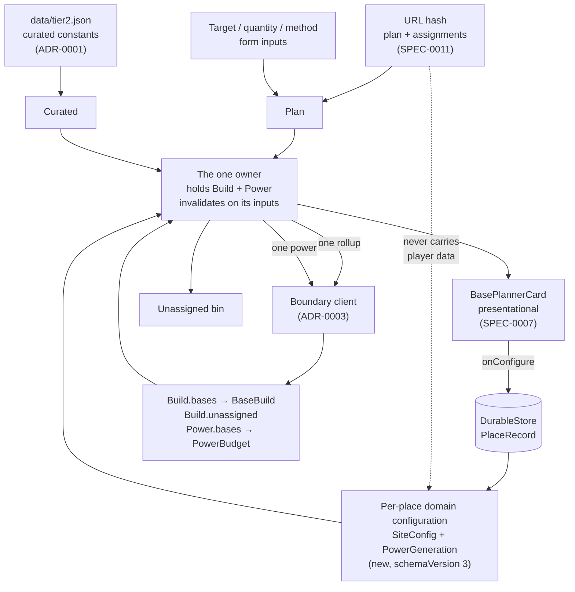

# ADR-0016: One owner for the stage-2 and stage-3 crossings, and a home for per-place domain configuration

## Context and Problem Statement

The base planner card is built, specified and tested, and the application has never rendered one. Not because the card is unfinished — because nothing in the application produces the `BaseBuild` it takes as a prop. Three hooks reach toward stage 2 and none of them arrives: `useLeafAssignment` sends a rollup carrying assignments and no site configuration, `useConfiguredBase` sends one carrying site configuration and no assignments and then *discards the payload*, and every test of the card hand-builds a `BaseBuild` literal because there is no other way to get one.

That is not two bugs. It is one absence: nobody owns the stage-2 and stage-3 crossings. Each hook was built to prove that a change dispatches a recompute, which is what its requirement asks, and neither was built to keep the answer.

Underneath sits a second, quieter gap. A base's extractor class and fill duration are player-authored values that the *domain reads as input*. SPEC-0011 REQ "The Hash Owns the Plan, the Store Owns the Player" gives the hash the plan and the store the player's data, and SPEC-0005 REQ "View State Boundaries" lets the view hold interface state only. A site configuration is none of those three things as they are currently enumerated, so it has been living in React state, forgotten on every reload.

So: who issues the rollup the cards render from, and where does the configuration that shapes it live?

## Decision Drivers

* **One request, or the figures are wrong.** A rollup carrying assignments without sites reports every leaf unsited; one carrying sites without assignments reports no demands at all. The correct request is the union, and a design in which two callers each hold half cannot produce it.
* **SPEC-0005 REQ "View State Boundaries."** A cached boundary result "MUST be invalidated by the inputs that produced it, and MUST NOT be edited in place." Whoever keeps `Build` inherits that obligation, so there should be exactly one of them.
* **SPEC-0011's store/hash split is already decided.** Player-authored durable data belongs in the store and MUST NOT be encoded into the hash. The question is not where configuration goes, but that nothing has yet said a domain *input* can be player-authored data.
* **The card is already the right shape.** `BasePlannerCardProps` takes `base: BaseBuild`, `budget: PowerBudget`, `configuration` and `onConfigure`. It is presentational and wants to stay that way; SPEC-0007 covers the card and explicitly defers "the panel that arranges cards" to a shell surface that has no spec.
* **A configuration that forgets itself is not a configuration.** SPEC-0009 REQ "View Preferences Survive a Reload" makes exactly this argument — "a preference that forgets itself on reload is not a preference." A player who sets class S and a ninety-minute fill has authored something.
* **The drift should shrink, not grow.** `useLeafAssignment` holds a second copy of `plan.assignments`, which already has an owner. Mounting the card is the moment to remove that, not to build a third holder beside it.

## Considered Options

* **A. One owner in the shell** — a single hook holds nothing the plan already holds, issues one rollup and one power call, and hands decoded figures down
* **B. Per-card owners** — each card issues its own crossing for its own base
* **C. A stage-2/3 provider** — option A's state, delivered through React context instead of props

## Decision Outcome

Chosen option: **A, one owner in the shell**, with per-place domain configuration persisted on `PlaceRecord`.

Concretely, four things move:

1. **Assignments stop being held twice.** `plan.assignments` is the owner, the hash is its persistent home per SPEC-0011, and an assignment edit is a plan edit. `useLeafAssignment` keeps its resolution rule — an assignment naming an absent place is unassigned — and loses its own map and its dispatch.

2. **Per-place domain configuration becomes player data.** `SiteConfig` and `PowerGeneration` join `ticks` and `stocked` on `PlaceRecord`, read and written through `DurableStore`. This is a `SCHEMA_VERSION` bump to 3 and an amendment to SPEC-0009, not a new store.

3. **One hook owns the crossings.** It takes the plan, the place records, and the curated constants; it issues exactly one `rollup` and one `power` per settled change; it keeps the decoded `Build` and `Power` and invalidates them by those inputs. `useConfiguredBase` becomes the editor for a place's configuration field and stops crossing the boundary.

4. **The cards stay presentational.** `BaseBuild` and `PowerBudget` in, `onConfigure` out — which is what they already accept.

**The naming this ADR is actually for.** SPEC-0011 splits state into plan state (the hash) and player-authored data (the store), and SPEC-0005 reserves interface state for the view. A site configuration is player-authored, so the store is where it goes; what made it homeless is that it is also **an input the domain reads**, and no artifact had said those two facts could be true of the same value. They can. The consequence is narrow and worth stating: such a value is written by the player, stored locally, sent with every request — and **never** encoded into a shared link, because SPEC-0011 forbids player-authored data in the hash in either direction. A shared plan carries where you decided to gather Sulphurine; it does not carry the class of your extractor.

**Why not B, honestly.** B is the smaller diff and the independence is appealing. It is also mostly illusory: the domain's `RollupProducers` iterates every group and returns every base, so each card's own rollup would return all N bases and discard N−1 of them. The assignments map has to reach every card regardless. What B actually buys is N crossings, N sequence counters, and two callers constructing the same request shape.

### Consequences

* Good, because the request that reaches the domain is the whole request, and there is no arrangement of the code in which half of it is missing.
* Good, because `Build.unassigned` arrives on the payload the cards are already rendering from, so the handoff's unassigned bin needs no second call.
* Good, because a configuration survives a reload, and the store already holds the player's other per-place state, so nothing new is introduced to keep in step.
* Good, because it deletes a duplicate rather than adding an owner: `useLeafAssignment`'s private assignments map goes away.
* Good, because the one-owner rule is mechanically checkable — a source scan for `client.rollup` outside the owning module, in the style of `tests/helpers/source-checks.ts`.
* Bad, because a single card's class change re-costs every base. This follows the domain's design rather than the view's, and it is the behaviour today; naming it here stops it being discovered as a surprise.
* Bad, because it is a schema migration. `SCHEMA_VERSION` goes to 3, and ADR-0008's versioning discipline means a store at 2 must fail legibly rather than guess.
* Bad, because two merged stories lose the halves their tests assert. Those tests do not disappear — the dispatch assertions move to the new owner — but the change touches code that is on main and green.
* Neutral, because the panel that arranges the cards still has no spec. This decision is its precondition, not its substitute.

### Confirmation

* **One owner, checked by scan.** No module other than the owning hook's calls `client.rollup` or `client.power`. Today there are exactly two such call sites — `src/card/useConfiguredBase.ts:93` and `src/canvas/useLeafAssignment.ts:141` — and both lose theirs. Absence is confirmed mechanically rather than by review, for the reason `tests/boundary/discipline.spec.ts` gives: the failure mode is always the path nobody thought of.
* **One crossing per change.** A test drives one configuration change and asserts exactly one rollup and one power call settled — not two, and not one per rendered card.
* **The request is whole.** An integration test against the real module assigns a leaf to a configured place and asserts the returned `BaseBuild` carries a sized producer row for it. Today either half of this request returns nothing useful.
* **Configuration outlives the page.** A class and a fill duration set on a card are as the player left them after a reload, asserted against IndexedDB rather than against the screen.
* **The hash stays clean.** A hash encoded from a workspace with configured places contains no site or power configuration. This is SPEC-0011's "a share carries no player data" scenario applied to the value this ADR introduces, and it is the assertion that keeps the split from eroding.

## Pros and Cons of the Options

### A. One owner in the shell (chosen)

One hook above the cards holds the decoded `Build` and `Power`; the plan and the place records are its inputs; the cards receive figures and emit configuration edits.

* Good, because the union of assignments and site configuration exists in exactly one place, so the incomplete request is not expressible.
* Good, because it matches the one hook in this codebase that already works this way — `usePlanResolution` owns stage 1, keeps its result, and invalidates on its inputs.
* Good, because SPEC-0005's cache obligation lands on one module rather than being restated in several.
* Good, because the cards become testable without a module, which is what their fixtures already assume.
* Bad, because the hook's input list is long: plan, places, constants. A long parameter list is a smell, though here each entry is a genuinely independent source.
* Bad, because it is the larger refactor, and it lands on two stories that are merged and passing.

### B. Per-card owners

Each mounted card issues its own rollup and power call for its own base, keeping `useConfiguredBase` roughly as it is and changing it only to return what it fetched.

* Good, because it is the smallest change: one hook gains a return value and nothing else moves.
* Good, because a card is self-contained, which makes it trivially composable onto any surface.
* Bad, because the domain returns every base from every rollup, so N cards means N crossings each discarding N−1 bases. The cost is real and grows with the thing players are most likely to add more of.
* Bad, because the assignments map still has to reach every card, so the independence is nominal — the card depends on plan-wide state either way.
* Bad, because two modules construct `RollupRequest`, which is precisely the drift that made `useLeafAssignment` and `useConfiguredBase` send different halves of it in the first place.
* Bad, because out-of-order replies have to be handled per card rather than once.

### C. A stage-2/3 provider

Option A's ownership, delivered through a React context the cards subscribe to rather than props threaded through the surface.

* Good, because it avoids prop drilling once the panel gains a header strip, a route bar and an unassigned bin between the owner and the cards.
* Good, because it is a real pattern in this codebase already — `ViewStateProvider` exists and works.
* Bad, because it puts a second state container beside the one SPEC-0005 deliberately keeps narrow, and the plan and its derived figures are exactly what that requirement keeps out of `ViewState`. A provider named for the domain's stages invites the next person to put the plan in it.
* Bad, because context makes the card's dependencies invisible at the call site, and the card's props are currently its whole contract.
* Neutral, because this is a delivery mechanism rather than a different owner. If prop threading becomes the real problem once the panel exists, adopting it later changes no ownership and needs no new decision.

## Architecture Diagram

The dotted edge is a prohibition rather than a flow: SPEC-0011 forbids player-authored data in the hash in either direction, and the configuration this ADR introduces is the first domain *input* that rule applies to.

## More Information

**What this decision does not settle.** The panel that arranges the cards — header strip, target switcher, unassigned bin, route bar, the link to the Atlas — remains unspecified. SPEC-0007 § Scope pushed it to "the shell surface, which has no spec yet", and this ADR is that spec's precondition rather than a replacement for it. The surface question itself looks settled by the design: `docs/design/base-planner/handoff.md` opens by calling it "the build-checklist surface" with its own header strip and a "view tree →" link, and SPEC-0010 independently refers to "a run stop linking to a base's card".

**Why ADR-0004 is extended rather than merely cited.** ADR-0004 left client state management open and described what the view would be left holding once ADR-0003 moved the domain into Go: "selection, section collapse, form inputs, and focus." That list is short by one category. The view also holds the player's *inputs to* the domain — assignments, and now per-place configuration — which are neither interface state nor figures the domain produced. This ADR names that category and gives it a home, which is the part of ADR-0004's open question that the card surface forces.

**Why the persistence question is narrower than it first appears.** SPEC-0011 REQ "The Hash Owns the Plan, the Store Owns the Player" already assigns player-authored durable data to the store, and `PlaceRecord` already carries `ticks` and `stocked` on exactly that basis. SPEC-0007 REQ "Absent Data Is Absent" forbade the card persisting per-base data "until a governing decision establishes where it lives" — ADR-0008 established it for annotations and ticks, and this ADR finishes the job for configuration. No new storage mechanism is introduced.

**The duplicate that goes away.** `plan.assignments` exists and is encoded into the hash; `useLeafAssignment` also holds an assignments map in React state. Both are current, and the hook's own doc comment explains why it was built that way — the shell had no constants, so it held assignments and dispatched nothing. With constants shipped (#157) the reason has expired, and two holders of one value is the kind of thing that is cheap to remove now and expensive later.

**Open, and deliberately out of scope.** Whether a plan's `Recompute` button should also gate stage 2, or whether configuration edits recompute immediately as SPEC-0007 requires while plan edits wait for the button. Both behaviours are currently implemented and the inconsistency is visible; it is a spec question for the panel rather than an ownership question.

**References.**

* ADR-0003 — the boundary and the three stages this decision routes through
* ADR-0004 — the view layer, and the state-ownership question this extends
* ADR-0008 — the durable store and its schema-versioning discipline, which the `SCHEMA_VERSION` bump inherits
* ADR-0010 §4 — surfaces as shell view state, inside the one navigation landmark
* SPEC-0005 REQ "View State Boundaries", REQ "Boundary Client" — the cache obligation and the single access path
* SPEC-0007 § Scope and REQ "Absent Data Is Absent" — the card, and the panel it deferred
* SPEC-0009 REQ "View Preferences Survive a Reload" — the "a preference that forgets itself is not a preference" argument, applied here to configuration
* SPEC-0011 REQ "The Hash Owns the Plan, the Store Owns the Player" — the split this decision applies to a domain input
* `docs/design/base-planner/handoff.md` — the build-checklist surface and the card anatomy
