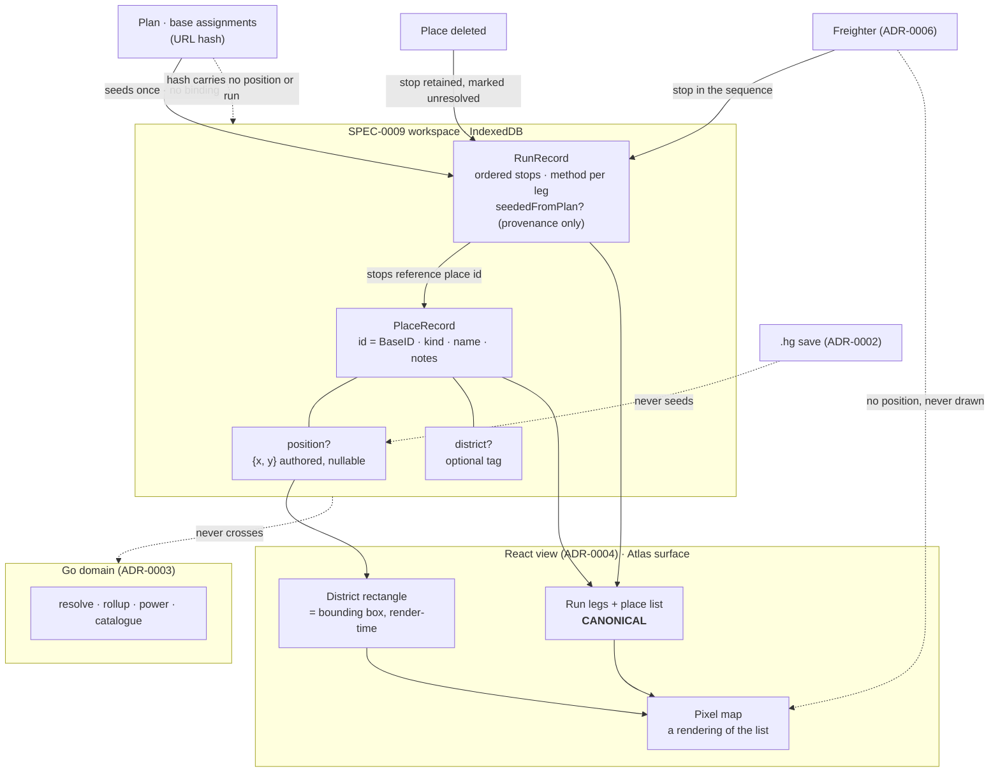

# Base Atlas — Design

## Context

`docs/design/bases-map/` has been a complete, high-fidelity design for a long time: a pixel map of every base, dashed district territories, harvest runs with numbered waypoints and per-leg travel methods, a handoff document and an interactive prototype. It had no ADR, no spec, no issues and no implementation, while two accepted decisions already reasoned about it as though it existed — ADR-0006 carries a section on the freighter's place in the route graph, and ADR-0007 rejects an option on the grounds that the Atlas dossier is too small for settlement state.

[ADR-0015](../../../adrs/ADR-0015-base-atlas-coordinate-space-and-route-graph.md) closed that gap by answering the three structural questions: where positions and runs live (the SPEC-0009 store), whether a run is authored or derived (authored, seeded once), and whether the route graph belongs in the Go domain (no). This spec turns those answers into requirements.

The starting conditions are good. SPEC-0009 is implemented, so the workspace and the place record exist. The two things this surface adds to the store are a nullable field and a new record type. Nothing here is blocked on the module, on save import, or on an account.

## Goals / Non-Goals

### Goals

- Give positions, districts and runs a home in the existing store, with the schema discipline SPEC-0009 already enforces.
- Make the freighter's "route node, never positioned" split fall out of the schema rather than out of a conditional.
- Make the ordered list canonical, up front, so the component tree is shaped by it rather than retrofitted around it.
- Keep the domain/view boundary exactly where it is: the Atlas adds nothing to it.
- Preserve player work — a deleted place must not silently reorder a route the player authored.

### Non-Goals

- **Route optimisation.** There is no metric. See "There is no distance to minimise" below.
- **Real coordinates.** Atlas positions are arrangement, not geography, and are never seeded from `GalacticAddress` or the in-game `Position`.
- **The shell's navigation model.** ADR-0010 §4 owns it; this spec adopts it and adds one surface.
- **Multiple runs drawn at once.** Held at one deliberately, which makes the overlapping-waypoint defect unreachable.
- **Authored district rectangles.** A district is a grouping and its territory is the hull of its members. A territory that is not that hull is a new decision, not a spec detail.
- **Accounts, sync, sharing mechanics.** ADR-0008 stages 2 and 3, ADR-0009, and the ADRs reserved at 0011–0014.

## Decisions

### There is no distance to minimise

The obvious objection to keeping routes out of the domain is that "the shortest run across five bases" looks exactly like the kind of thing a domain computes. It is not, and the reason is narrower than "rendering is the view's job".

Atlas positions are the player's arrangement of their own map. They are not the game's coordinates, not to scale, and not derived from anything. Travel between stops is a teleporter or a portal — constant cost, unaffected by how far apart two buildings sit in that arrangement. A shortest-path computation over this graph would minimise a fiction against a uniform cost. It is not that the domain may not compute the route; there is no well-posed question to ask it.

This is why REQ "The Atlas Makes No Boundary Call" forbids ranking, optimising or costing a route while permitting bounding-box and waypoint geometry. The line is not "no arithmetic in the view" — SPEC-0006 already permits layout geometry. The line is between geometry that positions what the player authored and arithmetic that claims a route is better than another.

**The premise to watch:** if positions ever mean real in-game distance, or travel acquires a per-leg cost, this argument fails and route optimisation becomes genuine domain work. ADR-0015 records that as a supersession trigger, not an amendment.

### Optional position, because the freighter requires it

ADR-0006 requires a freighter to be a route node that is never positioned. A schema making position mandatory would contradict an accepted decision on its first record.

So position is nullable on `PlaceRecord`, and the freighter needs no special case. REQ "A Freighter Is a Route Node Without a Position" makes the absence of a special case testable: a conditional on place kind in the positioning or map-rendering path is the defect, not the fix. This is the same shape as SPEC-0007 REQ "Absent Data Is Absent" — an absent value is a state, not a gap to fill with a default.

Two integers, in the Atlas's own grid space, meaningful only relative to other positions in the same workspace. Never seeded from the save. That last clause is a grep-for-absence assertion, the same one ADR-0006 already requires of the freighter card, and it exists because `GalacticAddress` is right there in the import path and looks like the obvious source.

### District as tag, rectangle as render-time geometry

Storing the rectangle would create a second source of truth that goes stale the moment a member moves. Deriving it means the territory cannot disagree with its members, and moving a place writes one field.

This is SPEC-0006 REQ "Layout Geometry Is Not a Domain Value" applied unchanged: a rectangle enclosing points is geometry, the points are the authored data. Drawing the same line differently on a second surface is how two surfaces end up with two answers to one question.

A place with no district is drawn outside every territory. There is no "ungrouped" pseudo-district record, because inventing one would make an absence into a value and then require code to distinguish the real districts from it.

### Runs are authored, seeded once, and owned by the workspace

The design shows two runs matching the planner's two targets, which invites "derive runs from assignments". A plan carries a set of bases; a run carries a sequence and a travel method per leg. Two of a run's three components have no source in any plan, so deriving would mean inventing both and presenting the invention as derived.

Seeding is the honest version of that convenience: a one-time copy that produces an ordinary authored run. REQ "Seeding Is a One-Time Copy" makes the absence of a binding testable — the plan gains a base and the run does not move.

Runs belong to the workspace rather than to a plan, because a player holds several plans and a route through their own base network outlives any of them. A run may record its seeding plan for provenance, and must survive that plan's deletion.

The cost is real and is recorded in ADR-0015: a player who edits a plan and expects their run to follow gets divergence instead. The alternative — a live binding that silently reorders a route the player arranged — is worse.

### Retain the unresolved stop; never renumber around a gap

ADR-0010 §1 rules that a plan assignment naming a deleted place resolves to unassigned. A run cannot use that mechanism, because a sequence has no unassigned bucket.

Dropping the stop silently would reorder a route the player authored. Renumbering the remaining stops would do the same while looking tidy — the tidier failure is the worse one, because the player has no signal that anything happened. So the stop stays, in place, marked unresolved, removable deliberately.

REQ "A Stop Naming a Deleted Place Is Retained and Unresolved" asserts the numbering explicitly (stops four and five are still four and five) because "the run still exists" is satisfiable by an implementation that quietly renumbers.

### The list is canonical, and that is a component-tree decision

A pixel map of clickable buildings is the hardest accessibility case in this project. It cannot be met by bolting an alternative on afterwards, because a surface designed map-first grows operations that only the map has, and the alternative then chases them.

So the run panel's ordered legs and the place list are the surface, and the map renders them. REQ "The Ordered List Is Canonical" forbids any map-only operation, which has one non-free consequence: repositioning by dragging implies a non-spatial way to set a position, which the prototype does not have and the design did not consider. That is stated as a requirement rather than left to implementation, because it is the requirement that costs something.

Run identity cannot rest on the run colours the design assigns. The numbered waypoints and per-leg method chips already carry order and method without hue; the active run's name carries identity. That is the existing `StatusBadge` rule — a glyph and a word beside every colour — applied to a surface that had been leaning on colour alone.

### Nothing new on the boundary, stated as an absence

REQ "The Atlas Makes No Boundary Call" is written as "no position, route, district, distance or travel entry point exists" rather than "the boundary has exactly N calls". ADR-0010 §5 adds a catalogue call for target search; a fixed count would fail for a reason that has nothing to do with the Atlas.

The complementary assertion — the Atlas renders completely with the module unloaded — is also what makes the Atlas eligible as the shell's entry surface under ADR-0010's own criterion. It is asserted here as a property of this surface, not as a claim about what the shell chooses to open on.

## Architecture

**Component shape that follows from the list being canonical.** The run panel and place list are the data-bearing components; the map is a sibling that consumes the same props and renders them spatially. No operation is defined on the map component that is not defined on a list component, and the map holds no state the list does not. An operation added to the map later without a list equivalent is a requirement violation, not a design drift.

**Where the geometry lives.** Bounding boxes and waypoint placement are computed in the map component at render time from positions passed in as props. Nothing geometric is stored, memoised into the store, or sent anywhere.

## Risks / Trade-offs

- **The no-metric premise is an argument, not a fact of the codebase.** If it changes, REQ "The Atlas Makes No Boundary Call" is wrong rather than merely outdated, and ADR-0015 should be superseded. Watch for: positions meaning real distance, or travel acquiring a per-leg cost.
- **Seeded-then-owned runs drift from their plans.** A player who edits a plan and expects their route to follow will be surprised. Mitigated only by making the seeding visibly one-time in the UI; not mitigated in the data model, by design.
- **Non-spatial repositioning is real production work.** Neither the prototype nor the handoff has it. It is the price of "no map-only operation" and it is not small.
- **The schema bump invalidates stored workspaces** under SPEC-0009's load-nothing rule. Cost is theoretical today because the field has no data in it; it will not be theoretical after the first release that ships positions.
- **Sharing now discloses arrangement.** Weak disclosure — arrangement rather than geography — but it is a new thing leaving the device on a path ADR-0008 built deliberately narrow. REQ "Sharing a Place Discloses Its Arrangement" makes the player aware rather than reversing the decision.
- **One active run is a constraint nobody asked for.** It buys the overlapping-waypoint defect being unreachable. If a player ever wants two runs drawn, that defect comes back and needs a real answer.

## Migration Plan

1. **Schema first.** Increment `schemaVersion`, add nullable `position` and `district` to `PlaceRecord`, add the run record. SPEC-0009's load-nothing rule handles the old version; the version-mismatch report is exercised as part of this change rather than after it.
2. **List before map.** Build the run panel and place list against the store, with every operation, before any map component exists. This is the order the canonical-list requirement implies, and building it in the other order is how a map-only operation gets created.
3. **Map as a renderer.** Add the map consuming the same props. Bounding boxes and waypoints computed at render.
4. **Seeding last.** The seed-from-plan convenience is additive and depends on nothing else here.

No data migration is needed: there are no stored positions or runs to move, and the new fields are nullable on existing records that the version bump discards anyway.

## Open Questions

- **Does a run stop deep-link to that base's card?** ADR-0015 §(e) defers it and notes that ADR-0010 §4 already settles the mechanism — a content link inside `main`, not a second landmark. This spec permits it (see REQ "The Atlas Is a Surface in the Shell") and does not require it.
- **What is the non-spatial position control?** Numeric fields, a grid picker, and "place relative to" are all viable. The requirement fixes that one must exist, not which.
- **How is a district assigned from the list?** REQ "The Ordered List Is Canonical" requires a non-spatial means; the interaction is unspecified.
- **Do districts ever become authored rectangles?** ADR-0015 defers it: deriving is correct while a district is a grouping. A territory that is not the hull of its members is a new decision.
- **Does the Atlas become the shell's entry surface?** It meets ADR-0010's criterion. Whether it is chosen is the shell's call, not this spec's.
