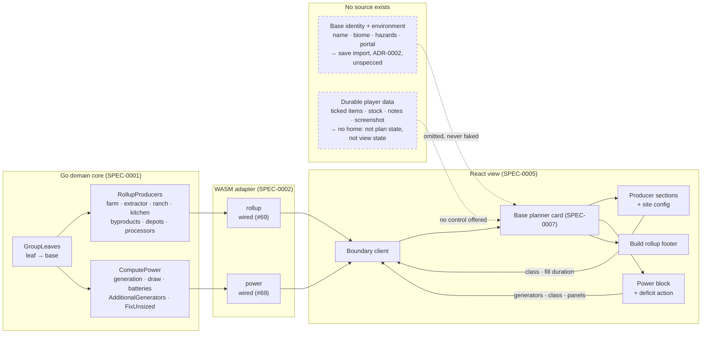

# Design: Base Planner Card

## Context

The base planner card is where the plan stops being a graph and becomes instructions: this many plants in this many biodomes, this many extractors at this class, this much power short and this many generators to fix it.

Its upstream is unusually complete. SPEC-0001's stages 2 and 3 are merged and cover every producer type the design draws — farm, extractor, ranch and kitchen — along with byproduct offsets, supply depots, per-base nutrient processors and pellet feeders, growth and cycle and fill durations, generation and draw, batteries for solar night coverage, and the additional-generator count that turns a deficit into an action. Very little of what this card displays needs new domain work.

What it needed was a boundary, and it has one. When this spec was drafted, `Module.Rollup` and `Module.Power` were reserved stubs returning a not-implemented envelope, and nothing this card renders could cross into JavaScript at all — unlike the tree canvas, where that dependency blocked one interaction, here it blocked the whole surface. Issue #64 wired both, so stage 2 and stage 3 payloads now cross.

Two of this spec's requirements are better supported than they were written to be. The boundary carries electromagnetic generator count, class and solar panel count as independent values, so REQ "Power Configuration Supports Mixed Sources" describes a configuration the wire actually accepts rather than one it might. And `fixUnsized` crosses as its own field, so REQ "Deficit Is an Action, Including When It Cannot Be Sized" has a real signal to read rather than a state a view would have to infer from a zero.

The design references are two prototypes rather than one. `Base Planner.dc.html` is the checklist, power and environment reference. `Base Planner v2.dc.html` is a manager view, adding a checkable build list with a progress bar, a storage tracker, an environment strip with biome and sentinel and economy detail, collapsible sections, a mini power-grid diagram, notes with tags, a screenshot slot, a target switcher, and an 8-bit restyle that squares every corner and swaps the display font. The handoff is explicit that its numbers are illustrative and production reads game data, so no figure in it is treated as normative here.

**The gap this spec is mostly about is not in the design or the domain, but between them.** The card as drawn shows three kinds of information, and only one of them has a source.

*Plan output* — every count, quantity, duration and power figure — comes from stages 2 and 3, and exists.

*Base identity and environment* — the base's name, its planet type and biome, its hazards, its sentinel level and economy and star class, its portal address — comes from nowhere. `BaseID` is a bare string. The Tier 1 artifact carries recipes, items and economy constants and nothing about a place. This is save-file data, which ADR-0002 decided would be imported client-side and which has no specification.

*Durable player data* — which construction items have been ticked off, how much of each resource is already stocked, notes and tags, a screenshot, a player-chosen base name — also comes from nowhere, and is a genuinely new category. It is not plan state: it is not derived from the graph, and a screenshot does not belong in a URL hash. It is not the interface state SPEC-0005 permits the view to hold, which is enumerated as selection, section collapse, form inputs, focus and view-local preferences. It needs a decision about where it lives before any of it can be built.

## Goals / Non-Goals

### Goals

- Render one base's construction instructions faithfully from the stage 2 and stage 3 payloads
- Give the player the configuration the domain accepts — extractor class and fill duration per site, generator count and class, panel count — and recompute through the domain for all of it
- Make a power deficit an action, including the case where it cannot yet be sized
- Keep every figure the domain's, including the durations whose unit is not yet confirmed
- Draw the line at data with no source, so the card cannot quietly invent it

### Non-Goals

- The panel around the cards: header strip, route bar, target switcher, unassigned bin, atlas link. Shell furniture, and the shell has no spec
- The base atlas surface, and the tree canvas (SPEC-0006)
- The freighter and settlement cards. ADR-0006 and ADR-0007 both chose a dedicated card variant over a base card with sections hidden or substituted, each for the same reason — a card defined by what it suppresses accumulates a conditional at every future change to this one. Both are `proposed` and each wants its own spec; what they inherit from this one is the card's composition rules, not its producer sections
- Save-file import (ADR-0002), which is where base environment data would come from
- Deciding where durable player data lives. This spec establishes that it has no home and constrains the card accordingly; choosing one is an architectural decision, not a view requirement
- Choosing between the v1 and v2 visual treatments

## Decisions

### The card is the unit; the panel is not

**Choice**: Specify the per-base card and name the chrome around it as shell.

**Rationale**: The card is the part with a domain payload behind it — one base, one `BaseBuild`, one `PowerBudget`. The panel's contents are a different kind of thing: a route between bases, a switcher between whole plans, a bin of unplaced leaves. They arrange cards and coordinate with other surfaces, which is what a shell does. Splitting here means this spec can be complete while the shell is still unspecified, rather than becoming partly a shell spec and blocking on questions the card does not need answered.

**Trade-off**: The unassigned bin sits awkwardly on the line — visually a peer of the cards, structurally the grouping's leftovers rather than a base. Left to the shell because it is about what the plan has *not* placed, which is a panel-level fact.

### Absent data is absent

**Choice**: The card must render completely from the plan payloads and the base identifier alone. Environment metadata is omitted when unavailable rather than shown as a placeholder, and no control may imply persistence that does not exist.

**Rationale**: This is the central decision, and it is a refusal rather than a feature. The prototype is populated: every card has a planet type, a hazard note, a portal address, notes, a screenshot slot, and stocked-versus-needed bars. None of it has a source, and all of it is convincing. A card built to match the prototype will acquire sample values, and sample values that survive into a build are indistinguishable from real ones — which is the failure mode this project has recorded repeatedly, in the PSARC label, in the Tier 2 "confirmed absent" finding, and in ADR-0001's node counts that turned out to be the fixture's.

The persistence half matters more than it first appears. A checkbox that ticks and a note that types are trivial to build and feel finished, and the data evaporates on reload. That is worse than the feature's absence: it teaches the player their work is saved. Forbidding the control until a store exists keeps the gap visible instead of shipping something that quietly loses data.

**Alternatives considered**:
- *Show placeholders and mark them clearly*: rejected. A marked placeholder is still a value on screen, and the mark is the first thing lost in a later restyle.
- *Hold the durable data in view state for the session*: rejected as the failure above.
- *Specify a store here*: rejected as out of scope. Where durable player data lives is an architectural decision with consequences beyond this card, and deciding it inside a view spec is how a decision ends up with no ADR.

### Power sources are counts, not a mode

**Choice**: The card configures electromagnetic generator count, generator class, and solar panel count independently, rather than offering a source-type toggle.

**Rationale**: The domain already answered this. `PowerConfig` carries `EMGenerators`, `EMClass` and `SolarPanels` as three independent values on one base, so a base running both is a configuration the engine accepts and computes. The prototype's EM|SOLAR toggle cannot express it, and the handoff's own open questions say as much — "production likely needs a generator list instead of a type toggle." The design guessed, the domain decided, and they agree.

Solar's classlessness follows from the same place: the domain scales electromagnetic output by hotspot class and does not scale solar at all, so a class control beside the panel count would imply arithmetic the engine does not perform.

### A deficit that cannot be sized is still a deficit

**Choice**: The card presents the unsized-fix state explicitly — deficit shown, fix stated as needing a generator class — rather than treating it as either a normal deficit or an absence of one.

**Rationale**: The domain models this state deliberately. `PowerBudget.FixUnsized` exists with the comment that a base you cannot yet cost is not a base you should be unable to see. The design has no such state: its deficit is always a sized, clickable fix. An implementer working from the prototype alone would meet a budget in deficit with `AdditionalGenerators` of zero and reasonably conclude there was nothing to show.

The related prohibition — that the card must not compute a solar fix — closes the other end. `AdditionalGenerators` is electromagnetic only, while the prototype's fix button offers panels as well. The panel count the design implies is not a number the domain reports, and computing it in the view would be exactly the arithmetic SPEC-0005 forbids.

### Durations are estimates, because the unit is not confirmed

**Choice**: Every duration on the card is presented as an estimate, and the card performs no unit conversion.

**Rationale**: `Constants.ExtractorRate` records the problem in its own comment: the extractor part carries a rate of 100 against a storage of 360,000, which fills in 3,600 of whatever those units are — an hour if the rate is per second, and the artifact does not say. The engine is internally consistent either way because callers supply the fill duration in the same unit, but the absolute number is only as right as that reading, and the comment ends by saying it is worth confirming in game before any duration is shown to a user.

This card is where that happens. Fill times, growth times, collection cycles, processing steps and a readiness estimate are all on it, and the prototype shows them as confident figures. Presenting them as estimates costs nothing if the reading turns out right, and avoids stating a wrong hour count as fact if it does not. The conversion prohibition follows: a card that turned seconds into hours would be putting the unconfirmed assumption into the view, where it is furthest from the comment that documents it.

### Provenance is required of the card, and is not yet available to it

**Choice**: The card must mark unverified figures where the payload reports provenance, and must not imply a verified/unverified distinction has been checked where it has not.

**Rationale**: The awkward version of this requirement is the honest one, because stage 2's provenance is incomplete. `PowerBudget` carries `Verified`. No producer row does — not `FarmRow`, `ExtractorRow`, `RanchRow`, `KitchenStep`, `NoBuild`, nor `BaseBuild` — even though `LeafDemand` carries stage 1's provenance into the grouping the producer stage reads. And `Curated` carries no verified dates at all, so SPEC-0001's scenario "a Tier 2 constant used in a producer calculation lacks a verified date" has nothing to evaluate.

That matters here more than anywhere else, because this card is built almost entirely on curated constants: biodome capacity, fauna yield and cycle length, steps per processor, the depot threshold, panels per battery, and processing time are all planner policy or community-sourced rather than read from the tables. A card that marked its power budget while showing every producer count unmarked would be asserting a distinction that was never computed. Stating the requirement as a prohibition on implying the check keeps the card honest until the domain can support the positive form.

## Architecture

## Risks / Trade-offs

- **The prototype is more finished than the data.** v2 is a convincing manager view, and most of what makes it convincing has no source. The pressure during implementation will be to fill the gaps with something plausible. → REQ "Absent Data Is Absent" is written as a prohibition for that reason, and its scenarios test for the placeholder rather than for the feature.

- **Every producer row will carry the marker, not a rare few.** The domain gap this spec was drafted around is closed: stage 2 now carries provenance per row and per base, and `Curated` carries verified dates. But none of this project's curated constants has a date yet, so a card rendered today marks every producer row. The design tuned that treatment against two subtle chips in a prototype. → The requirement now states the legibility constraint directly rather than hedging about availability, and a surface implementing it should be reviewed against the all-marked case rather than the two-chip one.

- **Two design references disagree visually.** v1 and v2 differ in display font, corner treatment, meter rendering and button shadows, and the handoff presents the 8-bit restyle as v2-only with v1 kept as the earlier reference. Neither is marked normative. → Recorded as an open question. Token discipline holds under either, so the ambiguity does not block structural work; it blocks final styling.

- **The card carries a lot of controls.** Class, fill duration, generator count and class, panel count, section collapse, selection, and a deficit action, times however many bases. Each recompute is a boundary crossing. → The focus-stability requirement exists because this is where a naive re-render will be most obviously wrong; a card that loses focus on every configuration change is unusable by keyboard.

## Migration Plan

Greenfield. The prerequisite this plan was written around — issue #64, wiring `rollup` and `power` into the boundary — has landed, so step 1 below is done and the surface is startable.

1. ~~Issue #64 wires `rollup` and `power` into the boundary.~~ Done.
2. Static card: identity, producer sections, byproduct rows, and the build footer, rendered from a payload with no controls. This exercises the composition and the no-arithmetic rule first.
3. The power block, including the deficit action and both the unsized and solar-deficit cases, which are the states most easily missed.
4. Site and power configuration controls, with recompute through the boundary and the focus-stability behaviour.
5. Section collapse and card selection.

Steps deferred until a governing decision exists: the checkable build list, storage tracking, notes, the screenshot slot, and base renaming. Steps deferred until save import exists: the environment strip and portal address.

## Open Questions

- **Where durable per-base player data lives.** Ticked items, stocked quantities, notes, tags, screenshots and player-chosen base names are none of plan state, view state, or domain output. This is the largest unanswered question on the surface and probably wants an ADR rather than a spec requirement, since it touches persistence, sharing and save import together.
- **Which visual treatment is normative, v1 or v2.** Also whether the 8-bit restyle is a theme variant the token layer can express or a separate treatment.
- **Whether the readiness estimate should account for refining time.** The handoff raises it as an open question and assigns it to the shell, but the figure is displayed on the card, so the card is where a wrong answer is visible.
- **Whether extractor fill duration is a per-site control or a plan-wide default with per-site override.** The domain models it per site; the design exposes it only through a global tweak, which is a third arrangement that matches neither.
- **How a base with no configured power source should read.** The domain reports zero generation and a deficit equal to draw. Whether that is a deficit to fix or an unconfigured base to set up is a presentation question the design did not face, because every prototype base was configured.
