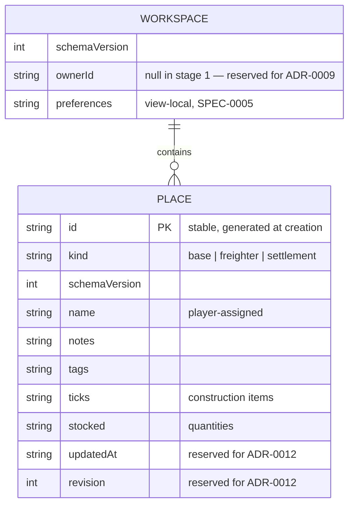
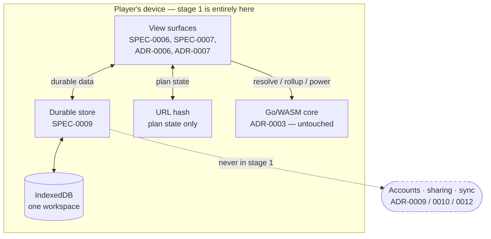

# Design: Durable Store

## Context

[ADR-0008](../../../adrs/ADR-0008-durable-user-data-store.md) decided that durable, player-authored data lives in a local-first IndexedDB store, with an optional account added later for sync and read-only sharing. [SPEC-0009](spec.md) is **stage 1 of three** — the local store, with no account, no server and no network.

The gap it closes is concrete. SPEC-0007 REQ "Absent Data Is Absent" forbids the base planner card persisting ticks, stocked quantities, notes, tags or player-assigned names, and forbids even *showing a control implying persistence*, "until a governing decision establishes where it lives." ADR-0008 is that decision and is now `accepted`, so the clause is discharged — but the card still has nothing to persist into. Four surfaces are waiting: the planner card, the tree canvas's base assignments, and the freighter and settlement surfaces ADR-0006 and ADR-0007 add.

There is a smaller gap that bites sooner. SPEC-0005 permits the view to hold "view-local preferences" as interface state, and `ViewState.preferences` holds exactly two — `groupSeparator` and `showUnverified`. With no store they last one page load, and a preference that forgets itself is not a preference.

**Nothing here exists yet.** `grep -rn "localStorage\|sessionStorage\|indexedDB\|caches\.\|navigator.storage"` over `web/src`, `web/tests` and `web/index.html` returns nothing. The design README's storage prohibition is intact in code, not merely on paper, and ADR-0008 lifts it for durable data while keeping it for plan state.

## Goals / Non-Goals

### Goals

- Give durable per-place data a home, so SPEC-0007 can ship its todo list, notes and stocked counts
- Give view preferences somewhere to survive a reload
- Carry the schema room ADR-0008 reserved — `ownerId`, `updatedAt`, `revision` — so stages 2 and 3 are additions rather than migrations
- Keep the store's failure modes legible: unrecognized version loads nothing, quota failure is not reported as success

### Non-Goals

- Accounts, identity, sign-in. ADR-0008 stage 2; ADR-0009's subject
- Sharing and permissions. Stage 3; ADR-0014's subject
- Multi-device sync and conflict resolution. ADR-0012's subject — `updatedAt` and `revision` are reserved here, and nothing reads them yet
- Blob and screenshot storage. ADR-0013's subject. Stage 1 may hold an image locally; sharing or syncing one is out
- Server hosting, retention operations. ADR-0011's subject. The *deletion* story is owed at stage 1 and is in scope; the *retention* story is not, because there is nothing retaining anything
- Plan state. It stays in the URL hash. The two mechanisms stay two, and ADR-0008 measured why

## Decisions

### IndexedDB, not localStorage

**Choice**: IndexedDB is the store.

**Rationale**: `localStorage` is synchronous, string-only, and capped around 5 MB. Synchronous is the disqualifying one — every read and write would block the main thread, on the same thread the WASM module and the layout engine run on. The measured text workspace at 200 places is 596 KB, which fits either, but images do not and neither does headroom.

It also matters that the design README's prohibition names `localStorage` specifically. Satisfying the letter of that rule while overturning its spirit would be the worse outcome, so ADR-0008 states the reversal explicitly and this spec is where it becomes normative.

**Alternatives considered**:
- *localStorage*: rejected — synchronous, string-only, too small for images, and the named subject of the prohibition
- *Cache Storage API*: rejected — designed for responses keyed by request, not for structured records with versioned schemas
- *In-memory with export/import*: rejected — makes "your data survived" a thing the player must do rather than a thing that happens

### One record type for bases, freighters and settlements

**Choice**: `PlaceRecord` with a `kind` field, not three record types.

**Rationale**: ADR-0006 and ADR-0007 establish freighters and settlements as their own *surfaces* because their domain content differs — a freighter has no power grid, a settlement is judged on stats rather than assembled from parts. None of that reaches durable user data. A note is a note, a tick is a tick, and a player-assigned name is a name.

Three record types would triple the schema, the versioning and the migration surface to express a distinction that does not exist at this layer. And ADR-0008 already settled the sharing unit as "one place", which only reads coherently if a place is one thing.

**Alternatives considered**:
- *One type per surface*: rejected — triples the schema to express a distinction the data does not have
- *Untyped bag keyed by surface*: rejected — loses the ability to validate a record at all, and validation is what makes the version failure legible

### Unrecognized version loads nothing

**Choice**: a `schemaVersion` the running build does not understand loads no places at all and reports both versions. Not a partial load, not a silent migration, not a best-effort subset.

**Rationale**: a partially loaded workspace is indistinguishable to the player from a complete one. They see their bases; they do not see that four of eleven are missing, and they make plans against what is there.

This is a rule the project already applies twice. `plan-hash.ts` returns `EMPTY_PLAN` through one path rather than applying a partial decode, and ADR-0002 requires an unrecognized `BaseVersion` to import nothing rather than partially populate. Three mechanisms, one rule, and each of them is cheaper to hold than to re-argue.

**Alternatives considered**:
- *Load what parses, warn about the rest*: rejected — the warning is dismissed and the incomplete workspace persists
- *Migrate forward automatically*: rejected for stage 1 — a migration that has never been exercised against real data is a bigger risk than refusing to load, and there is no data in the field yet to migrate

### `ownerId`, `updatedAt` and `revision` are written from version 1

**Choice**: three fields serving stages 2 and 3 exist and are written from the first version, unset or trivially set.

**Rationale**: this is the whole reason ADR-0008 settled ownership and the sharing unit before building the sharing. Sign-in attaches an `ownerId` to a workspace that already has the field; it does not re-key records. A field added in version 2 cannot do that for data written under version 1, and the player who has ticked fifty construction items before signing up is exactly the person the migration is for.

`revision` is the same argument for ADR-0012. A store that adds ordering later cannot order edits made before it existed.

**Trade-off**: three fields nothing reads yet, which will look like speculative generality to a reader who has not read ADR-0008. The cost is three fields; the cost of the alternative is a migration over live user data.

### Deletion is in scope; retention is not

**Choice**: stage 1 owes the player a way to delete everything, from the application. Retention policy is ADR-0011's.

**Rationale**: ADR-0002 banked "needs no upload endpoint, retention policy, or deletion story" as a benefit of holding nothing. This capability spends the third of those immediately — the moment data is held, the player is owed a way to remove it that does not involve developer tools.

Retention genuinely is not owed yet: nothing retains anything, because nothing leaves the device. It becomes real at stage 2 and belongs with the server decision.

### The store does not widen view state

**Choice**: preferences persist *through* the store; they do not move into it as their source of truth. The view still owns them.

**Rationale**: SPEC-0005's boundary is that the view holds interface state and never the plan, the graph or a derived quantity. Persisting a preference does not change what kind of state it is. Getting this wrong in the other direction — treating the store as a general state container — is how the plan ends up in it, which is the back door the whole `ViewState` and `ResultCache` design was built to keep shut.

## Architecture

The two mechanisms stay two. Plan state is a pure input to the boundary, lives in the hash, and is shareable by anyone with no account. Durable data is authored, personal, and does not fit — ADR-0008 measured ten places of it at 3,260 bytes base64url against a ~2,000-byte hash ceiling.

## Risks / Trade-offs

- **IndexedDB is evictable.** Browsers clear origin storage under pressure and private windows discard it on close, and until an account exists there is no recovery path. → REQ "Storage Is Evictable and the Application Must Not Imply Otherwise" forbids the application claiming more than the storage delivers. It is a labelling requirement because there is no technical mitigation at stage 1.
- **A quota failure silently discarded loses a player's work.** → It is called out by name in the error-handling requirement rather than left to the general no-swallowing rule, because it is the one failure that presents as success.
- **Three fields nothing reads will look like speculative generality.** → design.md and ADR-0008 both record the reason. The alternative is a migration over live user data.
- **This is the first place the project holds personal data**, and every later decision about it inherits this schema. → Which is why ADR-0008 settled ownership and the sharing unit before any of it was built.
- **The bound on a place's size is unset.** → REQ "Request Body Size Limits" requires it be measured rather than guessed, and requires images to be explicitly in or out of scope when it is set. Same discipline SPEC-0008 applies to the save file size limit, and blocked on the same kind of missing measurement.
- **A version-change event ignored presents as the application hanging on load**, not as a storage error. → Called out in the storage-operation requirement, because the symptom points nowhere near the cause.

## Migration Plan

Greenfield. No store exists, no data exists, nothing to migrate or roll back.

The migration that matters is the one *out* of stage 1, and ADR-0008 designed it here rather than leaving it to be discovered: every place has a stable `id` generated at creation, `ownerId` is nullable and present from version 1, and first sign-in with a non-empty local workspace uploads it whole. Sign-out leaves the local copy in place. That is the whole of it, and it works only because the schema room was reserved before there was data in the field.

## Open Questions

- **The per-place size bound.** Required, deliberately unset. ADR-0008 measured the text case; the bound needs setting with images explicitly in or out of scope, and the image question is ADR-0013's.
- **Whether view preferences share the workspace record or sit beside it.** They are not per-place and they are not a place; the ERD above puts them on the workspace, which is the simpler reading, but a separate settings record would keep the workspace record purely about places.
- **What the application shows when storage is unavailable entirely** — a private window with storage blocked, or a browser with the API disabled. The empty state is a designed state; "storage does not work here" is a different state and this spec does not say what it looks like.
- **Whether deletion offers per-place removal as well as delete-everything.** The requirement covers the second; the first is a product question that has not been asked.
