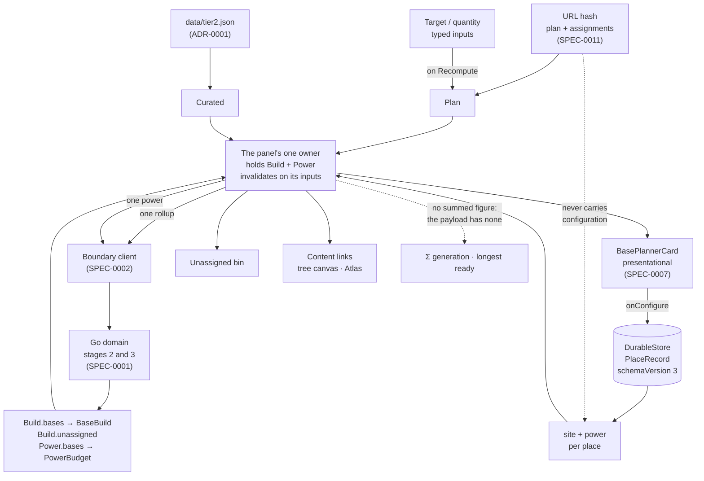

# Design: Planner Panel

## Context

The base planner card is the surface the project was started for, and the application has never rendered one. Not because the card is unfinished — `web/src/card/` is ten modules with five test suites, and [SPEC-0007](../base-planner-card/spec.md) is marked `implemented` — but because nothing in the application produces the `BaseBuild` the card takes as a prop.

[ADR-0016](../../../adrs/ADR-0016-one-owner-for-the-rollup-crossing.md) found why. Two hooks each reached toward stage 2 and neither arrived:

| Hook | Sends | Gets back |
|---|---|---|
| `useLeafAssignment` | rollup with `assignments`, no `sites` | nothing — counts dispatches |
| `useConfiguredBase` | rollup + power with `sites`, no `assignments` | discards the payloads |

A rollup carrying assignments without sites reports every leaf unsited; one carrying sites without assignments reports no demands at all. Each hook was built to satisfy its own requirement — that a change dispatches a recompute — and neither was built to keep the answer. Every card test hand-builds a `BaseBuild` literal because there is no other route to one.

[SPEC-0007](../base-planner-card/spec.md) § Scope deferred the panel on purpose: *"the panel that arranges cards — the header strip, the harvest-run route bar, the target switcher, the unassigned bin, and the link to the base atlas — is application-shell furniture and belongs with the shell surface, which has no spec yet."* Its design listed those same items as non-goals and flagged the one that sits awkwardly on the line: the unassigned bin, "visually a peer of the cards, structurally the grouping's leftovers rather than a base."

That deferral was right and is now spent. ADR-0016 is accepted; this is the spec it was the precondition for.

## Goals / Non-Goals

### Goals

- Render a base planner card from a real boundary payload, in the shipped application
- Give the stage-2 and stage-3 crossings exactly one owner, mechanically checkable
- Give per-place site and power configuration a durable home, so it survives a reload
- Present what the plan has *not* placed as prominently as what it has
- Keep the card presentational, so SPEC-0007's suites keep testing it without a module

### Non-Goals

- The card's internals — composition, producer sections, power block, provenance markers. [SPEC-0007](../base-planner-card/spec.md), unchanged
- Any cross-base aggregate figure. See the decision below; it is a change to SPEC-0001 and SPEC-0002, not to this one
- The harvest-run route bar. [SPEC-0010](../base-atlas/spec.md) owns runs, and the panel links to that surface rather than embedding it
- The freighter and settlement card variants. ADR-0006 and ADR-0007 each chose a dedicated variant and each wants its own spec; what they will inherit is this panel's arrangement rules, not a conditional inside it
- Base environment metadata — planet type, hazard note, portal address. Save import ([SPEC-0008](../save-import/spec.md)) is where it would come from, and SPEC-0007 already refuses to invent it
- Multi-plan switching. The handoff's target switcher swaps whole plans; the plan is the hash's per [SPEC-0011](../shell-surface/spec.md), and a second plan is a sharing question ADR-0014 has not answered

## Decisions

### One owner, above the cards, holding nothing the plan already holds

**Choice**: A single hook in the shell takes the plan, the place records and the curated constants; issues one `rollup` and one `power` per settled change; keeps the decoded `Build` and `Power` and invalidates them by those inputs. The cards receive `BaseBuild` and `PowerBudget` as props and emit configuration edits upward.

**Rationale**: It is the only arrangement in which the incomplete request is not expressible. The correct request is the union of assignments and site configuration, and any design where two callers each hold half can produce a half request — which is exactly what main does today. It also matches the one hook in this codebase that already works: `usePlanResolution` owns stage 1, keeps its result, and invalidates on its inputs.

Concentrating it also puts [SPEC-0005](../view-foundations/spec.md)'s cache obligation — invalidate by inputs, never edit in place — on one module instead of restating it in several.

**Alternatives considered**:
- *Per-card owners*: rejected, though it is the smaller diff and the card independence is genuinely appealing. `RollupProducers` iterates every group and returns every base, so *n* cards means *n* crossings each discarding *n*−1 bases. The assignments map has to reach every card regardless, so the independence is nominal, and out-of-order replies need handling per card rather than once.
- *A stage-2/3 context provider*: deferred rather than rejected. It is the same ownership delivered differently, and it solves a problem the panel does not have yet — prop threading past a header strip and a bin. Adopting it later changes no ownership and needs no new decision. The cost of adopting it now is a second state container beside the one SPEC-0005 deliberately keeps narrow, named for the domain's stages, which invites the next person to put the plan in it.

### Configuration lives on the place record

**Choice**: `SiteConfig` and `PowerGeneration` become optional fields on `PlaceRecord`, read and written through the existing store. `SCHEMA_VERSION` goes to 3.

**Rationale**: [SPEC-0011](../shell-surface/spec.md) REQ "The Hash Owns the Plan, the Store Owns the Player" already assigns player-authored durable data to the store, and `PlaceRecord` already carries `ticks` and `stocked` on exactly that basis. The configuration is player-authored, so the store was always the right home.

What made it homeless is that it is also *an input the domain reads*, and no artifact had said both could be true of one value. ADR-0016 names that category. The consequence worth stating in requirements rather than prose is the one that is easy to get wrong later: such a value is never encoded into a shared link. A shared plan carries where you decided to gather Sulphurine; it does not carry the class of your extractor.

[SPEC-0007](../base-planner-card/spec.md) REQ "Absent Data Is Absent" forbade the card presenting a control implying persistence "until a governing decision establishes where it lives". ADR-0008 established it for annotations and ticks; ADR-0016 finishes it for configuration. That requirement's precondition is now met for this field and for no other — environment metadata and screenshots remain homeless, and the card's refusal still stands for them.

**Alternatives considered**:
- *Session-only, as today*: rejected. SPEC-0009 makes the argument in its own words about preferences — "a preference that forgets itself on reload is not a preference" — and a class picker that resets is the first thing a player notices.
- *A separate configurations store keyed by place id*: rejected. A second record to keep in step and a join that can half-succeed, which is the reasoning ADR-0015 already used to put positions on the place rather than in a positions table.

### No cross-base aggregate, and the refusal is a requirement

**Choice**: The panel presents no summed generation, no summed draw, and no longest-ready-time across bases. A count of rendered cards is permitted.

**Rationale**: Neither payload carries one. `Power` is `bases: PowerBudget[]` and `Build` is `bases` plus `unassigned`; there is no workspace-level figure in either. Producing the handoff's `Σ kPs GEN` means summing power figures in the view, and `READY ~t` means taking a maximum over durations — both are arithmetic on values the domain produced, which SPEC-0005 forbids in terms and `tests/helpers/source-checks.ts` fails the build for.

The card count is different in kind: it is `bases.length`, the length of a list the panel was handed, not a quantity derived from domain figures.

Stating this as a requirement rather than leaving it as an omission is the point. An absent figure reads as an unfinished strip, and the next person to open the handoff will add it — in the view, where it is cheapest and wrong. Writing the refusal down, with the route to doing it properly, is what stops that.

**The route, if it is wanted**: an aggregate on the stage-3 payload and a longest-ready on stage 2, which is a SPEC-0001 requirement, a SPEC-0002 contract bump, and Go work. It belongs there, not here.

**Alternatives considered**:
- *Compute it in the panel*: rejected on the requirement, and it would not survive review.
- *Drop the header strip entirely*: rejected. The strip also carries the target and quantity controls and the route to the canvas; removing it would leave the panel with no way out.

### Configuration recomputes on change; typed plan inputs wait

**Choice**: A configuration control recomputes immediately. The target and quantity wait for an explicit recompute.

**Rationale**: SPEC-0007 requires that changing site or power configuration recompute through the boundary, and the controls are discrete — a class picker, a generator count, a committed duration entry. Every intermediate state of a discrete control is a configuration the player could mean. A half-typed quantity is not a plan, and resolving one would cross the boundary for `"3"` on the way to `"300"`.

The asymmetry is worth recording because it looks like an inconsistency and will be "fixed" otherwise. The honest reconciliation is not to make configuration wait; it is that *committed* edits recompute and *in-progress text* does not, and the two control kinds differ in when a value is committed.

### The cards stay presentational, and their fixtures keep working

**Choice**: `BasePlannerCardProps` is unchanged. `useConfiguredBase` keeps owning a place's configuration state and loses its boundary calls.

**Rationale**: The card's props are already the right contract — `BaseBuild`, `PowerBudget`, `configuration`, `onConfigure`. Five SPEC-0007 suites drive it with literals and no module, and that is a feature: it is what makes the card's composition, provenance and power rules testable at all. A card that fetched its own figures could not be tested that way.

The dispatch assertions in `tests/card/configuration.spec.ts` and `tests/canvas/assignment.spec.ts` move to the new owner rather than disappearing. They are the tests that would otherwise quietly stop asserting anything.

### A place with no demands is not an empty card

**Choice**: The panel renders a card only for a base the payload reports. A place the plan has given no work to is not shown as a card with nothing in it.

**Rationale**: An empty card and a card whose figures failed to arrive look identical, and the second is a bug. Keeping them distinguishable means the empty one cannot exist. Where such a place *is* listed — the bases surface already lists every place — is SPEC-0011's, and the panel does not need to duplicate it.

## Architecture

Two edges are prohibitions rather than flows. The hash never carries configuration, in either direction. And no aggregate is derived from the payload, because the payload has none to derive from.

## Risks / Trade-offs

- **One card's change re-costs every base.** → Follows the domain's design: `RollupProducers` iterates all groups and returns all bases, so there is no narrower call to make. Named in requirements so it is not discovered as a surprise, and bounded by the one-crossing-per-change rule.
- **A schema migration.** → `SCHEMA_VERSION` 2 → 3 under ADR-0008's discipline: a store at 2 must fail legibly rather than guess. SPEC-0009 REQ "Versioned, and Fails Legibly" already specifies the behaviour and already has a test shape, from the #163 bump to 2. The seeding helpers in `tests/shell` open the real database at a pinned version and must move with it — that was the source of fourteen CI failures on the last bump.
- **Two merged stories lose their dispatch halves.** → The assertions move to the new owner. The risk is that they are dropped instead of moved, leaving the only proof of "a change recomputes" in a fixture nobody runs against the real module. The integration case in requirements is the guard.
- **The panel could grow into the shell.** → The surface requirements borrow SPEC-0010's phrasing precisely so the limits are the same ones the Atlas already lives inside: no router, no second landmark, cross-links as content links.
- **The refusal to aggregate may read as unfinished.** → It is a requirement with its reason and its remedy attached. If the figures are wanted, the change is a payload field and a contract bump, in the specs that own them.

## Migration Plan

Not greenfield: this replaces behaviour that is on main and passing.

1. **Schema.** Add the two optional fields to `PlaceRecord`, bump `SCHEMA_VERSION` to 3, amend SPEC-0009's record requirement. Move the `tests/shell` seeders to the new version in the same change — they open the real database and a stale pin fails every shell test, not just the new ones.
2. **The owner.** Add the hook; it is additive and nothing depends on it yet.
3. **Strip the dispatches.** `useConfiguredBase` loses its `rollup`/`power` effect and keeps its configuration state. `useLeafAssignment` loses its private assignments map and its dispatch, and keeps the resolution rule SPEC-0011 REQ "An Assignment Naming an Absent Place Is Unassigned" needs. Their dispatch assertions move to the owner's suite in the same change — a gap here is a window with nothing asserting the recompute.
4. **Mount.** Add the surface, render the cards and the bin, wire the cross-links.
5. **Rollback.** Steps 2 through 4 are revertible on their own. Step 1 is not: a store written at version 3 is refused by a version-2 build, which is the designed behaviour and the reason the bump goes first and alone.

## Open Questions

- **Does the panel own a second route to configuration, or only the card?** The bases surface lists every place and could offer configuration there too. Two editors for one record is a drift risk; one editor on a card the player may not have rendered is a discoverability problem.
- **Where does the harvest-run route bar sit?** The handoff puts it in the panel's header; SPEC-0010 owns runs and gives the Atlas the authoring surface. A read-only bar fed by the active run is plausible and is not specified here.
- **Should an aggregate be added to the payload at all?** Deliberately left to SPEC-0001 and SPEC-0002 rather than answered here. The cost is a contract bump; the benefit is the handoff's strip as drawn.
- **Does the freighter variant arrange in this panel or its own?** ADR-0006 gave the freighter its own surface. Whether that means a separate panel or a filtered view of this one is its spec's question.
