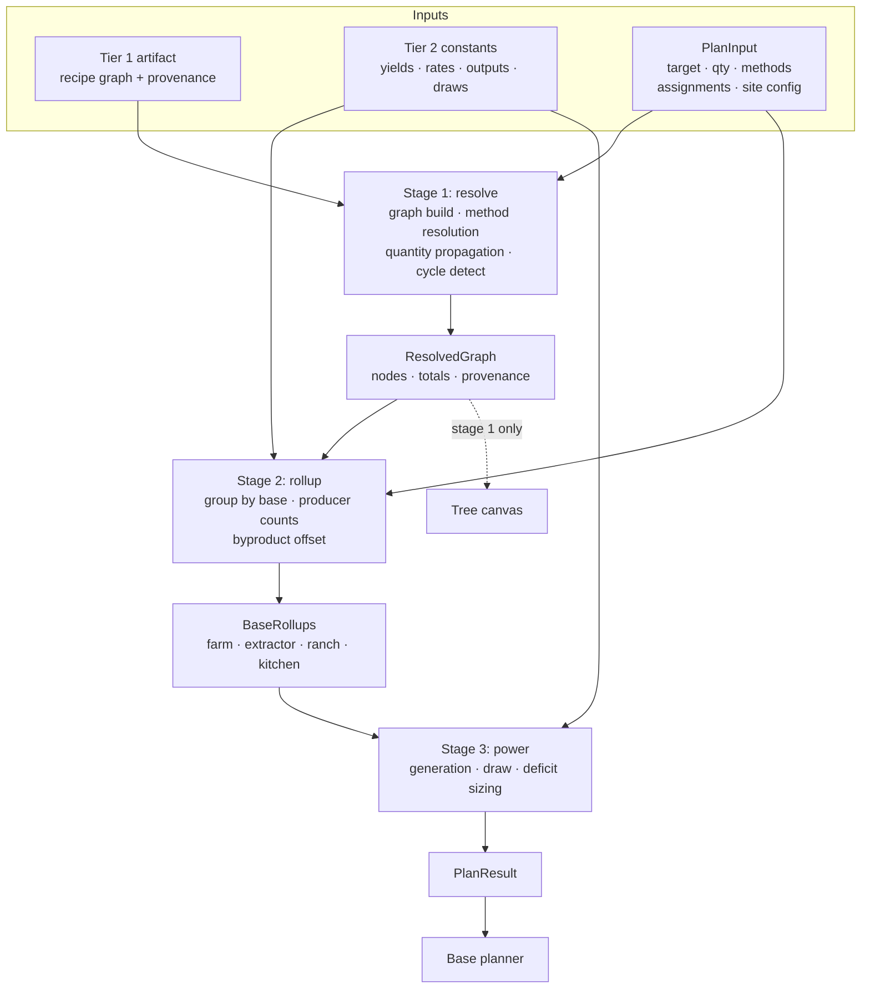

# Design: Rollup Engine

## Context

The base planner's two surfaces are both views over one computation: resolve a target item into a dependency graph, propagate quantities, group leaves by base, and turn each base's share into producer counts and a power budget.

The design prototypes each implemented this math independently, with their own sample constants — `docs/design/tree-canvas/handoff.md` for graph structure, `docs/design/base-planner/handoff.md` for the producer and power rollup. Both handoffs are explicit that their numbers are illustrative and that production reads real game data. That divergence is the problem this spec closes: one implementation, two consumers.

ADR-0003 places this engine in a Go package that imports no `syscall/js`. That constraint is what makes it shared with the ingestion CLI and testable with plain `go test`. ADR-0001 supplies its inputs as two tiers with different confidence levels — an extracted recipe graph and hand-curated economy constants — which is why provenance is a first-class concern here rather than a UI decoration.

Nothing is implemented yet. This is a greenfield design.

## Goals / Non-Goals

### Goals

- One graph and rollup implementation shared by the tree canvas, the base planner, and the ingestion CLI
- Exact arithmetic, so displayed counts are trustworthy and tests are stable
- Deterministic output, which plan-sharing and testing both depend on
- Tier 2 constants injected at call time so game-balance changes need no code change
- Provenance carried through derivation, so the `unverified` badge is data-driven
- Testable against the handoffs' known-correct values without a browser

### Non-Goals

- Save file parsing (ADR-0002, separate spec)
- Plan serialization to and from the URL hash (separate spec)
- Layout — node positioning is elkjs's job in the view layer
- Rendering, styling, and accessibility (ADR-0004, view layer)
- Mixed-type power grids at one base (see Open Questions)
- Persistence of any kind

## Decisions

### Pure function pipeline over an immutable plan input

**Choice**: The engine exposes a computation from an immutable `PlanInput` to a `PlanResult`. No internal mutable state persists between calls.

**Rationale**: Determinism (a spec requirement) falls out for free. It makes the WASM boundary trivial — the adapter marshals one value in and one value out, with no lifecycle to manage across the JS/Go divide. And it makes every scenario in the spec expressible as a table-driven test.

**Alternatives considered**:
- *Stateful engine object with incremental updates*: would allow finer-grained recomputation, but introduces cache-invalidation bugs precisely where correctness matters most, and complicates the WASM boundary. At this scale (34 nodes, a handful of bases) full recomputation is cheap enough that incrementalism buys nothing.
- *Streaming/observable API*: unnecessary for a computation that completes in well under a frame.

### Three sequential stages with explicit boundaries

**Choice**: `resolve` (graph) → `rollup` (producers) → `power` (budget). Each stage takes the prior stage's output plus its own configuration.

**Rationale**: The tree canvas needs only stage one. The base planner needs all three. Separating them means the canvas does not pay for producer math, and each stage is independently testable. It also localizes the Tier 2 dependency — stage one needs only Tier 1 data, so graph resolution can be tested with no economy constants at all.

**Alternatives considered**:
- *Single monolithic computation*: simpler signature, but couples the canvas to constants it does not use and makes failures harder to localize.

### Exact integer and rational arithmetic

**Choice**: Quantities are integers throughout. Non-integer multipliers (class multipliers of ×0.5/1/1.5/2, fill durations) are applied as exact rationals. Rounding happens only at named physical boundaries and always rounds up.

**Rationale**: This is the decision most likely to be regretted if made casually. Binary floating point accumulating across a 6-level graph can produce a leaf total of 499.9999999 where 500 is correct, and `ceil` then yields a wrong producer count — an off-by-one that surfaces as a wrong build checklist and is miserable to debug. Integers make the handoffs' known values (500 gases, 300 Condensed Carbon) exactly assertable.

Rounding up is not an arithmetic preference but a physical fact: you cannot build 0.4 of a biodome, and rounding down would under-provision the base.

**Alternatives considered**:
- *Floating point with epsilon comparison*: pushes tolerance decisions into every test and every comparison, and the epsilon is a lie that eventually bites.
- *Fixed-point decimal*: workable, but rationals express the class multipliers more directly and Go's `math/big.Rat` is available without a dependency.

### Recipe selection is the engine's job, not the artifact's

**Choice**: The Tier 1 artifact carries every recipe the game defines for an output and method. The engine picks one — smallest raw-input total, ties broken by a stable recipe id — and the view may override it per node.

**Rationale**: ADR-0005 records the discovery that forced this: 261 of 403 refiner output/method pairs have more than one recipe, up to 61 for a single item. Sodium Nitrate has 26. An artifact that carried only one would be discarding most of the refining graph, and a planner whose answer to "how do I make this?" is one arbitrary route is not doing the job the tree canvas exists to do.

Selection belongs in the engine rather than in the normalizer because it depends on the *expansion* — the raw-input total of a candidate is only knowable by resolving it — and because it is a user-facing choice. ADR-0004 keeps the view rendering rather than computing, so the view surfaces alternatives and reports a selection; it does not evaluate them.

**Trade-off**: The default rule costs more work per node than picking the only option, since candidates must be resolved before they can be compared. Acceptable — the comparison is over already-memoized subtrees, and correctness here is worth more than the saved traversal.

**Alternative considered**: Let the normalizer pick and emit one recipe. Rejected in ADR-0005 — it discards the alternatives invisibly, and the planner cannot offer what the artifact does not carry.

### Yield is part of exactness, not separate from it

**Choice**: A recipe's output quantity is a first-class field, and demand-to-batch arithmetic is exact.

**Rationale**: 156 of 1,681 refiner recipes produce a quantity other than one, up to 250. `1x Crystal Sulphide -> 50x Sodium Nitrate` is representative. The engine's exactness commitment was written for input quantities and non-integer multipliers; a yield of 50 handled as floating-point division reintroduces exactly the error that commitment exists to prevent, at the last step before the total the user reads.

Rounding a batch count up follows the same reasoning as the physical-unit boundaries: you cannot run 0.4 of a refining cycle.

**Trade-off**: One more place quantities can be wrong, and one more field the normalizer must read correctly. Mitigated by SPEC-0004's requirement that yields come from the source rather than defaulting silently.

### Tier 2 constants injected, never hardcoded

**Choice**: All economy constants — crop yields, dome capacity, extractor rates per class, generator outputs, class multipliers, draws, depot thresholds and capacities, battery ratios, fauna yield per collection cycle, cycle durations, and steps per nutrient processor — arrive as a parameter.

**Rationale**: ADR-0001 marks these as provisional and hand-curated; the game rebalances. The base-planner handoff already treats them as tweakable: *"`emOutput` (kPs, default 110) — swap in real game data without touching code."* Injection also makes every producer and power scenario testable with small synthetic constant sets rather than the full production dataset.

### Byproducts offset demand rather than generating construction

**Choice**: When an item's demand at a base is satisfied by a byproduct of another producer at that base, the engine reports it as requiring no construction, contributing neither producer count nor power draw.

**Rationale**: This matches the handoff's specified behavior (Condensed Carbon from gas refining renders as "nothing to build"). Modelling it as an offset in the rollup stage — rather than as a graph edge — keeps the graph a pure dependency structure and confines the accounting to where it belongs.

**Alternatives considered**:
- *Representing byproducts as negative demand in the graph*: conflates dependency structure with resource accounting and makes the canvas harder to reason about.

### Provenance propagates by taint

**Choice**: Every computed figure carries a verified/unverified flag. Any unverified input taints every figure derived from it.

**Rationale**: The `unverified` badge is a designed UI affordance with specific honest-labelling intent, and ADR-0001 establishes two data tiers with genuinely different confidence. Computing provenance in the engine rather than the view means the rule is applied once and consistently. Taint propagation is the conservative direction — over-flagging is honest, under-flagging presents guesses as facts.

## Architecture

## Risks / Trade-offs

- **Full recomputation on every interaction** → At the specced scale (34 nodes, ~3 bases) this completes far inside a frame, and the pure-function design makes it correct by construction. If a future target produces a much larger tree, memoize at the stage boundary rather than introducing incremental invalidation.
- **Rational arithmetic is slower than float** → Irrelevant at this scale, and correctness is worth far more than nanoseconds here.
- **Tier 2 injection means every caller must supply constants** → Mitigated by shipping a canonical constants loader alongside the artifact, so callers pass a parsed dataset rather than assembling one.
- **Taint propagation may over-flag** → Accepted deliberately. If most figures end up flagged, that is a signal that Tier 2 needs verification work, not that the rule is wrong.
- **The 34-node acceptance test could ossify** → It asserts against community-sourced data that may change with game updates. The spec's Dependency Graph Resolution requirement makes the version pin normative: a fixture asserting exact counts must name the game version it was captured against, so a failure reads as "data changed" rather than "engine broke".

## Migration Plan

Greenfield — no migration. Build order: stage 1 with the Stasis Device fixture, then stage 2 against the base-planner handoff's worked examples, then stage 3.

Stage 1 is independently valuable: it unblocks the tree canvas without any Tier 2 constants existing yet, which matters because ADR-0001 leaves Tier 2 as a provisional finding pending the extraction spike.

## Open Questions

Carried from the design handoffs, all deferred rather than resolved:

1. **Mixed power grids.** The base-planner handoff models one power type per base and notes production likely needs a generator list instead of a type toggle. This spec follows the mock (single type per base). Revisit before implementing stage 3 in earnest.
2. **Per-row extractor class override.** Deferred in the handoff pending a user asking for it; this spec specifies site-level class only.
3. **Where refining time is charged.** The handoff notes `ready ~t` ignores refine time at the collector base and leaves placement to the app-shell surface. This spec does not yet compute a `ready` duration for that reason.
4. **Large-tree behavior.** The handoff flags that a 60+ node tree may need edge labels on hover only. That is a view concern, but it suggests the engine should be benchmarked against a combined Fusion Ignitor plus Stasis Device tree before assuming full recomputation stays cheap.
5. **Whether Tier 2 survives the extraction spike.** If the economy constants turn out to be extractable from game files after all (ADR-0001's provisional finding), the injected-constants decision stands but the provenance model simplifies considerably.
