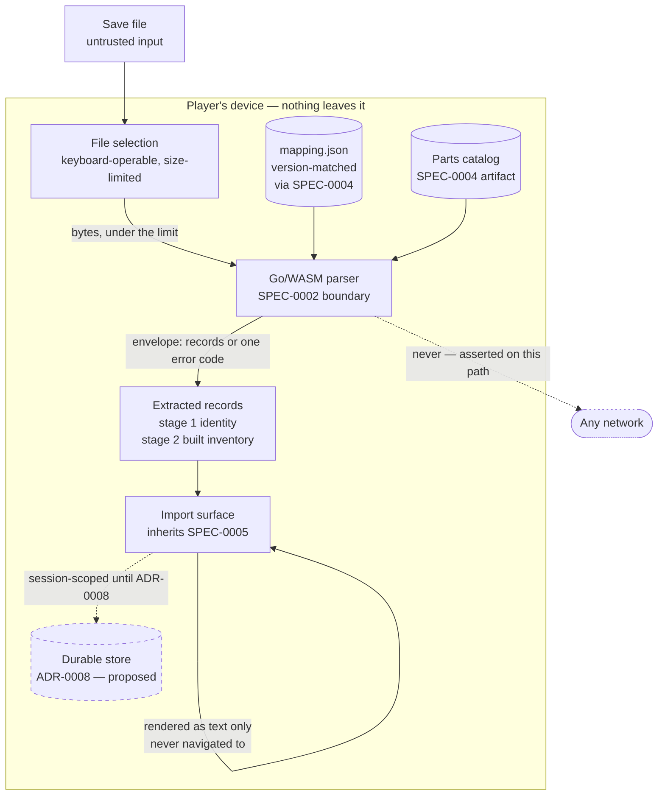

# Design: Save Import

## Context

[ADR-0002](../../../adrs/ADR-0002-client-side-save-import.md) decided that the planner imports No Man's Sky save files, that parsing runs client-side in Go compiled to WASM, that import is strictly read-only, and that it ships in stages. [SPEC-0008](spec.md) is that decision's requirements.

**The capability is entirely unbuilt**, and this was verified rather than assumed: no package under `internal/` or `cmd/` references `PersistentPlayerBases`, `BaseVersion`, or `mapping.json`, and none imports `net/http`. The search covered `internal/` and `cmd/` for Go sources.

That matters more than it usually would, because ADR-0002 lists a confirmation — "a test asserts that no `fetch`/XHR/WebSocket call occurs during parse" — which does not exist and cannot, since the parse path does not exist. Several requirements in the spec exist to bind obligations *before* the code is written, rather than to describe code that is already there.

The upstream half is genuinely ready. SPEC-0004's artifact carries the 108-entry parts catalog stage 2 joins against; SPEC-0002's envelope already carries stable error codes the import surface can branch on; SPEC-0005's shell, focus trap, live region and status primitives are on `main` as of #82. What is missing is the parser, the surface, and — importantly — a real save to check either against.

## Goals / Non-Goals

### Goals

- Remove the worst onboarding step: hand-entering twelve portal glyphs per base
- Keep ADR-0002's privacy guarantee structural rather than aspirational, and make it testable before the code exists
- Ship stage 1 (identity) independently of stage 2 (built inventory)
- Leave the speculative third stage unspecified rather than guessed at

### Non-Goals

- Writing saves. There is no such code path and the spec forbids one
- Container inventories. ADR-0002 marks the field unconfirmed; the spec forbids specifying it until reachability is recorded
- Choosing the file size limit. The spec requires one and requires it be measured; there is nothing in the repo to measure
- Persisting imported records. That is ADR-0008 (`proposed` in PR #91, not yet merged). Until it lands, import is session-scoped and says so
- Deciding whether WASM was the right call. ADR-0002 records that as a judgment call weighted by project goals, with TypeScript an acceptable fallback; nothing here re-opens it

## Decisions

### A real save is a prerequisite, not a nice-to-have

**Choice**: acceptance requires a committed real-save excerpt, plus an opt-in full-save test. A suite with only synthetic fixtures fails.

**Rationale**: the format description — magic `0xFEEDA1E5`, 16-byte block headers, LZ4 payloads, obfuscated three-character keys — comes from ADR-0002's prose. A synthetic fixture built from that prose agrees with it by construction. It would prove the parser matches the description and nothing about whether the description matches a save.

This project has recorded four instances of a bounded search reported as a general result, and SPEC-0003 already answered the same problem the same way with REQ "Real-Archive Verification". Doing it differently here would be inconsistent as well as wrong.

**Alternatives considered**:
- *Synthetic fixtures only*: rejected — proves the parser matches the prose, which is not the question
- *Full save committed*: rejected — a save is personal data, and `.gitignore` excludes `*.hg` and `testdata/saves/` deliberately. An excerpt scrubbed to the extracted scope carries the evidence without the exposure
- *Local-only, nothing committed*: rejected — a check that only runs on one machine is not a check

### The no-network test asserts on the call path, not the bundle

**Choice**: the confirming test asserts that the *parse call path* issues no request, not that the application contains no network code.

**Rationale**: ADR-0008 introduces an optional sync client. The moment it ships, "the bundle makes no requests" is false, and a test phrased that way gets weakened to accommodate it — at which point it reports a guarantee it has stopped checking. Phrasing it against the call path from the start means the sync client's arrival is not an event the test has to survive.

**Alternatives considered**:
- *Assert no network imports in the bundle*: rejected — goes false by design at ADR-0008 stage 2
- *Manual review*: rejected — ADR-0002 explicitly wanted this verifiable rather than aspirational, and this project has replaced two review-checklist rules with mechanical ones already (#78, #82)

### All-or-nothing import

**Choice**: an unrecognized version, a truncated file, or a mapping mismatch produces **no** records and a clear message. Never a partial set.

**Rationale**: a partially imported set of bases looks exactly like a complete one to the player. They have no way to tell that four of their seven bases are missing, and a plan built on the four is wrong in a way nothing surfaces. ADR-0002 set this standard for `BaseVersion`; `plan-hash.ts` already meets it by returning `EMPTY_PLAN` through one path rather than applying a partial decode. Three mechanisms, one rule.

**Alternatives considered**:
- *Import what parses, warn about the rest*: rejected — the warning is dismissed and the wrong plan persists
- *Import and mark incomplete bases*: rejected — invents a provenance state for a condition that means "the parser did not understand this file"

### Extraction scope is a whitelist

**Choice**: only the stage 1 and stage 2 fields are read. Nothing else, including fields that would be convenient later.

**Rationale**: the privacy guarantee is strongest when the parser *cannot* produce what it never reads. A parser that extracts a platform UID "for later" has created an exposure with no corresponding feature, and the exposure outlives the intention. It also keeps the committed excerpt small and scrubbable — the fixture only has to contain what the parser reads.

### Imported records do not opt themselves into sync

**Choice**: when ADR-0008's store exists, import writes into it as an ordinary authored edit and marks nothing for synchronization.

**Rationale**: ADR-0008's compatibility line with ADR-0002 is that nothing derived from a save reaches a server unless the player deliberately shared the place it belongs to. An import that marked its own output for sync would overturn ADR-0002's privacy driver by default rather than by decision — precisely the "reversal by silence" that ADR warns against.

### The size limit is required but not set here

**Choice**: the spec requires a limit enforced before the file is read, requires it be derived from measured real saves, and declines to name a number.

**Rationale**: SPEC-0005 records the value as unchosen. Choosing it here from nothing would replace an honest gap with a plausible-looking figure, which is worse — the number would then be cited rather than questioned. The fixture requirement and the limit requirement land together, so the measurement exists exactly when it is needed.

**Alternatives considered**:
- *Pick a round number now*: rejected — an invented constant that agrees with nothing, which is #47's recorded lesson
- *No limit*: rejected — decompression happens in the page, so an oversized file is a denial of service against the player's own tab

## Architecture

The parse is a single crossing. The file goes in as bytes, one envelope comes back carrying either the complete record set or one stable error code — no streaming, no partial results, no second call to fill gaps. That shape is what makes all-or-nothing enforceable rather than merely intended.

## Risks / Trade-offs

- **No real save is available to the author of this spec.** Every format claim traces to ADR-0002's prose. → The spec makes a real excerpt a gating requirement rather than a follow-up, so the first implementation cannot claim correctness without one.
- **Save formats drift across game updates.** `BaseVersion` exists precisely because the structure changes. → Refusal on unrecognized versions, with the version named in the message, so a break reports itself instead of producing wrong bases.
- **`mapping.json` is fetched at ingestion time rather than vendored** (ADR-0001's choice, to keep MBINCompiler's LGPL-3.0 redistribution question out of the repository). Its version can therefore drift from the save's. → The table version travels with the extracted records, and a mismatch refuses.
- **The excerpt is personal data, however scrubbed.** → It is reduced to the smallest span exercising the parser, contains no field outside the extracted scope, and its contents are asserted by a test rather than trusted to review.
- **Import could quietly become the expected path**, leaving console players second-class. → The spec requires every import-fed field to have a manual equivalent and forbids any control being disabled pending an import.
- **A crafted save is attacker-controllable input.** → Same treatment as a decoded URL hash and a shared record: rendered as text, never navigated to, never interpreted as markup.

## Migration Plan

Greenfield. No existing import path, no data to migrate, nothing to roll back.

The staging is ADR-0002's: stage 1 (identity) ships alone and delivers most of the onboarding benefit; stage 2 (built inventory) follows and depends only on the SPEC-0004 parts catalog, which already exists. Neither stage depends on ADR-0008 being accepted — import is session-scoped and says so until the store exists.

## Open Questions

- **The file size limit.** Required, deliberately unset, and blocked on the same real save the acceptance requirement needs. It must be recorded with the sizes it was derived from.
- **Whether container inventories are reachable at all.** ADR-0002 marks stage 3 speculative. The spec forbids specifying it until reachability is confirmed and the search boundary recorded — so this stays open until someone looks at a real save and writes down what they looked at.
- **How the excerpt is produced and kept current.** A scrubbing script that a contributor runs against their own save is the obvious answer, and `internal/hgpak/testdata/gen.go` is the precedent, but the scrubbing rules are stricter here and unwritten.
- **Whether the portal address derivation belongs in this capability or the domain.** ADR-0002 says the portal address derives from `GalacticAddress`; whether that conversion is import's job or a domain function the import calls is unsettled, and affects whether SPEC-0001 gains a requirement.
