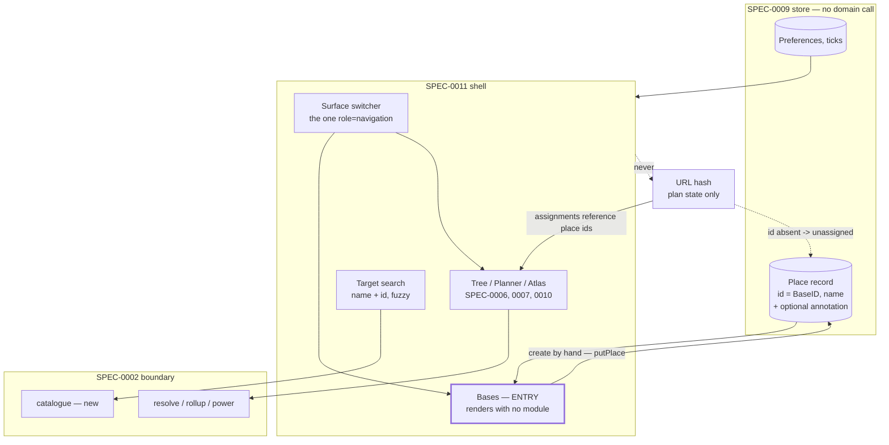

# Shell Surface — Design

## Context

`SPEC-0007` deferred this capability in its own scope note: "The panel that arranges cards … is application-shell furniture and belongs with the shell surface, which has no spec yet." Nothing picked it up, and the deferral became visible in the running application. `BasePlannerCard` is imported by exactly one file under `web/src/`, and only as a type-only import of `IdentitySlot` in `canvas/NodeCard.tsx`; every render of it is a Playwright fixture. `<nav aria-label="Surfaces">` holds one button, "Plan", carrying `aria-current="page"` and no handler. The target control is a bare `<input>` whose value reaches the domain as an item id, so the only way to load anything is to already know a string like `ULTRAPROD2`.

[ADR-0010](../../../adrs/ADR-0010-places-first-and-the-shell.md) closed the gap by answering the question underneath the missing chrome: which way the base/plan relationship runs. It runs place → plan. This spec turns that answer, and the five decisions that follow from it, into requirements.

## Goals / Non-Goals

### Goals

- Give the place record an identity a plan references rather than invents, so player annotations survive every change to every plan
- Make the entry surface one that renders with no domain call, which is what SPEC-0005's lazy module load already implied and nothing yet honoured
- Give a first-run player a route in that does not require knowing an item id
- Give `BasePlannerCard` a route, three stories after it was built
- State the hash/store boundary once, now that both mechanisms exist and the design note predates one of them

### Non-Goals

- The visual form of any control. The design bundle owns that; this spec names behaviour and semantics
- The sharing and permission model. A share's contents are constrained here only insofar as REQ "The Hash Owns the Plan" fixes what a hash carries
- The identity flow. ADR-0009 owns it; this spec states only that sign-in transmits nothing
- Save import. ADR-0002 and SPEC-0008 own it; this spec makes hand-authoring the *other* route, not a replacement
- The Atlas. SPEC-0010 owns it and already states its half of the shell contract
- Renaming `BaseID`. Its meaning changes; its name does not, because a rename touches more than this decision should

## Decisions

### `BaseID` becomes the place `id`, rather than a mapping onto it

The alternative was a side table keyed by the plan-scoped string. It was rejected because the key is invented by whichever plan first named it, so the same real base acquires different keys in different plans and the annotations fragment. That failure surfaces later as data loss rather than earlier as a type error, which is the worst time to find it.

Reusing SPEC-0009's `id` costs a change of meaning in already-merged code. Minting a second identifier costs a permanent second answer to "which base is this". The second cost does not stop being paid.

### A deleted place unassigns; it does not cascade and does not dangle

Three options existed: cascade the delete into every plan, leave a dangling id, or return the leaves to unassigned. Cascading destroys the player's work — the plan is the expensive artifact, not the place record. A dangling id renders as a base with no name, which lies about what happened.

Unassigned is the third option and it is not a fallback: the domain already models `Unassigned` as a designed value, and the design already draws an unassigned bin. The rule also does the work for a case that would otherwise need its own answer — a shared hash naming places the recipient does not have — which is why it is stated for every source of an assignment rather than only for deletion.

### Bases-first, on load-order grounds rather than preference

The bases surface is the only surface that renders correctly with no domain call, because it draws player-authored records out of the store. SPEC-0005 REQ "Module Loading" loads the module lazily after the shell is interactive, so any other entry surface shows a spinner first. That is a structural argument, not a taste one, and it is the reason the requirement is phrased as "renders without the domain" rather than "opens on bases".

The product argument runs the same way. A plan-first entry opens on a field demanding an item id the player cannot know; a bases-first entry opens with a question the player can answer.

### A name is the whole minimum

`putPlace` already exists on the store with no caller under `web/src/`, so the capability is present and the route is not. Requiring more than a name at creation would make the first-run path longer than the thing it unblocks, and every other field is annotation the player adds when they have it.

A place with no site configuration is assignable because SPEC-0007 REQ "Absent Data Is Absent" already knows how to render a gap. Making configuration a precondition would trade a solved rendering problem for an unsolved onboarding one.

### No router, and one navigation landmark

Three to five surfaces with no nested routes do not need a router, and ADR-0004's stack does not include one. Surface selection is view state.

The single named `role="navigation"` landmark is SPEC-0005's requirement, and the pressure against it is real: the design's cross-navigation links ("view planner →", "view atlas →") read like navigation. They are content links inside `main`. Satisfying a design flourish by adding an unlabelled second nav would break an accessibility requirement to gain nothing.

### The catalogue crosses the boundary, and that is a contract change

SPEC-0005 REQ "Boundary Client" forbids the view reading the Tier 1 artifact directly, and the boundary exposes only `resolve`, `rollup` and `power`. So a searchable item list has exactly two possible sources: a new boundary entry point, or a copy compiled into the view bundle.

The bundled copy was rejected because it drifts from the artifact the module actually resolves against — the failure mode is a search that offers an item the domain cannot resolve, which is worse than no search. The cost of the alternative is a fifth call and a contract-version bump, and the spec states that rather than hiding it.

### The hash owns the plan; the store owns the player

Both mechanisms now exist. `docs/design/README.md` line 37 says plan state serialises into a shareable hash with "no localStorage", and lists "todo checks" among the things it carries. That line predates ADR-0008. Ticks are per-place player data and belong in the store; the "no localStorage" half survives as ADR-0008 read it, since the point was that durable data must not be smuggled into a share.

Stating this in a requirement rather than a note matters because the two mechanisms are individually reasonable places for the same value, and the drift would be silent.

## Architecture

The dotted edges carry the two rules that are easiest to get wrong: an assignment naming an absent place degrades to unassigned rather than dangling, and no player-authored durable value is ever written into the hash.

## Risks / Trade-offs

- **`BaseID`'s meaning changes across the boundary and in the Go core.** Every site treating it as plan-scoped must be re-read. A rename would be honest and is deliberately not done here, so the risk is that a reader of the Go core sees the old doc comment and reasons from it. Mitigated by the requirement stating the identity explicitly rather than leaving it to the type.
- **A fifth boundary call is a contract-version bump**, and every consumer must be version-checked against it. SPEC-0002's existing rules cover the mechanics; the cost is a coordinated change rather than an additive one.
- **A shared plan can name places the recipient lacks**, so a share is never fully faithful. Resolving to unassigned mitigates it and does not solve it. Whether a share should carry enough to reconstruct a place is the sharing ADR's question, not this spec's.
- **The target search could issue a call per keystroke.** § Rate Limiting forbids it, but the natural implementation is the forbidden one, which is why it is written down.

## Migration Plan

No stored data changes shape. `BaseID` already holds a string and the place record already carries an `id`; what changes is which value is written there and what it means. Workspaces authored before this spec hold no assignments, because no UI produced them, so there is nothing to reconcile.

The boundary gains an entry point, which is a contract-version increment handled by SPEC-0002's existing mismatch rule: a view built against the older contract reports the mismatch and refuses the payload rather than proceeding.

## Open Questions

- **What the catalogue contains.** This spec requires id and display name per selectable item. Whether "selectable" means every item in Tier 1 or only those that can be a plan target is a question the domain answers, and it changes the payload's size rather than its shape.
- **How the surface set is ordered**, and whether the switcher shows surfaces a player has no data for. The requirement fixes that the set does not change under the player; it does not fix the order.
- **Whether the entry surface should be remembered.** Preferences live in the store, so remembering the last surface is possible. It is not required here because a first-run player and a returning player want different things, and the answer needs a player rather than an argument.
- **SPEC-0006 REQ "Leaf Assignment to Bases" is stale.** It says stage 2's entry point is "reserved and not yet wired"; `RollupRequest` carries `Assignments` and `Sites`, `client.ts` exposes `rollup()`, and `useConfiguredBase.ts` calls it. ADR-0010 recorded this. Correcting it belongs to a spec pass, not to this file.
