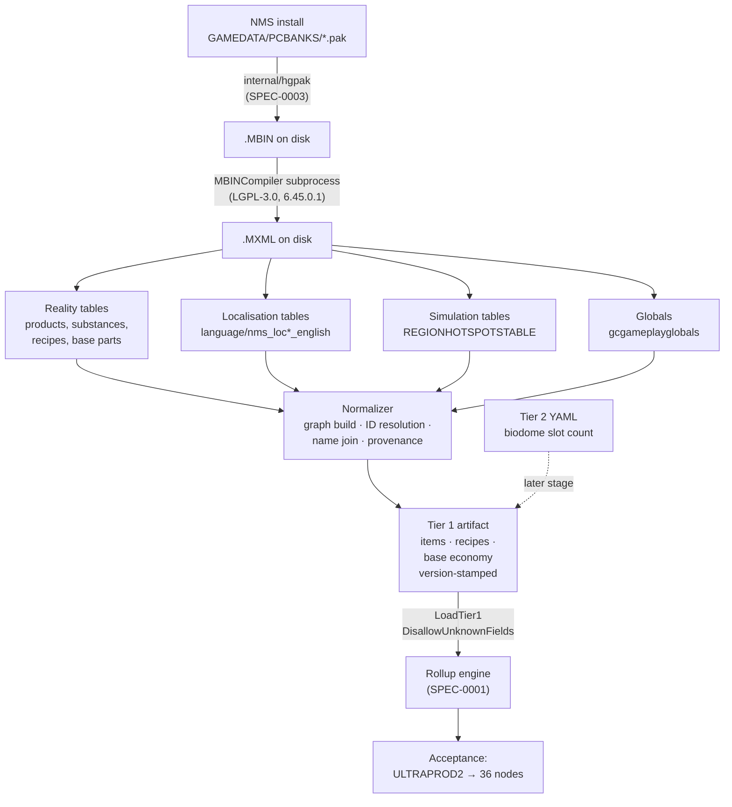

# Design: Tier 1 Normalizer

## Context

ADR-0001 chose direct extraction from the maintainer's own install, with a Go pipeline producing a version-stamped Tier 1 artifact. Two of the three stages exist. SPEC-0003's reader unpacks HGPAK archives and its CLI extracts to disk; MBINCompiler 6.45.0.1 decompiles the result to `.MXML`. The normalizer — the stage that turns 54 sprawling tables into the artifact the app loads — has never been written.

Four facts shape this design:

- **The target format already exists and already has a working consumer.** `internal/domain.Tier1`, `LoadTier1`, and the rollup engine merged in #2 resolve the 34-node Stasis Device tree from hand-authored fixtures today. This is unusually good ground: the output shape is not a guess, and `testdata/stasis-device.tier1.json` is a golden file to diff against.
- **`LoadTier1` decodes with `DisallowUnknownFields`.** Any new artifact section is a load-time error until the struct declares it. Producer, schema, and loader are one change, not three.
- **Tier 2 nearly dissolved.** ADR-0001 planned five hand-curated constants; four turned out extractable. The normalizer's scope grew accordingly, and the schema has to grow with it.
- **Identity is indirect.** Product IDs are opaque and carry no display name; names are localisation keys resolving in a different archive. Any readable output requires a join the reality tables alone cannot satisfy.

## Goals / Non-Goals

### Goals

- Produce the Tier 1 artifact ADR-0001 promised, from a real install, reproducibly
- Emit the base-economy data confirmed extractable, so it is regenerated rather than curated
- Fail precisely when a game update moves something, rather than emitting a quietly smaller graph
- Make the artifact a reviewable diff, so a balance change is legible in `git diff`
- Reach ADR-0001's acceptance criteria through generated output rather than fixtures

### Non-Goals

- **Decoding MBIN.** ADR-0001 rejected reimplementing libMBIN; MBINCompiler stays a subprocess.
- **Extraction.** SPEC-0003 owns unpacking; this spec starts at `.MXML` on disk.
- **The merged plan dataset.** Combining Tier 1 with Tier 2 into the shipped static asset is a later stage.
- **Save parsing.** ADR-0002, separate spec. The base-parts catalogue this emits is the join target, nothing more.
- **Biodome crop-slot count.** Not extractable as far as anything searched shows; it stays Tier 2.
- **Running in CI.** ADR-0001 already records ingestion as developer-local.

## Decisions

### Game IDs, not invented short codes

**Choice**: `Item.id` is the game's own identifier — `ULTRAPROD2`, `PLANT_SNOW`.

**Rationale**: Game IDs are stable across builds, are what save files carry, and are what ADR-0002's stage-2 join needs. A bespoke scheme would have to be re-derived and re-verified on every regeneration, and would break the save join outright. The existing fixtures use `fc` and `sb` because they were written by hand before extraction existed; that is a property of their authorship, not a design decision to inherit.

**Trade-off**: Artifacts get larger and less readable by eye. Acceptable — it is a machine artifact with a golden-file test, not a document.

### Localisation join is mandatory, and unresolved keys fail

**Choice**: Resolve every name through `language/nms_loc*_english.mbin`, and fail generation on any key that does not resolve.

**Rationale**: The alternative — falling back to the raw key — produces an artifact full of `UI_ULTRAPROD_2_NAME_L` that loads cleanly and looks like data. That is worse than failing, because it surfaces as a confusing UI much later rather than as an error at generation. This indirection is also what made the Stasis Device hard to find by search; recording it in the spec is how the next person avoids that hour.

**Alternative considered**: Emit keys and resolve in the view layer. Rejected — it pushes a game-data concern across the WASM boundary and into ADR-0004's render-only view layer.

### Fail closed on structural surprise

**Choice**: A missing field, unrecognized enum, or absent table fails generation. No partial artifacts, no skipped rows, no defaulted values.

**Rationale**: A game update moving a field is the expected failure, and ADR-0001 already accepts that an update can invalidate the pipeline. The useful behaviour is a precise error naming what moved. A quietly smaller recipe graph surfaces as a wrong tree in the planner, long after the cause.

**Contrast**: This is the same posture SPEC-0003 took for the same reason, and for the same reason it is not paranoia — the format is reverse-engineered from one build.

### Determinism as a correctness property

**Choice**: Stable ordering everywhere; two runs over one install produce byte-identical output.

**Rationale**: The artifact is committed. Nondeterministic ordering makes every regeneration an unreviewable diff, which means nobody reviews it, which means a real balance change lands unnoticed among reordering noise. Determinism is what keeps `git diff` meaningful as the review surface.

### Refiner throughput carries both difficulty variants

**Choice**: Emit the standard and Survival figures side by side rather than picking one.

**Rationale**: This resolves what was an open question in this design. `gcgameplayglobals` states both (`RefinerSubsMadeInTime` 250 against 100 on Survival), the planner knows which save it is planning for and the normalizer does not, and carrying both costs four integers.

### Crop yields are read from whichever reward shape the entry carries

**Choice**: Read both `GcRewardSpecificSubstance` and `GcRewardSpecificProduct`, and take the yielded item from the reward's own `ID` rather than from the key the reward was looked up by.

**Rationale**: Both were found by running the normalizer against the real reward table rather than by reading the requirement. Eight of twelve farmable plants yield a substance and four yield a product, so a spec naming only the substance form describes a normalizer that drops four crops and still produces a loadable artifact. Separately, the reward key and the yielded item agree for eleven of twelve crops — `PLANT_BARREN` yields `PLANT_DUST` — which is exactly the ratio that makes "the key is the item" look true.

**Trade-off**: Neither generalisation is provable from twelve cases. Both are written as "read what the entry says" rather than as a rule about which plants use which shape, so a thirteenth crop in a future build needs no change here.

### Base-economy data as ranges, keyed by hotspot

**Choice**: Preserve minimum and maximum where the source expresses a range, and attach class scaling to hotspot categories rather than to devices.

**Rationale**: This is the shape the data actually has. `REGIONHOTSPOTSTABLE` gives Power hotspots `ClassStrengths` of 150/220/250/300 and Mineral and Gas 1/1.5/2/2.5; a part declares a base rate and a hotspot dependency. Per-class device variants do not exist — searching the parts table for `_C`/`_B`/`_A` finds nothing, which is exactly how an earlier pass talked itself into "classes aren't in the data." Modelling devices per class would be inventing structure the game does not have.

Collapsing yield ranges to a point estimate would also discard the best/worst case the planner wants to show.

### Schema extension lands with the producer

**Choice**: Extend `Tier1`, bump `SchemaVersion`, migrate the fixtures, and write the normalizer as one change.

**Rationale**: `DisallowUnknownFields` makes any other sequencing broken by construction — a normalizer emitting sections the struct lacks produces artifacts that fail to load. Splitting the work would mean landing a producer whose output nothing can read.

**Trade-off**: A larger single change than the SPEC-0003 stories. Mitigated by the story split being along data-section lines rather than along producer/schema lines.

## Architecture

The four source groups are the reason the normalizer is not a single-table read. Names come from a different archive than products; class scaling comes from `METADATA/SIMULATION/SCANNING/` rather than `METADATA/REALITY/TABLES/`; refiner throughput comes from globals. Each was found only after looking somewhere the first pass had not.

### The normalizer emits every recipe and selects none

**Choice**: All recipes for an output and method are emitted; selection is left to the engine.

**Rationale**: ADR-0005. Choosing requires knowing each candidate's raw-material total, which requires expanding it — work the normalizer does not do and should not start doing, since it would duplicate the engine's traversal and drift from it. Emitting everything also keeps the artifact a faithful record of the source rather than a record of one interpretation of it.

**Trade-off**: A larger artifact. 2,159 recipes rather than roughly 400 if deduplicated. Acceptable: it is a static asset, and the alternative discards most of refining.

### Raw-obtainability is a fact about the item, not a fact about the recipe table

**Choice**: Read `raw_obtainable` from the substance table's `PinObjective`, and let a raw-obtainable item default to `raw` even where it also has recipes.

**Rationale**: The first version of this spec derived raw-obtainability from the absence of a recipe, which quietly assumed the two are exclusive. They are not — you mine Cobalt and you can refine it — and the assumption produced a graph that does not resolve: 571 of 2,237 items hit a cycle under default methods, every one of them a refine loop between gatherable substances. The engine is right to refuse; SPEC-0001 REQ "Cycle Detection" treats cycles as a runtime condition rather than one to design away. The fix belongs in the producer, and the source states the fact directly rather than requiring it to be inferred.

Measured rather than assumed: setting `raw_obtainable` from `PinObjective != UI_REFINE_OBJ` resolves all 2,237 items with no cycles.

**Trade-off**: The rule is a small allow/deny list over an enum this project has seen exactly one build of, so a game update that adds a `PinObjective` value will fail generation rather than classify it. That is the intended direction — the alternative is a default that silently reclassifies items — but it does mean this is a place an update can break, and it is named in the risks below.

**Correction, 2026-08-19**: the first version of this decision said the product table carries no `PinObjective`. It does — on all 2,144 rows. That claim came from reading the substance table's shape and inferring the product table's rather than looking, which is the fourth recorded instance in this project of a bounded search reported as a general result, and it happened in the same change that added a requirement to read facts from the source. The rule survives the correction on its merits rather than on the false premise: 1,240 of those values are empty and the vocabulary is open-ended, running from `UI_BUY_OBJ` and `UI_CRAFT_OBJ` to per-item mission strings like `UI_PIN_VENTGEM_OBJ`. It classifies nothing.

### Where two source facts disagree, the graph wins and the disagreement is recorded

**Choice**: A substance the source marks refined-only that no recipe produces is emitted raw-obtainable, and every such override is reported.

**Rationale**: Found by implementing the rule above against the whole table. `WATERPLANT` (Cyto-Phosphate) reads `UI_REFINE_OBJ` while nothing in the recipe table makes it. One of the two facts has to give, and it has to be the flag: an item with neither a recipe nor a gathering route is one the engine cannot terminate on, so honouring the flag produces an artifact that does not resolve.

What matters is that the override is not silent. The "no recipe, therefore raw" fallback would have swallowed this case without a trace, and the next reader would have had no way to tell a rule being applied from a rule being contradicted. Reporting it makes the disagreement a reviewable line in the output, and a change in that set a change in the game data.

**Trade-off**: One item today, and a mechanism for it. Justified because the alternative is indistinguishable from the bug: a silent fallback that happens to produce the right answer here is the same code that would produce a wrong one somewhere else.

### Cooking is a flag, not a table

**Choice**: Read `Cooking` from each refiner recipe rather than treating cooking as a separate source.

**Rationale**: This resolves what was an open question in this design. The refiner table carries both refining and cooking, with a per-recipe boolean distinguishing them — verified against the real table, where `RECIPE_1` (yeast) carries `Cooking` true. There is no separate nutrient-processor source to read.

## Risks / Trade-offs

- **A game update moves a field.** Likely eventually. Mitigated by failing closed with a named error, so the next update presents as a precise failure rather than corrupt output.
- **MBINCompiler lags the game.** ADR-0001 already records this. The normalizer inherits it and can do nothing about it beyond failing clearly.
- **The schema extension is a wide change.** `DisallowUnknownFields` forces producer, schema, loader, and fixtures to move together. Split the stories by data section, not by layer.
- **`PinObjective` is an enum read from one build.** Gatherability now depends on it, and a value NMS 5.97 does not contain will fail generation. Deliberate — the alternative silently reclassifies an item — but it is a new way for a game update to stop the pipeline.
- **Localisation coverage may be incomplete for some items.** Failing on an unresolved key is deliberate, but if the tables genuinely omit names for some obscure items it becomes a hard blocker. If that happens the right answer is an explicit allowlist of known-unnamed IDs, not a silent fallback.
- **Everything here was verified against one build.** NMS 5.97, paks spanning 2026-05-04 to 2026-06-16. Every structural claim in the spec names the table it came from so a future reader can tell measurement from assumption.

## Migration Plan

1. Extend `Tier1` and bump `SchemaVersion`; migrate the committed fixtures so they still load.
2. Build the recipe-graph half — items, recipes, IDs, localisation join — and diff generated output against `stasis-device.tier1.json`.
3. Add the base-economy sections.
4. Wire the acceptance test to run the rollup engine over generated output, not fixtures.
5. Regenerate and commit the artifact; from then on it is machine-produced and never hand-edited.

The hand-authored fixtures stay after step 2, as golden files rather than as the dataset.

## Open Questions

- Should the artifact be one file or split per section? One file is simpler and matches `LoadTier1` today; splitting would make `git diff` narrower when only economy data changes.
- Is there a stable machine-readable game version in the install, or does `game_version` have to be derived from pak timestamps and the executable's version string?
- Biodome crop-slot count is reported as 16 by the community wiki and is not in any table searched. Is it geometric — snap points in the scene — and therefore extractable after all, or genuinely Tier 2?
