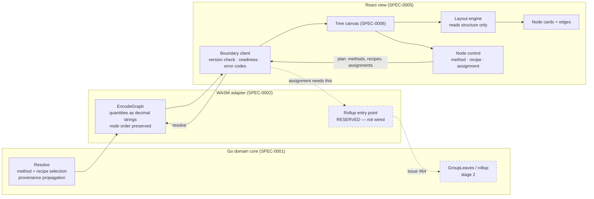

# Design: Tree Canvas

## Context

SPEC-0006 specifies the first surface built on SPEC-0005. The view layer does not exist yet; SPEC-0005 established the rules it will be built under, and this spec is the first thing those rules have to hold for.

The design reference is `docs/design/tree-canvas/handoff.md` and its prototype, `Tree Canvas.dc.html` — a high-fidelity HTML reference for node cards, edges, the popover, states and colours, with layout positions explicitly illustrative because elkjs decides them in production. The handoff carries a convention note that where it and a later spec disagree, the spec wins. This spec invokes that note twice.

**The design predates ADR-0005 by one day.** The handoff was authored 2026-08-17; ADR-0005 was accepted 2026-08-18. The prototype's popover offers a binary craft|refine segmented control, which was the whole of the choice a node had when it was drawn. ADR-0005 changed that: a node now resolves to one *recipe* as well as one method, alternatives are common rather than exceptional — 261 of 403 refiner output/method pairs have more than one — and the ADR assigns the view the job of surfacing them. Nothing in the design covers this.

The gap is not small. Sodium Nitrate carries 26 refine recipes; the largest cooked output carries 61. A segmented control is the correct affordance for two options and the wrong one for twenty-six. This spec therefore requires the capability and defers the form, in the same way SPEC-0005 deferred fractional typography rather than inventing it.

The upstream half of this surface is ready. `internal/bridge` already encodes `legalMethods`, `legalRecipes`, `yield`, `applications`, `terminal`, `verified` and per-edge `perUnit`/`yield` on every node, and SPEC-0002 REQ "Recipe Selection Crossing" already requires the view be able to offer alternatives without reading the artifact. What the canvas needs from the boundary, the boundary sends.

The downstream half is not. Leaf-to-base assignment reaches the domain through stage 2, and `Module.Rollup` is still a reserved stub returning a not-implemented envelope. Assignment is a core interaction of this surface and cannot be built until that entry point is wired.

## Goals / Non-Goals

### Goals

- Render the resolved graph faithfully from one boundary payload, with the domain's ordering intact
- Give the player the two choices the domain accepts per node — method and recipe — and the leaf assignment
- Keep every domain figure the domain's, including the fractional ones this surface is the first to display
- Make the surface fully operable by keyboard, with tab order following build order
- Name the places where the design has not yet decided, instead of deciding them here

### Non-Goals

- The base planner surface, the bases map, and the application shell — separate specs
- The URL hash codec. Plan state is SPEC-0002's encoding and ADR-0002's decision; the decode-on-load path still has no home, which SPEC-0005 records as an open question
- Save-file import — ADR-0002, unspecced
- Phone layout. The brief makes phone view-only, so the method control's small-screen form is deferred to the shell surface
- Choosing the state library. ADR-0004 leaves it open and SPEC-0005 records it as an open question to settle after the first working slice; this is that slice, but the choice belongs with the slice, not ahead of it

## Decisions

### The recipe control is required; its form is the design's to decide

**Choice**: The spec requires that alternatives be offered, that they remain usable at 26 and 61 options, and that each be distinguishable by inputs and yield rather than by identifier. It does not specify the control.

**Rationale**: This is the same judgement SPEC-0005 reached about fractional display, and for the same reason: specifying a visual form the design has never drawn is how a spec acquires a requirement no one validated. What can be specified without the design is the *shape of the problem* — the option counts are measured facts from ADR-0005, and "distinguishable by what it consumes and yields" follows from what an alternative recipe actually is. Those constrain the design's answer without substituting for it.

**Alternatives considered**:
- *Extend the segmented control*: rejected. It is drawn for two options and the data has up to 61.
- *Specify a dropdown*: rejected. It would be a guess with a spec's authority behind it, and a bare `<select>` of 61 recipe identifiers fails the distinguishability requirement anyway.
- *Leave recipe selection out of this spec*: rejected. ADR-0005 assigns the view this job explicitly, and a canvas that shows one route where the domain reports 26 is the failure the ADR was written to prevent.

### Layout geometry is carved out of the no-arithmetic rule, explicitly

**Choice**: The spec states that computing node positions is not a violation of SPEC-0005 REQ "The View Computes No Domain Values", and draws the line at what the computation reads: structure yes, quantities no.

**Rationale**: A layout engine is arithmetic on the view side, performed on graph data, producing numbers. Read literally, SPEC-0005's rule appears to forbid it, and a reviewer would be right to raise it. Stating the carve-out is cheaper than having the argument at review time on every surface. The line is checkable: pass nodes and edges to the layout engine and never a total, and the question of whether a coordinate is a domain value never arises. The test in the spec — changing quantity must not move the graph — makes the rule observable rather than a matter of reading the layout code.

**Trade-off**: A carve-out is a place where a rule has an exception, and exceptions get cited by analogy. Mitigated by making it narrow and by stating the prohibited cases directly: sizing a node by its total, or ordering a column by quantity, are named as violations.

### Tab order is the payload's node order, not the layout's

**Choice**: Each node is one tab stop, visited in the order the boundary payload lists them — terminals first, target last.

**Rationale**: The handoff already asked for this ("nodes are `<button>`s in topological order (raws first, device last) = tab order"), and the boundary already guarantees it: SPEC-0002 REQ "Determinism Across the Boundary" requires node order to survive encoding, and `EncodeGraph`'s own comment says the adapter does not re-sort because "the tab order the view renders is a domain decision and re-deriving it here would be a second place for it to drift". So the canvas inherits an order that three layers have agreed on rather than computing a fourth.

This also makes the accessibility requirement and the no-computation requirement the same requirement, which is a good sign for both. A canvas that sorted nodes for tab order would be deriving a view fact from domain data — the thing SPEC-0005 forbids — and would drift from the domain's order the moment the engine's ordering changed.

**Trade-off**: Tab order will not follow visual position, because elkjs positions nodes and the domain orders them. For a dependency graph this is the right way round — build order is more useful than reading order — but it is a deliberate divergence from the usual "tab order follows visual layout" guidance, and worth stating so it is not later "fixed".

### The border belongs to base identity, and nothing else

**Choice**: The card's border conveys base assignment only. Hover, focus and selection use filter, outboard outline and inboard overlay ring.

**Rationale**: Inherited from the design, which arrived at it the hard way and recorded the provenance — one rule from an outfitter issue, one from an outfitter PR after inset box-shadows were found painting under positioned children. SPEC-0005 already carries the inset-shadow prohibition as a general styling rule; what this spec adds is *why* the border was unavailable in the first place, which is that a leaf's base identity is a fact the player needs while hovering, focusing and selecting that same node.

### Assignment depends on stage 2 being wired, and says so

**Choice**: The spec requires leaf assignment and states that it reaches the domain through the reserved stage-2 entry point, explicitly forbidding a workaround that reads the domain's rollup types directly.

**Rationale**: The prohibition is the useful half. An implementer meeting a not-implemented envelope has an obvious escape — reach past the boundary for the types, which are right there in the same repository — and it would work, and it would put domain knowledge in the render layer that ADR-0003 and ADR-0004 both exist to keep out. Naming the escape closes it.

## Architecture

The plan travels back the way the payload came: a change in the node control produces new plan state, the client sends it, and the canvas renders whatever returns. No figure is adjusted in place on the way.

## Risks / Trade-offs

- **The recipe control is the hard part and is not designed yet.** 61 options with meaningful distinctions between them is a genuine interaction-design problem, not a styling exercise, and it sits on the critical path of the surface's core interaction. → Mitigated by specifying the constraints now so the design work starts from measured option counts rather than from the prototype's two. This should be resolved before the surface is planned into stories, not during implementation.

- **The provenance marker cannot be validated against real data.** The generated artifact marks nothing unverified — resolving `ULTRAPROD2` against `data/tier1.json` returns 36 nodes, 0 of them unverified — because the normalizer never emits `"verified": false`. The domain supports the flag, the boundary carries it, the design drew the badge, and today nothing triggers it. → The marker must be built against a fixture rather than the real artifact, and its propagated form — a connected span up to the target, not isolated chips — is what the fixture should exercise. The design tuned "subtle, honest, non-alarming" against two instances in a prototype; propagation means the real count is a spine, not a pair.

- **Edge label legibility does not scale with the tree.** The handoff records labels as legible at the prototype's 34 nodes and flags 60+ as needing hover-only. The real target already resolves to 36, and combined targets go further. → Flagged for layout spacing tests; the spec requires the per-unit quantity be present without fixing how it is revealed, so hover-only remains available without a spec change.

- **Two substantial third-party dependencies enter the project here.** React Flow and elkjs are the first, and both sit directly under a surface whose spec forbids the view computing domain values. → The carve-out decision above draws the line at what the layout engine may read, which keeps the dependency inside the rule rather than beside it.

- **This surface will find SPEC-0005's unfinished edges.** It is the first consumer of the boundary client, the first place the fraction rule renders, and the first test of the token constraints. → That is the point of building it first, but it means SPEC-0005 should be expected to take amendments rather than being treated as settled.

## Migration Plan

Greenfield. The dependency order:

1. Issue #64 wires `rollup` and `power` into the boundary — a hard prerequisite for leaf assignment, and independent of everything else here.
2. The SPEC-0005 foundations: Vite and TypeScript, the token stylesheet, the boundary client, module loading.
3. Static rendering: payload → layout → node cards and edges, with no interaction. This exercises the ordering, the token discipline, and the no-arithmetic rule before any control exists.
4. The method control, which the design has fully specified.
5. The recipe control, once the design has answered.
6. Leaf assignment, once step 1 has landed.

Steps 4 and 6 are independent of each other; step 5 is blocked on design rather than on code.

## Open Questions

- **The recipe control's form.** The central one. Needs the design, given option counts up to 61 and the requirement that alternatives be told apart by inputs and yield rather than identifier.
- **How a fractional application count is set.** This surface is where SPEC-0005's deferred fraction question becomes concrete: `applications` is exact and unrounded, and the theme handoff sets every figure in `tabular-nums`, which aligns digits and not a solidus. The two open questions should be answered together, since this is the first place either is visible.
- **Whether the yield belongs on the card or in the control.** The spec requires a non-unit yield be visible on the node; the card as drawn has no room for it, and the design has not been asked. Putting it only in the control would mean the card shows a total whose derivation is hidden.
- **Where target and quantity selection live.** The handoff puts device quantity in a tweaks panel, which is shell furniture rather than canvas. The boundary needs both on every call, so the canvas consumes them regardless — but which surface owns the control is unsettled, and the shell has no spec yet.
- **Whether edge labels become hover-only, and at what node count.** Deferred to layout spacing tests rather than guessed at.
