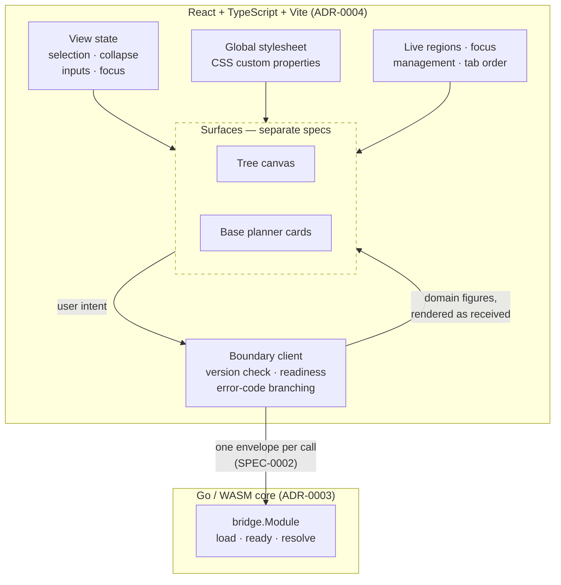

# Design: View Foundations

## Context

ADR-0003 moved the dependency graph, rollup engine, power math, save parsing and plan serialization into a Go/WASM core. ADR-0004 chose React with TypeScript and Vite for what remains, and recorded openly that the choice was made on familiarity rather than on merit in isolation — Svelte 5 was the stronger recommendation, and its advantages were knowingly declined so the learning budget could go to Go.

That trade is only cheap if the boundary holds. If domain logic leaks into the view, a framework change stops costing the views and starts costing the parts of the system that were supposed to be safe from it. SPEC-0005 is where the boundary becomes checkable.

Three of ADR-0004's four Confirmation criteria are requirements in the paired spec; the fourth is its Accessibility section. That is not a coincidence — the ADR wrote its confirmation criteria as things a reviewer could check, and this spec is those criteria given scenarios.

The design handoffs are the source for the visual rules: `docs/design/theme/handoff.md` for tokens, border discipline and the control scale, and `docs/design/tree-canvas/handoff.md` for the accessibility behaviour the surfaces inherit.

## Goals / Non-Goals

### Goals

- Make "the view recomputes nothing" a reviewable property rather than an intention
- Fix the token and border rules once, so each surface inherits rather than restates them
- Define the boundary client so no surface talks to the module directly
- Establish the accessibility baseline every surface builds on
- Keep the spec small enough to plan into a handful of stories

### Non-Goals

- The tree canvas — React Flow, elkjs layout, node buttons in topological order, the method popover. A separate capability that requires this one.
- The base planner cards — card anatomy, the class picker, the deficit action.
- Choosing a client state library. ADR-0004 defers this deliberately; see Open Questions.
- Visual design decisions. The handoffs are final and measured; this spec says how they are expressed in code, not what they are.

## Decisions

### The view holds no domain value, and formatting is the boundary of what it may do

**Choice**: The view performs no arithmetic on quantities, power figures or counts, and does not round. It may format for presentation only where the formatting is reversible and changes no magnitude.

**Rationale**: ADR-0004's Confirmation names this as the criterion that any arithmetic in the React tree is a defect. The temptation `design.md` for SPEC-0002 already identified is rounding — a rational like `3/2` is awkward to show, and rounding it on the way out looks like presentation rather than computation. SPEC-0001 enumerates which physical boundaries round and in which direction; none is "on the way to a screen". Drawing the line at *reversible* formatting gives a reviewer a test rather than a judgement call: if you cannot recover the received value from what is displayed, the view computed something.

**Alternatives considered**:
- *Allow display rounding with a documented precision*: rejected. Every precision is wrong for some value, and the engine spent real effort keeping quantities exact through five stages. Discarding that at the last step is precisely the failure SPEC-0002's encoding requirement exists to prevent.
- *Forbid all formatting*: rejected as unusable. Grouping separators and units are not computation.
- *Require the rational's own string in every case*: rejected on re-reading. It contradicts the reversible-formatting allowance in the same decision — a grouping separator already changes the string — and it forces `3/2` to be set as a solidus where `1.5` is the same number, exactly recoverable, and the form the design's `tabular-nums` figures are built for. The line that survives is float and magnitude, not glyphs: an exact decimal is a representation, a rounded one is a computation.

### One boundary client, not per-surface module access

**Choice**: A single client owns the module handle, the version check, readiness, and error-code branching. Surfaces call the client.

**Rationale**: The version check and the not-ready state are easy to get right once and easy to forget in the third place they are needed. Concentrating them also means a surface cannot accidentally reach the Tier 1 artifact — there is nothing in a surface's reach that could.

**Trade-off**: An indirection between a surface and its data. Accepted because the alternative distributes the boundary contract across every surface that touches it, which is how a contract drifts.

### Not-ready is a state, not an error

**Choice**: The client distinguishes "the module has not loaded" from "the call failed", and the view renders a pending state rather than a failure or a zero.

**Rationale**: SPEC-0002 already separates these on the wire, with distinct codes, precisely so the consumer can. Showing zero while the module loads is the worse failure of the two available: an empty result and a not-yet result look identical to a user, and one of them is a lie about the plan.

### The security section is written out even where the answer is "there is no surface"

**Choice**: All six security topics appear, with the absent ones stating why they are absent rather than being omitted.

**Rationale**: Three of the six are real here — a CSP that must permit WebAssembly, a size limit on user-supplied save files, and validation of plan state arriving from the URL hash. The other three are absent because there is no server. Recording that is more useful than silence, because "there is no server" is a fact that stops being true the day someone adds one, and a heading that was never there gives that change nothing to trip over.

**Trade-off**: Three paragraphs that say a control is unnecessary. Cheaper than a future reader having to work out whether authentication was considered and dismissed or simply forgotten.

## Architecture

## Risks / Trade-offs

- **Arithmetic creeps into the view.** The likeliest breach, and it will look reasonable each time — a percentage for a progress bar, a sum for a section header. Mitigated by making the rule specific enough to check: any arithmetic on a domain figure, including rounding. A lint rule over the view's data types would make it mechanical, which is worth doing once the shapes settle.
- **React's re-render model is the weaker fit for the recompute pattern.** ADR-0004 names this as an accepted cost requiring memoization discipline on the quantity path. Not a performance problem at 34 nodes and three base cards, but ongoing authoring attention rather than something the framework gives structurally.
- **The token file drifts from the design reference.** The reference computes its own contrast and colour-blindness tables from its hexes, so it cannot drift from its own math — but a copy in another repo can drift from it. Mitigated by recreating rather than reinterpreting, and by keeping every value in one file where a diff is legible.
- **The accessibility baseline is inherited but not enforced.** A surface spec can add requirements; nothing stops one omitting a live region. Mitigated by the surfaces requiring this spec, so a reviewer has something to check against — but the real enforcement is tests in the surface stories.

## Migration Plan

Greenfield: no view layer exists. The build order that follows from the dependencies:

1. Vite project, TypeScript configuration, and the token stylesheet recreated from the theme handoff.
2. The boundary client against the module SPEC-0002 defines, including the version check and the not-ready state.
3. The shell — landmarks, live region, focus management primitives — with no surface in it yet.
4. Lazy loading for the module and, when the tree canvas arrives, elkjs.

The surfaces follow in their own specs. Nothing here needs the tree canvas or the base planner to exist, which is the point of splitting them out.

## Open Questions

- **Client state management.** ADR-0004 records React as decided and leaves the state library open, recommending `useReducer` plus context or Zustand, and adopting Redux Toolkit only if a concrete need appears. The one argument for Redux worth keeping in view is that its devtools time-travel is useful precisely when debugging a boundary you cannot step through — which the JS/WASM boundary is. Settle after the first working slice.
- **Whether the no-arithmetic rule can be enforced mechanically.** A branded type on values arriving from the boundary would make arithmetic on them a type error rather than a review finding. Worth trying once the payload shapes settle; premature before that.
- **How the design sets a non-integer quantity.** The theme handoff specifies JetBrains Mono with `tabular-nums` for every figure, which aligns digits into columns and does nothing for a solidus, and no handoff or prototype has yet shown a fractional quantity — the reference was built entirely from integers. Terminating decimals fall out fine. A rational with no terminating decimal (`1/3` is reachable — a recipe yielding three units where one is needed) needs the design's answer, and the spec defers to it. Settle at the first quantity component rather than in the abstract.
- **Where the save-file size limit is set.** The spec requires one; the number is not chosen. It should come from the largest real save observed rather than from a round figure, which means measuring before deciding.
- **Whether the shell spec should own the URL hash codec or defer it.** Plan state in the hash is ADR-0002's decision and SPEC-0002 encodes it, but the decode-on-load path is view work and currently has no home.
