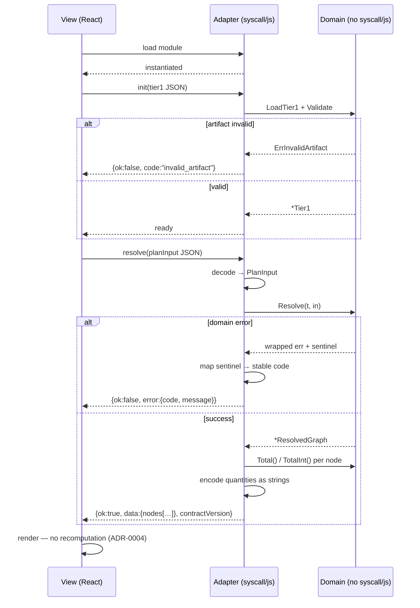

# Design: WASM Boundary

## Context

ADR-0003 splits the application: a Go domain package that imports no `syscall/js`, and a thin adapter that is the only code permitted to touch `js.Value`. The domain half exists and is merged — SPEC-0001 stage 1 resolves the 34-node Stasis Device tree, holds the import boundary, and tests under plain `go test`. The adapter does not exist, and nothing yet specifies what crosses it.

Three facts about the current code shape this design:

- **The domain types carry no JSON tags.** `PlanInput`, `ResolvedGraph`, `Node`, and `Edge` are plain Go structs with no serialization annotations. Nothing can be marshalled by reflection without first deciding a wire shape.
- **`Node.total` is unexported.** The authoritative quantity is a `*big.Rat` reachable only through `Total()` and `TotalInt()`. Reflection-based marshalling cannot see it at all.
- **JavaScript cannot represent Go's integer range.** `Number.MAX_SAFE_INTEGER` is 2^53−1; `int64` reaches 2^63−1. A ~1000× gap where values silently lose precision.

That last fact is why this spec exists in the shape it does. SPEC-0001 went to real lengths for exactness — integers throughout, rationals for multipliers, rounding only at named physical boundaries, and a `TotalInt` that refuses to report an out-of-range value as exact. All of it is undone by one careless `float64` at the boundary.

## Goals / Non-Goals

### Goals

- Preserve SPEC-0001's exactness guarantee across the boundary, not just inside the engine
- Make the ADR-0003 import boundary verifiable rather than aspirational
- Keep encoding and decoding testable without a browser or WASM toolchain
- Give the view a failure contract it can branch on without parsing prose
- Keep crossings coarse, so the boundary is not a per-node chatter surface

### Non-Goals

- Stage 2 and 3 payload shapes — reserved, and specified when those stages exist
- Save file import across the boundary (ADR-0002, separate spec)
- Plan URL-hash serialization (separate spec) — a different serialization with different constraints
- Bundle size and lazy-loading strategy beyond the SHOULD in the spec — a view-layer build concern
- Running the domain in a Web Worker

## Decisions

### JSON strings across the boundary, not `js.Value` construction

**Choice**: Entry points accept a JSON string and return a JSON string. The adapter marshals and unmarshals; it does not build `js.Value` object graphs field by field.

**Rationale**: The decisive property is testability. A JSON-string boundary is exercisable under plain `go test` — marshal, unmarshal, assert — with no browser and no WASM build, which is what REQ "Domain Purity Preservation" demands. Building `js.Value` trees is only testable inside a running WASM instance, which would make the most correctness-critical code in the module the least testable.

It also gives precision a place to live: a JSON string can carry an arbitrary-precision decimal as a string field, where a `js.Value` number cannot.

**Alternatives considered**:
- *`js.Value` object construction*: avoids a serialize/parse round-trip, but is only testable in a browser and offers no escape from float64 for numeric fields.
- *A binary format*: unnecessary at this scale and unreadable in devtools, which matters more than bytes for a 34-node graph.

### Every quantity crosses as a decimal string

**Choice**: Node totals, edge per-unit quantities, target quantity, and every later derived count encode as strings. Uniformly — not "number when it fits, string when it doesn't."

**Rationale**: A conditional contract is a contract consumers get wrong. If a field is *sometimes* a number and *sometimes* a string, every consumer needs a type check, and the code path that handles the string case is the one that never runs in testing and breaks in production on the one large value.

Uniform strings also match what the view actually does with quantities: it displays them. The design handoffs render every figure in JetBrains Mono with `tabular-nums` — display text, not operands. SPEC-0001 already forbids the view from recomputing domain values, so arithmetic on the JS side is out of scope by construction. A consumer that genuinely needs arithmetic opts into `BigInt` explicitly, which is the correct amount of friction for that operation.

**Alternatives considered**:
- *Number when within safe-integer range, string otherwise*: smaller payloads and more ergonomic in the common case, but creates exactly the rarely-exercised branch described above.
- *Always a number*: discards SPEC-0001's guarantee outright. Rejected on the spec's own terms.
- *`{num, denom}` pairs*: exact and unambiguous, but verbose, and pushes rational reconstruction onto a consumer that only wants to print the value.

### Stable error codes decoupled from Go error text

**Choice**: Each sentinel maps to a fixed identifier carried in the error payload. The wrapped Go message crosses alongside it as an unstructured human-readable field.

**Rationale**: Go's error wrapping produces excellent diagnostics — SPEC-0001 requires the chain from target to failing node — but `errors.Is` does not survive a boundary crossing, and matching on message text is the classic brittle coupling. A stable code lets the view branch on failure kind while the message stays free to improve.

The reserved unclassified code matters more than it appears: silently mapping an unrecognized error onto the nearest sentinel would make the view branch confidently on a wrong kind. Better to be explicitly unclassified.

### The adapter holds no domain logic

**Choice**: Encoding, decoding, and error mapping only. No traversal, no arithmetic, no provenance rules.

**Rationale**: This is what keeps ADR-0003's claim true rather than nominal. Logic that drifts into the adapter is logic the ingestion CLI cannot share and that plain `go test` cannot reach without a WASM build — which is the erosion ADR-0003 warned would mean the decision "has failed even if the app works."

The concrete temptation is rounding. It will be tempting to round a rational to something display-friendly in the adapter. Rounding is a domain rule — SPEC-0001 names exactly which physical boundaries round and in which direction — and it belongs in the domain.

### An explicit readiness signal, with artifact loading separate from instantiation

**Choice**: Module start and Tier 1 artifact load are distinct steps, with an explicit readiness signal gating entry points.

**Rationale**: They fail for unrelated reasons and deserve unrelated diagnostics. A malformed artifact is a data problem the extraction spike may cause; a failed instantiation is a build or delivery problem. Collapsing them produces a message that helps with neither. Separation also lets a future flow swap artifacts — a re-extracted Tier 1 — without re-instantiating the module.

## Architecture

## Risks / Trade-offs

- **Serialize/parse cost on every crossing** → Irrelevant at 34 nodes and one crossing per interaction. Revisit only if a combined tree pushes payloads far beyond current scale, and measure before optimizing.
- **String quantities are less ergonomic for consumers** → Accepted deliberately. The view displays rather than computes, so the ergonomic cost lands almost nowhere, and the alternative reintroduces the precision bug this spec exists to prevent.
- **Adapter logic drift** → The strongest defence is that the domain package stays independently testable; if a rule migrates to the adapter, its domain test disappears. Worth watching in review rather than trusting to discipline.
- **Contract version becomes ceremonial** → A version nobody bumps is worse than none, because it asserts a compatibility that was never checked. Tie the bump to the shapes named in the requirement and check it in review.
- **WASM payload delays first paint** → Lazy loading is a SHOULD here and a view-layer build concern; ADR-0003 already records payload as a known cost to measure rather than assume.

## Migration Plan

Greenfield. Build order: the encoding and decoding layer first, tested in plain Go against the existing Stasis and cake fixtures; then the `syscall/js` registration; then the view's consumption path.

The first two steps need no WASM toolchain at all, which means the boundary's correctness-critical half can be built and tested before the WASM build is proven — and if the WASM build proves unworkable, that work transfers directly to the TypeScript fallback ADR-0002 records.

## Open Questions

1. **Synchronous or asynchronous entry points.** The spec requires event-loop safety and expresses a preference for async when a call could become long-running, without settling it. At current scale a synchronous call returns well inside a frame. Settle when the first real timing exists rather than guessing.
2. **Where the Tier 1 artifact is fetched.** The view could fetch it and pass it in, or the module could fetch it itself. Passing it in keeps the module free of network concerns and is the assumed shape here, but it has not been decided.
3. **Whether stages 2 and 3 are separate crossings or one composed call.** Separate crossings match the staged design and let the canvas skip producer math; a composed call halves the crossings for the base planner. Decide when stage 2 exists.
4. **Contract version format.** An integer is sufficient and hard to misuse; semantic versioning would let additive changes avoid a hard failure. Unresolved, and cheap to change before the first consumer ships.
